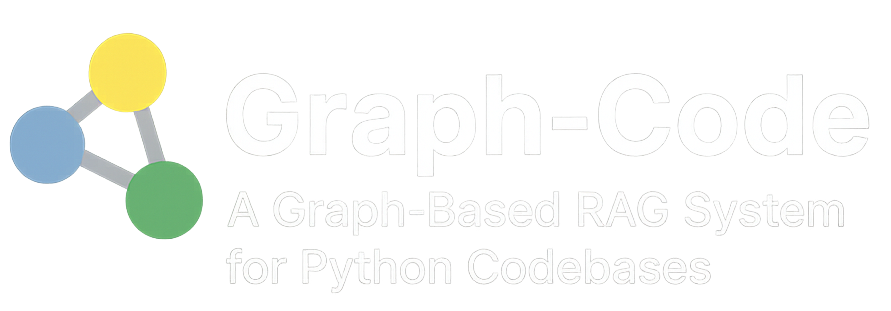

<div align="center">
  <picture>
    <source srcset="assets/logo-dark-any.png" media="(prefers-color-scheme: dark)">
    <source srcset="assets/logo-light-any.png" media="(prefers-color-scheme: light)">
    
  </picture>

  <p>
  <a href="https://github.com/vitali87/code-graph-rag/stargazers">
    
  </a>
  <a href="https://github.com/vitali87/code-graph-rag/network/members">
    
  </a>
  <a href="https://github.com/vitali87/code-graph-rag/blob/main/LICENSE">
    
  </a>
</p>
</div>

# Graph-Code: A Multi-Language Graph-Based RAG System

An accurate Retrieval-Augmented Generation (RAG) system that analyzes multi-language codebases using Tree-sitter, builds comprehensive knowledge graphs, and enables natural language querying of codebase structure and relationships as well as editing capabilities.


https://github.com/user-attachments/assets/2fec9ef5-7121-4e6c-9b68-dc8d8a835115


## 🛠️ Makefile Updates

Use the Makefile for:
- **make install**: Install project dependencies with full language support.
- **make python**: Install dependencies for Python only.
- **make dev**: Setup dev environment (install deps + pre-commit hooks).
- **make test**: Run all tests.
- **make clean**: Clean up build artifacts and cache.
- **make help**: Show available commands.

## 🚀 Features

- **🌍 Multi-Language Support**: Supports Python, JavaScript, TypeScript, Rust, Go, Scala, Java, and C++ codebases
- **🌳 Tree-sitter Parsing**: Uses Tree-sitter for robust, language-agnostic AST parsing
- **📊 Knowledge Graph Storage**: Uses Memgraph to store codebase structure as an interconnected graph
- **🗣️ Natural Language Querying**: Ask questions about your codebase in plain English
- **🤖 AI-Powered Cypher Generation**: Supports both cloud models (Google Gemini), local models (Ollama), and OpenAI models for natural language to Cypher translation
- **🤖 OpenAI Integration**: Leverage OpenAI models to enhance AI functionalities.
- **📝 Code Snippet Retrieval**: Retrieves actual source code snippets for found functions/methods
- **✍️ Advanced File Editing**: Surgical code replacement with AST-based function targeting, visual diff previews, and exact code block modifications
- **⚡️ Shell Command Execution**: Can execute terminal commands for tasks like running tests or using CLI tools.
- **🚀 Interactive Code Optimization**: AI-powered codebase optimization with language-specific best practices and interactive approval workflow
- **📚 Reference-Guided Optimization**: Use your own coding standards and architectural documents to guide optimization suggestions
- **🔗 Dependency Analysis**: Parses `pyproject.toml` to understand external dependencies
- **🎯 Nested Function Support**: Handles complex nested functions and class hierarchies
- **🔄 Language-Agnostic Design**: Unified graph schema across all supported languages

## 🏗️ Architecture

The system consists of two main components:

1. **Multi-language Parser**: Tree-sitter based parsing system that analyzes codebases and ingests data into Memgraph
2. **RAG System** (`codebase_rag/`): Interactive CLI for querying the stored knowledge graph


## 📋 Prerequisites

- Python 3.12+
- Docker & Docker Compose (for Memgraph)
- **For cloud models**: Google Gemini API key
- **For local models**: Ollama installed and running
- `uv` package manager

## 🛠️ Installation

```bash
git clone https://github.com/vitali87/code-graph-rag.git

cd code-graph-rag
```

2. **Install dependencies**:

For basic Python support:
```bash
uv sync
```

For full multi-language support:
```bash
uv sync --extra treesitter-full
```

For development (including tests and pre-commit hooks):
```bash
make dev
```

This installs all dependencies and sets up pre-commit hooks automatically.

This installs Tree-sitter grammars for all supported languages (see Multi-Language Support section).

3. **Set up environment variables**:
```bash
cp .env.example .env
# Edit .env with your configuration (see options below)
```

### Configuration Options

#### Option 1: Cloud Models (Gemini)

```bash
# .env file
GEMINI_API_KEY=your_gemini_api_key_here
```
Get your free API key from [Google AI Studio](https://aistudio.google.com/app/apikey).

#### Option 2: OpenAI Models
```bash
# .env file
OPENAI_API_KEY=your_openai_api_key_here
```

#### Option 3: Local Models (Ollama)
```bash
# .env file
LOCAL_MODEL_ENDPOINT=http://localhost:11434/v1
LOCAL_ORCHESTRATOR_MODEL_ID=llama3
LOCAL_CYPHER_MODEL_ID=llama3
LOCAL_MODEL_API_KEY=ollama
```

**Install and run Ollama**:
```bash
# Install Ollama (macOS/Linux)
curl -fsSL https://ollama.ai/install.sh | sh

# Pull required models
ollama pull llama3
# Or try other models like:
# ollama pull llama3.1
# ollama pull mistral
# ollama pull codellama

# Ollama will automatically start serving on localhost:11434
```

> **Note**: Local models provide privacy and no API costs, but may have lower accuracy compared to cloud models like Gemini.

4. **Start Memgraph database**:
```bash
docker-compose up -d
```

## 🎯 Usage

The Graph-Code system offers four main modes of operation:
1. **Parse & Ingest**: Build knowledge graph from your codebase
2. **Interactive Query**: Ask questions about your code in natural language
3. **Export & Analyze**: Export graph data for programmatic analysis
4. **AI Optimization**: Get AI-powered optimization suggestions for your code.
5. **Editing**: Perform surgical code replacements and modifications with precise targeting.

### Step 1: Parse a Repository

Parse and ingest a multi-language repository into the knowledge graph:

**For the first repository (clean start):**
```bash
python -m codebase_rag.main start --repo-path /path/to/repo1 --update-graph --clean
```

**For additional repositories (preserve existing data):**
```bash
python -m codebase_rag.main start --repo-path /path/to/repo2 --update-graph
python -m codebase_rag.main start --repo-path /path/to/repo3 --update-graph
```

The system automatically detects and processes files for all supported languages (see Multi-Language Support section).

### Step 2: Query the Codebase

Start the interactive RAG CLI:

```bash
python -m codebase_rag.main start --repo-path /path/to/your/repo
```

### Runtime Model Switching

You can switch between cloud and local models at runtime using CLI arguments:

**Use Local Models:**
```bash
python -m codebase_rag.main start --repo-path /path/to/your/repo --llm-provider local
```

**Use Cloud Models:**
```bash
python -m codebase_rag.main start --repo-path /path/to/your/repo --llm-provider gemini
```

**Specify Custom Models:**
```bash
# Use specific local models
python -m codebase_rag.main start --repo-path /path/to/your/repo \
  --llm-provider local \
  --orchestrator-model llama3.1 \
  --cypher-model codellama

# Use specific Gemini models
python -m codebase_rag.main start --repo-path /path/to/your/repo \
  --llm-provider gemini \
  --orchestrator-model gemini-2.0-flash-thinking-exp-01-21 \
  --cypher-model gemini-2.5-flash-lite-preview-06-17
```


Example queries (works across all supported languages):
- "Show me all classes that contain 'user' in their name"
- "Find functions related to database operations"
- "What methods does the User class have?"
- "Show me functions that handle authentication"
- "List all TypeScript components"
- "Find Rust structs and their methods"
- "Show me Go interfaces and implementations"
- "Add logging to all database connection functions"
- "Refactor the User class to use dependency injection"
- "Convert these Python functions to async/await pattern"
- "Add error handling to authentication methods"
- "Optimize this function for better performance"

### Step 3: Export Graph Data (New!)

For programmatic access and integration with other tools, you can export the entire knowledge graph to JSON:

**Export during graph update:**
```bash
python -m codebase_rag.main start --repo-path /path/to/repo --update-graph --clean -o my_graph.json
```

**Export existing graph without updating:**
```bash
python -m codebase_rag.main export -o my_graph.json
```

**Working with exported data:**
```python
from codebase_rag.graph_loader import load_graph

# Load the exported graph
graph = load_graph("my_graph.json")

# Get summary statistics
summary = graph.summary()
print(f"Total nodes: {summary['total_nodes']}")
print(f"Total relationships: {summary['total_relationships']}")

# Find specific node types
functions = graph.find_nodes_by_label("Function")
classes = graph.find_nodes_by_label("Class")

# Analyze relationships
for func in functions[:5]:
    relationships = graph.get_relationships_for_node(func.node_id)
    print(f"Function {func.properties['name']} has {len(relationships)} relationships")
```

**Example analysis script:**
```bash
python examples/graph_export_example.py my_graph.json
```

This provides a reliable, programmatic way to access your codebase structure without LLM restrictions, perfect for:
- Integration with other tools
- Custom analysis scripts
- Building documentation generators
- Creating code metrics dashboards

### Step 4: Code Optimization (New!)

For AI-powered codebase optimization with best practices guidance:

**Basic optimization for a specific language:**
```bash
python -m codebase_rag.main optimize python --repo-path /path/to/your/repo
```

**Optimization with reference documentation:**
```bash
python -m codebase_rag.main optimize python \
  --repo-path /path/to/your/repo \
  --reference-document /path/to/best_practices.md
```

**Using specific models for optimization:**
```bash
python -m codebase_rag.main optimize javascript \
  --repo-path /path/to/frontend \
  --llm-provider gemini \
  --orchestrator-model gemini-2.0-flash-thinking-exp-01-21
```

**Supported Languages for Optimization:**
All supported languages: `python`, `javascript`, `typescript`, `rust`, `go`, `java`, `scala`, `cpp`

**How It Works:**
1. **Analysis Phase**: The agent analyzes your codebase structure using the knowledge graph
2. **Pattern Recognition**: Identifies common anti-patterns, performance issues, and improvement opportunities
3. **Best Practices Application**: Applies language-specific best practices and patterns
4. **Interactive Approval**: Presents each optimization suggestion for your approval before implementation
5. **Guided Implementation**: Implements approved changes with detailed explanations

**Example Optimization Session:**
```
Starting python optimization session...
┏━━━━━━━━━━━━━━━━━━━━━━━━━━━━━━━━━━━━━━━━━━━━━━━━━━━━━━━━━━━━━━━━━━━━━━━━━━━━━━┓
┃ The agent will analyze your python codebase and propose specific          ┃
┃ optimizations. You'll be asked to approve each suggestion before          ┃
┃ implementation. Type 'exit' or 'quit' to end the session.                 ┃
┗━━━━━━━━━━━━━━━━━━━━━━━━━━━━━━━━━━━━━━━━━━━━━━━━━━━━━━━━━━━━━━━━━━━━━━━━━━━━━━┛

🔍 Analyzing codebase structure...
📊 Found 23 Python modules with potential optimizations

💡 Optimization Suggestion #1:
   File: src/data_processor.py
   Issue: Using list comprehension in a loop can be optimized
   Suggestion: Replace with generator expression for memory efficiency

   [y/n] Do you approve this optimization?
```

**Reference Document Support:**
You can provide reference documentation (like coding standards, architectural guidelines, or best practices documents) to guide the optimization process:

```bash
# Use company coding standards
python -m codebase_rag.main optimize python \
  --reference-document ./docs/coding_standards.md

# Use architectural guidelines
python -m codebase_rag.main optimize java \
  --reference-document ./ARCHITECTURE.md

# Use performance best practices
python -m codebase_rag.main optimize rust \
  --reference-document ./docs/performance_guide.md
```

The agent will incorporate the guidance from your reference documents when suggesting optimizations, ensuring they align with your project's standards and architectural decisions.

**Common CLI Arguments:**
- `--llm-provider`: Choose `gemini` or `local` models
- `--orchestrator-model`: Specify model for main operations
- `--cypher-model`: Specify model for graph queries
- `--repo-path`: Path to repository (defaults to current directory)
- `--reference-document`: Path to reference documentation (optimization only)

## 📊 Graph Schema

The knowledge graph uses the following node types and relationships:

### Node Types
- **Project**: Root node representing the entire repository
- **Package**: Language packages (Python: `__init__.py`, etc.)
- **Module**: Individual source code files (`.py`, `.js`, `.jsx`, `.ts`, `.tsx`, `.rs`, `.go`, `.scala`, `.sc`, `.java`)
- **Class**: Class/Struct/Enum definitions across all languages
- **Function**: Module-level functions and standalone functions
- **Method**: Class methods and associated functions
- **Folder**: Regular directories
- **File**: All files (source code and others)
- **ExternalPackage**: External dependencies

### Language-Specific Mappings
- **Python**: `function_definition`, `class_definition`
- **JavaScript/TypeScript**: `function_declaration`, `arrow_function`, `class_declaration`
- **Rust**: `function_item`, `struct_item`, `enum_item`, `impl_item`
- **Go**: `function_declaration`, `method_declaration`, `type_declaration`
- **Scala**: `function_definition`, `class_definition`, `object_definition`, `trait_definition`
- **Java**: `method_declaration`, `class_declaration`, `interface_declaration`, `enum_declaration`
- **C++**: `function_definition`, `constructor_definition`, `destructor_definition`, `class_specifier`, `struct_specifier`, `union_specifier`, `enum_specifier`

### Relationships
- `CONTAINS_PACKAGE`: Project or Package contains Package nodes
- `CONTAINS_FOLDER`: Project, Package, or Folder contains Folder nodes
- `CONTAINS_FILE`: Project, Package, or Folder contains File nodes
- `CONTAINS_MODULE`: Project, Package, or Folder contains Module nodes
- `DEFINES`: Module defines classes/functions
- `DEFINES_METHOD`: Class defines methods
- `DEPENDS_ON_EXTERNAL`: Project depends on external packages
- `CALLS`: Function or Method calls other functions/methods

## 🔧 Configuration

Configuration is managed through environment variables in `.env` file:

### Gemini (Cloud) Configuration
- `GEMINI_API_KEY`: Required when  using Google models.
- `GEMINI_MODEL_ID`: Main model for orchestration (default: `gemini-2.5-pro`)
- `MODEL_CYPHER_ID`: Model for Cypher generation (default: `gemini-2.5-flash-lite-preview-06-17`)

### Local Models Configuration
- `LOCAL_MODEL_ENDPOINT`: Ollama endpoint (default: `http://localhost:11434/v1`)
- `LOCAL_ORCHESTRATOR_MODEL_ID`: Model for main RAG orchestration (default: `llama3`)
- `LOCAL_CYPHER_MODEL_ID`: Model for Cypher query generation (default: `llama3`)
- `LOCAL_MODEL_API_KEY`: API key for local models (default: `ollama`)

### Other Settings
- `MEMGRAPH_HOST`: Memgraph hostname (default: `localhost`)
- `MEMGRAPH_PORT`: Memgraph port (default: `7687`)
- `TARGET_REPO_PATH`: Default repository path (default: `.`)

### Key Dependencies
- **tree-sitter**: Core Tree-sitter library for language-agnostic parsing
- **tree-sitter-{language}**: Language-specific grammars (Python, JS, TS, Rust, Go, Scala, Java)
- **pydantic-ai**: AI agent framework for RAG orchestration
- **pymgclient**: Memgraph Python client for graph database operations
- **loguru**: Advanced logging with structured output
- **python-dotenv**: Environment variable management

## 🤖 Agentic Workflow & Tools

The agent is designed with a deliberate workflow to ensure it acts with context and precision, especially when modifying the file system.

### Core Tools

The agent has access to a suite of tools to understand and interact with the codebase:

- **`query_codebase_knowledge_graph`**: The primary tool for understanding the repository. It queries the graph database to find files, functions, classes, and their relationships based on natural language.
- **`get_code_snippet`**: Retrieves the exact source code for a specific function or class.
- **`read_file_content`**: Reads the entire content of a specified file.
- **`create_new_file`**: Creates a new file with specified content.
- **`replace_code_surgically`**: Surgically replaces specific code blocks in files. Requires exact target code and replacement. Only modifies the specified block, leaving rest of file unchanged. True surgical patching.
- **`execute_shell_command`**: Executes a shell command in the project's environment.

### Intelligent and Safe File Editing

The agent uses AST-based function targeting with Tree-sitter for precise code modifications. Features include:
- **Visual diff preview** before changes
- **Surgical patching** that only modifies target code blocks
- **Multi-language support** across all supported languages
- **Security sandbox** preventing edits outside project directory
- **Smart function matching** with qualified names and line numbers


## 🌍 Multi-Language Support

### Supported Languages & Features

| Language   | Extensions    | Functions | Classes/Structs | Modules | Package Detection |
|------------|---------------|-----------|-----------------|---------|-------------------|
| Python     | `.py`         | ✅        | ✅              | ✅      | `__init__.py`    |
| JavaScript | `.js`, `.jsx` | ✅        | ✅              | ✅      | -                |
| TypeScript | `.ts`, `.tsx` | ✅        | ✅              | ✅      | -                |
| Rust       | `.rs`         | ✅        | ✅ (structs/enums) | ✅    | -                |
| Go         | `.go`         | ✅        | ✅ (structs)    | ✅      | -                |
| Scala      | `.scala`, `.sc` | ✅      | ✅ (classes/objects/traits) | ✅ | package declarations |
| Java       | `.java`       | ✅        | ✅ (classes/interfaces/enums) | ✅ | package declarations |
| C++        | `.cpp`, `.h`, `.hpp`, `.cc`, `.cxx`, `.hxx`, `.hh`| ✅      | ✅ (classes/structs/unions/enums) | ✅      | -                |

### Language-Specific Features

- **Python**: Full support including nested functions, methods, classes, and package structure
- **JavaScript/TypeScript**: Functions, arrow functions, classes, and method definitions
- **Rust**: Functions, structs, enums, impl blocks, and associated functions
- **Go**: Functions, methods, type declarations, and struct definitions
- **Scala**: Functions, methods, classes, objects, traits, case classes, and Scala 3 syntax
- **Java**: Methods, constructors, classes, interfaces, enums, and annotation types
- **C++**: Functions, classes, structs, and methods


### Language Configuration

The system uses a configuration-driven approach for language support. Each language is defined in `codebase_rag/language_config.py`.

## 📦 Building a binary

You can build a binary of the application using the `build_binary.py` script. This script uses PyInstaller to package the application and its dependencies into a single executable.

```bash
python build_binary.py
```
The resulting binary will be located in the `dist` directory.

## 🐛 Debugging

1. **Check Memgraph connection**:
   - Ensure Docker containers are running: `docker-compose ps`
   - Verify Memgraph is accessible on port 7687

2. **View database in Memgraph Lab**:
   - Open http://localhost:3000
   - Connect to memgraph:7687

3. **For local models**:
   - Verify Ollama is running: `ollama list`
   - Check if models are downloaded: `ollama pull llama3`
   - Test Ollama API: `curl http://localhost:11434/v1/models`
   - Check Ollama logs: `ollama logs`

## 🤝 Contributing

Please see [CONTRIBUTING.md](CONTRIBUTING.md) for detailed contribution guidelines.

Good first PRs are from TODO issues.

## 🙋‍♂️ Support

For issues or questions:
1. Check the logs for error details
2. Verify Memgraph connection
3. Ensure all environment variables are set
4. Review the graph schema matches your expectations

## Star History

[](https://www.star-history.com/#vitali87/code-graph-rag&Date)
