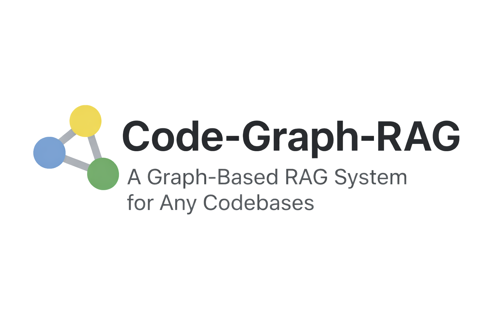

<div align="center">
  <!-- Bitbucket strips <picture>/<source> tags, so we use a single light-mode . Restore the theme-aware <picture> block below when the GitHub account is reinstated:
  <picture>
    <source srcset="assets/logo-dark-any.png" media="(prefers-color-scheme: dark)">
    <source srcset="assets/logo-light-any.png" media="(prefers-color-scheme: light)">
    
  </picture>
  -->
  

  <p>
  <!-- Badges below are commented out while the GitHub account is suspended. Restore them when the account is reinstated.
       Stars/Forks: shields.io hits GitHub's API (returns "repo not found" for suspended accounts).
       gitcgr: indexes from GitHub (shows "not indexed" while unavailable).
       MseeP.ai: badge PNG ignores inline height on Bitbucket and renders as a full-size tile.
  <a href="https://github.com/vitali87/code-graph-rag/stargazers">
    
  </a>
  <a href="https://github.com/vitali87/code-graph-rag/network/members">
    
  </a>
  -->
  <!-- Codecov, SonarCloud, and OpenSSF Scorecard badges are fed by GitHub-side CI. Uncomment once that CI is confirmed to publish to these services again.
  <a href="https://codecov.io/gh/vitali87/code-graph-rag">
    
  </a>
  <a href="https://sonarcloud.io/summary/overall?id=vitali87_code-graph-rag">
    
  </a>
  -->
  <!--
  <a href="https://mseep.ai/app/vitali87-code-graph-rag">
    
  </a>
  -->
  <a href="https://code-graph-rag.com">
    
  </a>
  <a href="https://pepy.tech/projects/code-graph-rag">
    
  </a>
  <a href="https://skillsllm.com/security-check/DHsMGRb1Ysys">
    
  </a>
  <!-- OpenSSF Scorecard only tracks GitHub-hosted repos. Uncomment once the Scorecard workflow is confirmed running on the authoritative GitHub repo.
  <a href="https://scorecard.dev/viewer/?uri=github.com/vitali87/code-graph-rag">
    
  </a>
  -->
  <!--
  <a href="https://gitcgr.com/vitali87/code-graph-rag">
    
  </a>
  -->
</p>
</div>

# Code-Graph-RAG

Code-Graph-RAG parses a multi-language codebase with Tree-sitter, builds a knowledge graph of its structure in Memgraph, and lets you query, edit, and optimise that code in plain English. It works across a monorepo of mixed languages under one unified graph schema.

<p align="center">
  
</p>

## Latest News 🔥

<!-- SECTION:latest_news -->
- **Ruby Support**: Ruby joins the graph through a new pluggable ast-grep tier that adds a language from a single YAML pattern file, emitting `Module`, `Function`, and `Class` nodes plus import edges without a hand-written parser.
- **Structural Search & Replace**: Find and rewrite code by AST pattern with ast-grep, exposed as agent tools so you can match and transform structure across the whole codebase instead of relying on text or regex.
- **Data-Flow Tracing**: New `FLOWS_TO` taint edges follow values through assignments, function calls, and I/O sinks, with coverage across C#, Java, C, and Go.
<!-- /SECTION:latest_news -->

See [NEWS.md](NEWS.md) for the full history.

## What It Does

Point Code-Graph-RAG at a repository and it reads every source file, extracts functions, classes, methods, modules, and the relationships between them, and stores the result as an interconnected graph. Once the graph exists you can:

- Ask questions about the codebase in natural language and get answers grounded in the real structure.
- Retrieve the actual source of any function, class, or method by name or by intent.
- Edit code through the agent with AST-based surgical patching and a diff preview before anything changes.
- Optimise code against language best practices or your own coding standards.
- Find dead code by walking call and reference edges from entry points.
- Search and rewrite structurally by AST pattern with ast-grep.

## How It Works

The system has two components:

1. **Multi-language parser.** A Tree-sitter based parser reads the codebase and ingests functions, classes, methods, modules, and their relationships into Memgraph under a single language-agnostic schema.
2. **RAG system** (`codebase_rag/`). An interactive CLI that turns natural language into Cypher queries, retrieves matching code, and drives AI-powered editing and optimisation.

```
Source Code -> Tree-sitter Parser -> AST Analysis -> Memgraph Knowledge Graph
                                                             |
User Query -> AI Model (Cypher Gen) -> Cypher Query -> Graph Results -> Response
```

See the [Architecture Overview](docs/architecture/overview.md) and [Graph Schema](docs/architecture/graph-schema.md) for the full picture.

## Supported Languages

Python, TypeScript, TSX, JavaScript, Rust, Go, Java, C, C++, C#, PHP, Lua, and Dart are fully supported. Scala is in development, and Ruby has structural support (modules, functions, classes, and imports) through the pluggable ast-grep tier. See the [Language Support](docs/architecture/language-support.md) matrix for per-language capabilities.

## Installation

`cgr` is published to PyPI. Install it system-wide with the `treesitter-full` (all languages) and `semantic` (vector search) extras:

```bash
# with uv (recommended)
uv tool install "code-graph-rag[treesitter-full,semantic]"

# or with pipx
pipx install "code-graph-rag[treesitter-full,semantic]"
```

You also need Docker (for Memgraph), `cmake`, and `ripgrep`. Full prerequisites, source installs, and environment setup are in the [Installation](docs/getting-started/installation.md) guide.

## Quick Start

```bash
# Start the packaged Memgraph + Qdrant stack (no compose file needed)
cgr daemon up

# Parse a repository into the graph, then query it
cgr start --repo-path /path/to/repo --update-graph --clean
cgr start --repo-path /path/to/repo
```

The [Quick Start](docs/getting-started/quickstart.md) guide walks through parsing, querying, and exporting in five minutes.

## MCP Server

Code-Graph-RAG runs as an [MCP](https://modelcontextprotocol.io) server so Claude Code and other MCP clients can query and edit your codebase directly. See the [MCP Server](docs/guide/mcp-server.md) guide for setup.

## Documentation

**Getting Started**
- [Installation](docs/getting-started/installation.md)
- [Quick Start](docs/getting-started/quickstart.md)
- [Configuration](docs/getting-started/configuration.md)

**User Guide**
- [CLI Reference](docs/guide/cli-reference.md)
- [Interactive Querying](docs/guide/interactive-querying.md)
- [Code Optimisation](docs/guide/code-optimization.md)
- [Dead Code Detection](docs/guide/dead-code.md)
- [Graph Export](docs/guide/graph-export.md)
- [Real-Time Updates](docs/guide/realtime-updates.md)
- [MCP Server](docs/guide/mcp-server.md)

**Architecture**
- [Overview](docs/architecture/overview.md)
- [Graph Schema](docs/architecture/graph-schema.md)
- [Language Support](docs/architecture/language-support.md)
- [Data-Flow Edges](docs/architecture/data-flow-edges.md)

**Python SDK**
- [Overview](docs/sdk/overview.md)
- [Graph Loader](docs/sdk/graph-loader.md)
- [Cypher Generator](docs/sdk/cypher-generator.md)
- [Semantic Search](docs/sdk/semantic-search.md)

**Advanced**
- [Adding Languages](docs/advanced/adding-languages.md)
- [Ignore Patterns](docs/advanced/ignore-patterns.md)
- [Building Binaries](docs/advanced/building-binaries.md)
- [Troubleshooting](docs/advanced/troubleshooting.md)

## Enterprise Services

Code-Graph-RAG is open source and free to use. For organisations that need more, we offer **fully managed cloud-hosted solutions** and **on-premise deployments**:

- **Cloud-Hosted Deployment**: Managed cloud infrastructure for both the graph database and the AI agent connection. Zero infrastructure overhead, so we handle scaling, updates, and availability while your team focuses on building.
- **On-Premise & Air-Gapped Deployment**: Deploy Code-Graph-RAG entirely within your own environment, including air-gapped networks. Full data sovereignty for regulated industries and security-sensitive organisations.

We also offer custom development, integration consulting, technical support contracts, and team training.

**[View plans & pricing at code-graph-rag.com](https://code-graph-rag.com/enterprise)**

## Contributing

Please see [CONTRIBUTING.md](CONTRIBUTING.md) for contribution guidelines. Good first PRs come from the TODO issues.

## Support

For issues or questions, check the [Troubleshooting](docs/advanced/troubleshooting.md) guide first, then open an issue.

## License

MIT. See [LICENSE](LICENSE).
