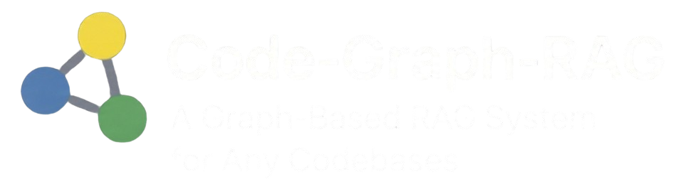
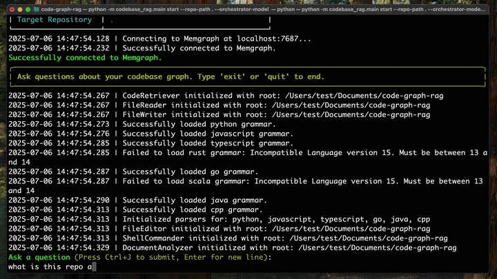

<div align="center">
  <picture>
    <source srcset="assets/logo-dark-any.png" media="(prefers-color-scheme: dark)">
    <source srcset="assets/logo-light-any.png" media="(prefers-color-scheme: light)">
    
  </picture>

  <p>
  <a href="https://github.com/vitali87/code-graph-rag/stargazers">
    
  </a>
  <a href="https://github.com/vitali87/code-graph-rag/network/members">
    
  </a>
  <a href="https://codecov.io/gh/vitali87/code-graph-rag">
    
  </a>
  <a href="https://sonarcloud.io/summary/overall?id=vitali87_code-graph-rag">
    
  </a>
  <a href="https://mseep.ai/app/vitali87-code-graph-rag">
    
  </a>
  <a href="https://code-graph-rag.com">
    
  </a>
  <a href="https://pepy.tech/projects/code-graph-rag">
    
  </a>
  <a href="https://scorecard.dev/viewer/?uri=github.com/vitali87/code-graph-rag">
    
  </a>
  <a href="https://gitcgr.com/vitali87/code-graph-rag">
    
  </a>
</p>
</div>

# Code-Graph-RAG: A Graph-Based RAG System for Any Codebases

An accurate Retrieval-Augmented Generation (RAG) system that analyzes multi-language codebases using Tree-sitter, builds comprehensive knowledge graphs, and enables natural language querying of codebase structure and relationships as well as editing capabilities.


<p align="center">
  
</p>

## Latest News 🔥

- **PHP Language Support**: Full PHP language support added — classes, interfaces, traits, enums, namespaces, PHP 8 attributes, and call graph analysis. Contributed by [@rs-ipps](https://github.com/rs-ipps).
- **C Language Support**: Full C language support added — functions, structs, unions, enums, preprocessor includes, and call graph analysis. Contributed by [@dj0nes](https://github.com/dj0nes).
- **Visualise any GitHub repo instantly!** Just change `github.com` to `gitcgr.com` in any repo URL — that's it, only 3 letters! Get an interactive graph of the entire codebase structure. Try it now: [gitcgr.com](https://gitcgr.com)

## 🚀 Features

- **Multi-Language Support**:

<!-- SECTION:supported_languages -->
| Language | Status | Extensions | Functions | Classes/Structs | Modules | Package Detection | Additional Features |
|--------|------|----------|---------|---------------|-------|-----------------|-------------------|
| C | Fully Supported | .c | ✓ | ✓ | ✓ | ✓ | Functions, structs, unions, enums, preprocessor includes |
| C++ | Fully Supported | .cpp, .h, .hpp, .cc, .cxx, .hxx, .hh, .ixx, .cppm, .ccm | ✓ | ✓ | ✓ | ✓ | Constructors, destructors, operator overloading, templates, lambdas, C++20 modules, namespaces |
| Java | Fully Supported | .java | ✓ | ✓ | ✓ | - | Generics, annotations, modern features (records/sealed classes), concurrency, reflection |
| JavaScript | Fully Supported | .js, .jsx | ✓ | ✓ | ✓ | - | ES6 modules, CommonJS, prototype methods, object methods, arrow functions |
| Lua | Fully Supported | .lua | ✓ | - | ✓ | - | Local/global functions, metatables, closures, coroutines |
| PHP | Fully Supported | .php | ✓ | ✓ | ✓ | - | Classes, interfaces, traits, enums, namespaces, PHP 8 attributes |
| Python | Fully Supported | .py | ✓ | ✓ | ✓ | ✓ | Type inference, decorators, nested functions |
| Rust | Fully Supported | .rs | ✓ | ✓ | ✓ | ✓ | impl blocks, associated functions |
| TypeScript | Fully Supported | .ts, .tsx | ✓ | ✓ | ✓ | - | Interfaces, type aliases, enums, namespaces, ES6/CommonJS modules |
| C# | In Development | .cs | ✓ | ✓ | ✓ | - | Classes, interfaces, generics (planned) |
| Go | In Development | .go | ✓ | ✓ | ✓ | - | Methods, type declarations |
| Scala | In Development | .scala, .sc | ✓ | ✓ | ✓ | - | Case classes, objects |
<!-- /SECTION:supported_languages -->
- **🌳 Tree-sitter Parsing**: Uses Tree-sitter for robust, language-agnostic AST parsing
- **📊 Knowledge Graph Storage**: Uses Memgraph to store codebase structure as an interconnected graph
- **🗣️ Natural Language Querying**: Ask questions about your codebase in plain English
- **🤖 AI-Powered Cypher Generation**: Supports both cloud models (Google Gemini), local models (Ollama), and OpenAI models for natural language to Cypher translation
- **🤖 OpenAI Integration**: Leverage OpenAI models to enhance AI functionalities.
- **📝 Code Snippet Retrieval**: Retrieves actual source code snippets for found functions/methods
- **✍️ Advanced File Editing**: Surgical code replacement with AST-based function targeting, visual diff previews, and exact code block modifications
- **⚡️ Shell Command Execution**: Can execute terminal commands for tasks like running tests or using CLI tools.
- **🚀 Interactive Code Optimization**: AI-powered codebase optimization with language-specific best practices and interactive approval workflow
- **📚 Reference-Guided Optimization**: Use your own coding standards and architectural documents to guide optimization suggestions
- **🔗 Dependency Analysis**: Parses `pyproject.toml` to understand external dependencies
- **🎯 Nested Function Support**: Handles complex nested functions and class hierarchies
- **🔄 Language-Agnostic Design**: Unified graph schema across all supported languages

## 🏗️ Architecture

The system consists of two main components:

1. **Multi-language Parser**: Tree-sitter based parsing system that analyzes codebases and ingests data into Memgraph
2. **RAG System** (`codebase_rag/`): Interactive CLI for querying the stored knowledge graph


## 📋 Prerequisites

- Python 3.12+
- Docker & Docker Compose (for Memgraph)
- **cmake** (required for building pymgclient dependency)
- **ripgrep** (`rg`) (required for shell command text searching)
- **For cloud models**: Google Gemini API key
- **For local models**: Ollama installed and running
- `uv` package manager

### Installing cmake and ripgrep

On macOS:
```bash
brew install cmake ripgrep
```

On Linux (Ubuntu/Debian):
```bash
sudo apt-get update
sudo apt-get install cmake ripgrep
```

On Linux (CentOS/RHEL):
```bash
sudo yum install cmake
sudo dnf install ripgrep
# Note: ripgrep may need to be installed from EPEL or via cargo
```

## 🛠️ Installation

```bash
git clone https://github.com/vitali87/code-graph-rag.git

cd code-graph-rag
```

2. **Install dependencies**:

For basic Python support:
```bash
uv sync
```

For full multi-language support:
```bash
uv sync --extra treesitter-full
```

For development (including tests and pre-commit hooks):
```bash
make dev
```

This installs all dependencies and sets up pre-commit hooks automatically.

This installs Tree-sitter grammars for all supported languages (see Multi-Language Support section).

3. **Set up environment variables**:
```bash
cp .env.example .env
# Edit .env with your configuration (see options below)
```

### Configuration Options

The new provider-explicit configuration supports mixing different providers for orchestrator and cypher models.

#### Option 1: All Ollama (Local Models)

```bash
# .env file
ORCHESTRATOR_PROVIDER=ollama
ORCHESTRATOR_MODEL=llama3.2
ORCHESTRATOR_ENDPOINT=http://localhost:11434/v1

CYPHER_PROVIDER=ollama
CYPHER_MODEL=codellama
CYPHER_ENDPOINT=http://localhost:11434/v1
```

#### Option 2: All OpenAI Models
```bash
# .env file
ORCHESTRATOR_PROVIDER=openai
ORCHESTRATOR_MODEL=gpt-4o
ORCHESTRATOR_API_KEY=sk-your-openai-key

CYPHER_PROVIDER=openai
CYPHER_MODEL=gpt-4o-mini
CYPHER_API_KEY=sk-your-openai-key
```

#### Option 3: All Google Models
```bash
# .env file
ORCHESTRATOR_PROVIDER=google
ORCHESTRATOR_MODEL=gemini-2.5-pro
ORCHESTRATOR_API_KEY=your-google-api-key

CYPHER_PROVIDER=google
CYPHER_MODEL=gemini-2.5-flash
CYPHER_API_KEY=your-google-api-key
```

#### Option 4: Mixed Providers
```bash
# .env file - Google orchestrator + Ollama cypher
ORCHESTRATOR_PROVIDER=google
ORCHESTRATOR_MODEL=gemini-2.5-pro
ORCHESTRATOR_API_KEY=your-google-api-key

CYPHER_PROVIDER=ollama
CYPHER_MODEL=codellama
CYPHER_ENDPOINT=http://localhost:11434/v1
```

Get your Google API key from [Google AI Studio](https://aistudio.google.com/app/apikey).

**Install and run Ollama**:
```bash
# Install Ollama (macOS/Linux)
curl -fsSL https://ollama.ai/install.sh | sh

# Pull required models
ollama pull llama3.2
# Or try other models like:
# ollama pull llama3
# ollama pull mistral
# ollama pull codellama

# Ollama will automatically start serving on localhost:11434
```

> **Note**: Local models provide privacy and no API costs, but may have lower accuracy compared to cloud models like Gemini.

4. **Start Memgraph database**:
```bash
docker compose up -d
```

5. **Verify installation**:
```bash
# If installed from PyPI:
cgr --help

# If running from source:
uv run cgr --help
```

> **Note**: When running from source (cloned repo), prefix all `cgr` commands below with `uv run`, e.g., `uv run cgr start ...`

## 🛠️ Makefile Commands

Use the Makefile for common development tasks:

<!-- SECTION:makefile_commands -->
| Command | Description |
|-------|-----------|
| `make help` | Show this help message |
| `make all` | Install everything for full development environment (deps, grammars, hooks, tests) |
| `make install` | Install project dependencies with full language support |
| `make python` | Install project dependencies for Python only |
| `make dev` | Setup development environment (install deps + pre-commit hooks) |
| `make test` | Run unit tests only (fast, no Docker) |
| `make test-parallel` | Run unit tests in parallel (fast, no Docker) |
| `make test-integration` | Run integration tests (requires Docker) |
| `make test-all` | Run all tests including integration and e2e (requires Docker) |
| `make test-parallel-all` | Run all tests in parallel including integration and e2e (requires Docker) |
| `make clean` | Clean up build artifacts and cache |
| `make build-grammars` | Build grammar submodules |
| `make watch` | Watch repository for changes and update graph in real-time |
| `make readme` | Regenerate README.md from codebase |
| `make lint` | Run ruff check |
| `make format` | Run ruff format |
| `make typecheck` | Run type checking with ty |
| `make check` | Run all checks: lint, typecheck, test |
| `make pre-commit` | Run all pre-commit checks locally (comprehensive test before commit) |
<!-- /SECTION:makefile_commands -->

## 🎯 Usage

The Code-Graph-RAG system offers four main modes of operation:
1. **Parse & Ingest**: Build knowledge graph from your codebase
2. **Interactive Query**: Ask questions about your code in natural language
3. **Export & Analyze**: Export graph data for programmatic analysis
4. **AI Optimization**: Get AI-powered optimization suggestions for your code.
5. **Editing**: Perform surgical code replacements and modifications with precise targeting.

### Step 1: Parse a Repository

Parse and ingest a multi-language repository into the knowledge graph:

**For the first repository (clean start):**
```bash
cgr start --repo-path /path/to/repo1 --update-graph --clean
```

**For additional repositories (preserve existing data):**
```bash
cgr start --repo-path /path/to/repo2 --update-graph
cgr start --repo-path /path/to/repo3 --update-graph
```

**Control Memgraph batch flushing:**
```bash
# Flush every 5,000 records instead of the default from settings
cgr start --repo-path /path/to/repo --update-graph \
  --batch-size 5000
```

The system automatically detects and processes files for all supported languages (see Multi-Language Support section).

### Step 2: Query the Codebase

**Interactive mode:**

Start the interactive RAG CLI:

```bash
cgr start --repo-path /path/to/your/repo
```

**Non-interactive mode (single query):**

Run a single query and exit, with output sent to stdout (useful for scripting):

```bash
python -m codebase_rag.main start --repo-path /path/to/your/repo \
  --ask-agent "What functions call UserService.create_user?"
```

### Step 2.5: Real-Time Graph Updates (Optional)

For active development, you can keep your knowledge graph automatically synchronized with code changes using the realtime updater. This is particularly useful when you're actively modifying code and want the AI assistant to always work with the latest codebase structure.

**What it does:**
- Watches your repository for file changes (create, modify, delete)
- Automatically updates the knowledge graph in real-time
- Maintains consistency by recalculating all function call relationships
- Filters out irrelevant files (`.git`, `node_modules`, etc.)

**How to use:**

Run the realtime updater in a separate terminal:

```bash
# Using Python directly
python realtime_updater.py /path/to/your/repo

# Or using the Makefile
make watch REPO_PATH=/path/to/your/repo
```

**With custom Memgraph settings:**
```bash
# Python
python realtime_updater.py /path/to/your/repo --host localhost --port 7687 --batch-size 1000

# Makefile
make watch REPO_PATH=/path/to/your/repo HOST=localhost PORT=7687 BATCH_SIZE=1000
```

**Multi-terminal workflow:**
```bash
# Terminal 1: Start the realtime updater
python realtime_updater.py ~/my-project

# Terminal 2: Run the AI assistant
cgr start --repo-path ~/my-project
```

**Performance note:** The updater currently recalculates all CALLS relationships on every file change to ensure consistency. This prevents "island" problems where changes in one file aren't reflected in relationships from other files, but may impact performance on very large codebases with frequent changes. **Note:** Optimization of this behavior is a work in progress.

**CLI Arguments:**
- `repo_path` (required): Path to repository to watch
- `--host`: Memgraph host (default: `localhost`)
- `--port`: Memgraph port (default: `7687`)
- `--batch-size`: Number of buffered nodes/relationships before flushing to Memgraph

**Specify Custom Models:**
```bash
# Use specific local models
cgr start --repo-path /path/to/your/repo \
  --orchestrator ollama:llama3.2 \
  --cypher ollama:codellama

# Use specific Gemini models
cgr start --repo-path /path/to/your/repo \
  --orchestrator google:gemini-2.0-flash-thinking-exp-01-21 \
  --cypher google:gemini-2.5-flash-lite-preview-06-17

# Use mixed providers
cgr start --repo-path /path/to/your/repo \
  --orchestrator google:gemini-2.0-flash-thinking-exp-01-21 \
  --cypher ollama:codellama
```

Example queries (works across all supported languages):
- "Show me all classes that contain 'user' in their name"
- "Find functions related to database operations"
- "What methods does the User class have?"
- "Show me functions that handle authentication"
- "List all TypeScript components"
- "Find Rust structs and their methods"
- "Show me Go interfaces and implementations"
- "Find all C++ operator overloads in the Matrix class"
- "Show me C++ template functions with their specializations"
- "List all C++ namespaces and their contained classes"
- "Find C++ lambda expressions used in algorithms"
- "Add logging to all database connection functions"
- "Refactor the User class to use dependency injection"
- "Convert these Python functions to async/await pattern"
- "Add error handling to authentication methods"
- "Optimize this function for better performance"

### Step 3: Export Graph Data

For programmatic access and integration with other tools, you can export the entire knowledge graph to JSON:

**Export during graph update:**
```bash
cgr start --repo-path /path/to/repo --update-graph --clean -o my_graph.json
```

**Export existing graph without updating:**
```bash
cgr export -o my_graph.json
```

**Optional: adjust Memgraph batching during export:**
```bash
cgr export -o my_graph.json --batch-size 5000
```

**Working with exported data:**
```python
from codebase_rag.graph_loader import load_graph

# Load the exported graph
graph = load_graph("my_graph.json")

# Get summary statistics
summary = graph.summary()
print(f"Total nodes: {summary['total_nodes']}")
print(f"Total relationships: {summary['total_relationships']}")

# Find specific node types
functions = graph.find_nodes_by_label("Function")
classes = graph.find_nodes_by_label("Class")

# Analyze relationships
for func in functions[:5]:
    relationships = graph.get_relationships_for_node(func.node_id)
    print(f"Function {func.properties['name']} has {len(relationships)} relationships")
```

**Example analysis script:**
```bash
python examples/graph_export_example.py my_graph.json
```

This provides a reliable, programmatic way to access your codebase structure without LLM restrictions, perfect for:
- Integration with other tools
- Custom analysis scripts
- Building documentation generators
- Creating code metrics dashboards

### Step 4: Code Optimization

For AI-powered codebase optimization with best practices guidance:

**Basic optimization for a specific language:**
```bash
cgr optimize python --repo-path /path/to/your/repo
```

**Optimization with reference documentation:**
```bash
cgr optimize python \
  --repo-path /path/to/your/repo \
  --reference-document /path/to/best_practices.md
```

**Using specific models for optimization:**
```bash
cgr optimize javascript \
  --repo-path /path/to/frontend \
  --orchestrator google:gemini-2.0-flash-thinking-exp-01-21

# Optional: override Memgraph batch flushing during optimization
cgr optimize javascript --repo-path /path/to/frontend \
  --batch-size 5000
```

**Supported Languages for Optimization:**
All supported languages: `python`, `javascript`, `typescript`, `rust`, `go`, `java`, `scala`, `c`, `cpp`

**How It Works:**
1. **Analysis Phase**: The agent analyzes your codebase structure using the knowledge graph
2. **Pattern Recognition**: Identifies common anti-patterns, performance issues, and improvement opportunities
3. **Best Practices Application**: Applies language-specific best practices and patterns
4. **Interactive Approval**: Presents each optimization suggestion for your approval before implementation
5. **Guided Implementation**: Implements approved changes with detailed explanations

**Example Optimization Session:**
```
Starting python optimization session...
┏━━━━━━━━━━━━━━━━━━━━━━━━━━━━━━━━━━━━━━━━━━━━━━━━━━━━━━━━━━━━━━━━━━━━━━━━━━━━━━┓
┃ The agent will analyze your python codebase and propose specific          ┃
┃ optimizations. You'll be asked to approve each suggestion before          ┃
┃ implementation. Type 'exit' or 'quit' to end the session.                 ┃
┗━━━━━━━━━━━━━━━━━━━━━━━━━━━━━━━━━━━━━━━━━━━━━━━━━━━━━━━━━━━━━━━━━━━━━━━━━━━━━━┛

🔍 Analyzing codebase structure...
📊 Found 23 Python modules with potential optimizations

💡 Optimization Suggestion #1:
   File: src/data_processor.py
   Issue: Using list comprehension in a loop can be optimized
   Suggestion: Replace with generator expression for memory efficiency

   [y/n] Do you approve this optimization?
```

**Reference Document Support:**
You can provide reference documentation (like coding standards, architectural guidelines, or best practices documents) to guide the optimization process:

```bash
# Use company coding standards
cgr optimize python \
  --reference-document ./docs/coding_standards.md

# Use architectural guidelines
cgr optimize java \
  --reference-document ./ARCHITECTURE.md

# Use performance best practices
cgr optimize rust \
  --reference-document ./docs/performance_guide.md
```

The agent will incorporate the guidance from your reference documents when suggesting optimizations, ensuring they align with your project's standards and architectural decisions.

**Common CLI Arguments:**
- `--orchestrator`: Specify provider:model for main operations (e.g., `google:gemini-2.0-flash-thinking-exp-01-21`, `ollama:llama3.2`)
- `--cypher`: Specify provider:model for graph queries (e.g., `google:gemini-2.5-flash-lite-preview-06-17`, `ollama:codellama`)
- `--repo-path`: Path to repository (defaults to current directory)
- `--batch-size`: Override Memgraph flush batch size (defaults to `MEMGRAPH_BATCH_SIZE` in settings)
- `--reference-document`: Path to reference documentation (optimization only)

## 🔌 MCP Server (Claude Code Integration)

Code-Graph-RAG can run as an MCP (Model Context Protocol) server, enabling seamless integration with Claude Code and other MCP clients.

### Quick Setup

```bash
claude mcp add --transport stdio code-graph-rag \
  --env TARGET_REPO_PATH=/absolute/path/to/your/project \
  --env CYPHER_PROVIDER=openai \
  --env CYPHER_MODEL=gpt-4 \
  --env CYPHER_API_KEY=your-api-key \
  -- uv run --directory /path/to/code-graph-rag code-graph-rag mcp-server
```

### Available Tools

<!-- SECTION:mcp_tools -->
| Tool | Description |
|----|-----------|
| `list_projects` | List all indexed projects in the knowledge graph database. Returns a list of project names that have been indexed. |
| `delete_project` | Delete a specific project from the knowledge graph database. This removes all nodes associated with the project while preserving other projects. Use list_projects first to see available projects. |
| `wipe_database` | WARNING: Completely wipe the entire database, removing ALL indexed projects. This cannot be undone. Use delete_project for removing individual projects. |
| `index_repository` | WARNING: Clears all data for the current project including its embeddings. Parse and ingest the repository into the Memgraph knowledge graph. Use update_repository for incremental updates. Only use when explicitly requested. |
| `update_repository` | Update the repository in the Memgraph knowledge graph without clearing existing data. Use this for incremental updates. |
| `query_code_graph` | Query the codebase knowledge graph using natural language. Use semantic_search unless you know the exact names of classes/functions you are searching for. Ask questions like 'What functions call UserService.create_user?' or 'Show me all classes that implement the Repository interface'. |
| `get_code_snippet` | Retrieve source code for a function, class, or method by its qualified name. Returns the source code, file path, line numbers, and docstring. |
| `surgical_replace_code` | Surgically replace an exact code block in a file using diff-match-patch. Only modifies the exact target block, leaving the rest unchanged. |
| `read_file` | Read the contents of a file from the project. Supports pagination for large files. |
| `write_file` | Write content to a file, creating it if it doesn't exist. |
| `list_directory` | List contents of a directory in the project. |
| `semantic_search` | Performs a semantic search for functions based on a natural language query describing their purpose, returning a list of potential matches with similarity scores. Requires the 'semantic' extra to be installed. |
| `ask_agent` | Ask the RAG agent a question about the codebase. Wraps the full RAG pipeline (graph query, LLM response) as an MCP tool. |
<!-- /SECTION:mcp_tools -->

### Example Usage

```
> Index this repository
> What functions call UserService.create_user?
> Update the login function to add rate limiting
```

For detailed setup, see [Claude Code Setup Guide](docs/claude-code-setup.md).

## 📊 Graph Schema

The knowledge graph uses the following node types and relationships:

### Node Types

<!-- SECTION:node_schemas -->
| Label | Properties |
|-----|----------|
| Project | `{name: string}` |
| Package | `{qualified_name: string, name: string, path: string, absolute_path: string}` |
| Folder | `{path: string, name: string, absolute_path: string}` |
| File | `{path: string, name: string, extension: string, absolute_path: string}` |
| Module | `{qualified_name: string, name: string, path: string, absolute_path: string}` |
| Class | `{qualified_name: string, name: string, decorators: list[string], path: string, absolute_path: string}` |
| Function | `{qualified_name: string, name: string, decorators: list[string], path: string, absolute_path: string}` |
| Method | `{qualified_name: string, name: string, decorators: list[string], path: string, absolute_path: string}` |
| Interface | `{qualified_name: string, name: string, path: string, absolute_path: string}` |
| Enum | `{qualified_name: string, name: string, path: string, absolute_path: string}` |
| Type | `{qualified_name: string, name: string}` |
| Union | `{qualified_name: string, name: string}` |
| ModuleInterface | `{qualified_name: string, name: string, path: string, absolute_path: string}` |
| ModuleImplementation | `{qualified_name: string, name: string, path: string, absolute_path: string, implements_module: string}` |
| ExternalPackage | `{name: string, version_spec: string}` |
<!-- /SECTION:node_schemas -->

### Language-Specific Mappings

<!-- SECTION:language_mappings -->
- **C**: `enum_specifier`, `function_definition`, `struct_specifier`, `union_specifier`
- **C++**: `class_specifier`, `declaration`, `enum_specifier`, `field_declaration`, `function_definition`, `lambda_expression`, `struct_specifier`, `template_declaration`, `union_specifier`
- **Java**: `annotation_type_declaration`, `class_declaration`, `constructor_declaration`, `enum_declaration`, `interface_declaration`, `method_declaration`, `record_declaration`
- **JavaScript**: `arrow_function`, `class`, `class_declaration`, `function_declaration`, `function_expression`, `generator_function_declaration`, `method_definition`
- **Lua**: `function_declaration`, `function_definition`
- **PHP**: `anonymous_function`, `arrow_function`, `class_declaration`, `enum_declaration`, `function_definition`, `interface_declaration`, `method_declaration`, `trait_declaration`
- **Python**: `class_definition`, `function_definition`
- **Rust**: `closure_expression`, `enum_item`, `function_item`, `function_signature_item`, `impl_item`, `struct_item`, `trait_item`, `type_item`, `union_item`
- **TypeScript**: `abstract_class_declaration`, `arrow_function`, `class`, `class_declaration`, `enum_declaration`, `function_declaration`, `function_expression`, `function_signature`, `generator_function_declaration`, `interface_declaration`, `internal_module`, `method_definition`, `type_alias_declaration`
- **C#**: `anonymous_method_expression`, `class_declaration`, `constructor_declaration`, `destructor_declaration`, `enum_declaration`, `function_pointer_type`, `interface_declaration`, `lambda_expression`, `local_function_statement`, `method_declaration`, `struct_declaration`
- **Go**: `function_declaration`, `method_declaration`, `type_declaration`
- **Scala**: `class_definition`, `function_declaration`, `function_definition`, `object_definition`, `trait_definition`
<!-- /SECTION:language_mappings -->

### Relationships

<!-- SECTION:relationship_schemas -->
| Source | Relationship | Target |
|------|------------|------|
| Project, Package, Folder | CONTAINS_PACKAGE | Package |
| Project, Package, Folder | CONTAINS_FOLDER | Folder |
| Project, Package, Folder | CONTAINS_FILE | File |
| Project, Package, Folder | CONTAINS_MODULE | Module |
| Module | DEFINES | Class, Function |
| Class | DEFINES_METHOD | Method |
| Module | IMPORTS | Module |
| Module | EXPORTS | Class, Function |
| Module | EXPORTS_MODULE | ModuleInterface |
| Module | IMPLEMENTS_MODULE | ModuleImplementation |
| Class | INHERITS | Class |
| Class | IMPLEMENTS | Interface |
| Method | OVERRIDES | Method |
| ModuleImplementation | IMPLEMENTS | ModuleInterface |
| Project | DEPENDS_ON_EXTERNAL | ExternalPackage |
| Function, Method | CALLS | Function, Method |
<!-- /SECTION:relationship_schemas -->

## 🔧 Configuration

Configuration is managed through environment variables in `.env` file:

### Provider-Specific Settings

#### Orchestrator Model Configuration
- `ORCHESTRATOR_PROVIDER`: Provider name (`google`, `openai`, `ollama`)
- `ORCHESTRATOR_MODEL`: Model ID (e.g., `gemini-2.5-pro`, `gpt-4o`, `llama3.2`)
- `ORCHESTRATOR_API_KEY`: API key for the provider (if required)
- `ORCHESTRATOR_ENDPOINT`: Custom endpoint URL (if required)
- `ORCHESTRATOR_PROJECT_ID`: Google Cloud project ID (for Vertex AI)
- `ORCHESTRATOR_REGION`: Google Cloud region (default: `us-central1`)
- `ORCHESTRATOR_PROVIDER_TYPE`: Google provider type (`gla` or `vertex`)
- `ORCHESTRATOR_THINKING_BUDGET`: Thinking budget for reasoning models
- `ORCHESTRATOR_SERVICE_ACCOUNT_FILE`: Path to service account file (for Vertex AI)

#### Cypher Model Configuration
- `CYPHER_PROVIDER`: Provider name (`google`, `openai`, `ollama`)
- `CYPHER_MODEL`: Model ID (e.g., `gemini-2.5-flash`, `gpt-4o-mini`, `codellama`)
- `CYPHER_API_KEY`: API key for the provider (if required)
- `CYPHER_ENDPOINT`: Custom endpoint URL (if required)
- `CYPHER_PROJECT_ID`: Google Cloud project ID (for Vertex AI)
- `CYPHER_REGION`: Google Cloud region (default: `us-central1`)
- `CYPHER_PROVIDER_TYPE`: Google provider type (`gla` or `vertex`)
- `CYPHER_THINKING_BUDGET`: Thinking budget for reasoning models
- `CYPHER_SERVICE_ACCOUNT_FILE`: Path to service account file (for Vertex AI)

### System Settings
- `MEMGRAPH_HOST`: Memgraph hostname (default: `localhost`)
- `MEMGRAPH_PORT`: Memgraph port (default: `7687`)
- `MEMGRAPH_HTTP_PORT`: Memgraph HTTP port (default: `7444`)
- `LAB_PORT`: Memgraph Lab port (default: `3000`)
- `MEMGRAPH_BATCH_SIZE`: Batch size for Memgraph operations (default: `1000`)
- `TARGET_REPO_PATH`: Default repository path (default: `.`)
- `LOCAL_MODEL_ENDPOINT`: Fallback endpoint for Ollama (default: `http://localhost:11434/v1`)

### Custom Ignore Patterns

You can specify additional directories to exclude by creating a `.cgrignore` file in your repository root:

```
# Comments start with #
vendor
.custom_cache
my_build_output
```

- One directory name per line
- Lines starting with `#` are comments
- Blank lines are ignored
- Patterns are exact directory name matches (not globs)
- Patterns from `.cgrignore` are merged with `--exclude` flags and auto-detected directories

### Key Dependencies

<!-- SECTION:dependencies -->
- **loguru**: Python logging made (stupidly) simple
- **mcp**: Model Context Protocol SDK
- **pydantic-ai**: Agent Framework / shim to use Pydantic with LLMs
- **pydantic-settings**: Settings management using Pydantic
- **pymgclient**: Memgraph database adapter for Python language
- **python-dotenv**: Read key-value pairs from a .env file and set them as environment variables
- **tiktoken**: Fast BPE tokeniser used for token counting and context window management
- **toml**: Python Library for Tom's Obvious, Minimal Language
- **tree-sitter-python**: Python grammar for tree-sitter
- **tree-sitter**: Python bindings to the Tree-sitter parsing library
- **watchdog**: Filesystem events monitoring
- **typer**: Typer, build great CLIs. Easy to code. Based on Python type hints.
- **rich**: Render rich text, tables, progress bars, syntax highlighting, markdown and more to the terminal
- **prompt-toolkit**: Library for building powerful interactive command lines in Python
- **diff-match-patch**: Repackaging of Google's Diff Match and Patch libraries.
- **click**: Composable command line interface toolkit
- **protobuf**
- **defusedxml**: XML bomb protection for Python stdlib modules
- **huggingface-hub**: Client library to download and publish models, datasets and other repos on the huggingface.co hub
<!-- /SECTION:dependencies -->

## 🤖 Agentic Workflow & Tools

The agent is designed with a deliberate workflow to ensure it acts with context and precision, especially when modifying the file system.

### Core Tools

The agent has access to a suite of tools to understand and interact with the codebase:

<!-- SECTION:agentic_tools -->
| Tool | Description |
|----|-----------|
| `query_graph` | Query the codebase knowledge graph using natural language questions. Ask in plain English about classes, functions, methods, dependencies, or code structure. Examples: 'Find all functions that call each other', 'What classes are in the user module', 'Show me functions with the longest call chains'. |
| `read_file` | Reads the content of text-based files. For documents like PDFs or images, use the 'analyze_document' tool instead. |
| `create_file` | Creates a new file with content. IMPORTANT: Check file existence first! Overwrites completely WITHOUT showing diff. Use only for new files, not existing file modifications. |
| `replace_code` | Surgically replaces specific code blocks in files. Requires exact target code and replacement. Only modifies the specified block, leaving rest of file unchanged. True surgical patching. |
| `list_directory` | Lists the contents of a directory to explore the codebase. |
| `analyze_document` | Analyzes documents (PDFs, images) to answer questions about their content. |
| `execute_shell` | Executes shell commands from allowlist. Read-only commands run without approval; write operations require user confirmation. |
| `semantic_search` | Performs a semantic search for functions based on a natural language query describing their purpose, returning a list of potential matches with similarity scores. |
| `get_function_source` | Retrieves the source code for a specific function or method using its internal node ID, typically obtained from a semantic search result. |
| `get_code_snippet` | Retrieves the source code for a specific function, class, or method using its full qualified name. |
<!-- /SECTION:agentic_tools -->

### Intelligent and Safe File Editing

The agent uses AST-based function targeting with Tree-sitter for precise code modifications. Features include:
- **Visual diff preview** before changes
- **Surgical patching** that only modifies target code blocks
- **Multi-language support** across all supported languages
- **Security sandbox** preventing edits outside project directory
- **Smart function matching** with qualified names and line numbers


## 🌍 Multi-Language Support

### Adding New Languages

Code-Graph-RAG makes it easy to add support for any language that has a Tree-sitter grammar. The system automatically handles grammar compilation and integration.

> **⚠️ Recommendation**: While you can add languages yourself, we recommend waiting for official full support to ensure optimal parsing quality, comprehensive feature coverage, and robust integration. The languages marked as "In Development" above will receive dedicated optimization and testing.

> **💡 Request Support**: If you want a specific language to be officially supported, please [submit an issue](https://github.com/vitali87/code-graph-rag/issues) with your language request.

#### Quick Start: Add a Language

Use the built-in language management tool to add any Tree-sitter supported language:

```bash
# Add a language using the standard tree-sitter repository
cgr language add-grammar <language-name>

# Examples:
cgr language add-grammar c-sharp
cgr language add-grammar php
cgr language add-grammar ruby
cgr language add-grammar kotlin
```

#### Custom Grammar Repositories

For languages hosted outside the standard tree-sitter organization:

```bash
# Add a language from a custom repository
cgr language add-grammar --grammar-url https://github.com/custom/tree-sitter-mylang
```

#### What Happens Automatically

When you add a language, the tool automatically:

1. **Downloads the Grammar**: Clones the tree-sitter grammar repository as a git submodule
2. **Detects Configuration**: Auto-extracts language metadata from `tree-sitter.json`
3. **Analyzes Node Types**: Automatically identifies AST node types for:
   - Functions/methods (`method_declaration`, `function_definition`, etc.)
   - Classes/structs (`class_declaration`, `struct_declaration`, etc.)
   - Modules/files (`compilation_unit`, `source_file`, etc.)
   - Function calls (`call_expression`, `method_invocation`, etc.)
4. **Compiles Bindings**: Builds Python bindings from the grammar source
5. **Updates Configuration**: Adds the language to `codebase_rag/language_config.py`
6. **Enables Parsing**: Makes the language immediately available for codebase analysis

#### Example: Adding C# Support

```bash
$ cgr language add-grammar c-sharp
🔍 Using default tree-sitter URL: https://github.com/tree-sitter/tree-sitter-c-sharp
🔄 Adding submodule from https://github.com/tree-sitter/tree-sitter-c-sharp...
✅ Successfully added submodule at grammars/tree-sitter-c-sharp
Auto-detected language: c-sharp
Auto-detected file extensions: ['cs']
Auto-detected node types:
Functions: ['destructor_declaration', 'method_declaration', 'constructor_declaration']
Classes: ['struct_declaration', 'enum_declaration', 'interface_declaration', 'class_declaration']
Modules: ['compilation_unit', 'file_scoped_namespace_declaration', 'namespace_declaration']
Calls: ['invocation_expression']

✅ Language 'c-sharp' has been added to the configuration!
📝 Updated codebase_rag/language_config.py
```

#### Managing Languages

```bash
# List all configured languages
cgr language list-languages

# Remove a language (this also removes the git submodule unless --keep-submodule is specified)
cgr language remove-language <language-name>
```

#### Language Configuration

The system uses a configuration-driven approach for language support. Each language is defined in `codebase_rag/language_config.py` with the following structure:

```python
"language-name": LanguageConfig(
    name="language-name",
    file_extensions=[".ext1", ".ext2"],
    function_node_types=["function_declaration", "method_declaration"],
    class_node_types=["class_declaration", "struct_declaration"],
    module_node_types=["compilation_unit", "source_file"],
    call_node_types=["call_expression", "method_invocation"],
),
```

#### Troubleshooting

**Grammar not found**: If the automatic URL doesn't work, use a custom URL:
```bash
cgr language add-grammar --grammar-url https://github.com/custom/tree-sitter-mylang
```

**Version incompatibility**: If you get "Incompatible Language version" errors, update your tree-sitter package:
```bash
uv add tree-sitter@latest
```

**Missing node types**: The tool automatically detects common node patterns, but you can manually adjust the configuration in `language_config.py` if needed.

## 📦 Building a binary

You can build a binary of the application using the `build_binary.py` script. This script uses PyInstaller to package the application and its dependencies into a single executable.

```bash
python build_binary.py
```
The resulting binary will be located in the `dist` directory.

## 🐛 Debugging

1. **Check Memgraph connection**:
   - Ensure Docker containers are running: `docker-compose ps`
   - Verify Memgraph is accessible on port 7687

2. **View database in Memgraph Lab**:
   - Open http://localhost:3000
   - Connect to memgraph:7687

3. **For local models**:
   - Verify Ollama is running: `ollama list`
   - Check if models are downloaded: `ollama pull llama3`
   - Test Ollama API: `curl http://localhost:11434/v1/models`
   - Check Ollama logs: `ollama logs`

## 🤝 Contributing

Please see [CONTRIBUTING.md](CONTRIBUTING.md) for detailed contribution guidelines.

Good first PRs are from TODO issues.

## 🙋‍♂️ Support

For issues or questions:
1. Check the logs for error details
2. Verify Memgraph connection
3. Ensure all environment variables are set
4. Review the graph schema matches your expectations

## 💼 Enterprise Services

Code-Graph-RAG is open source and free to use. For organizations that need more, we offer **fully managed cloud-hosted solutions** and **on-premise deployments**:

- **Cloud-Hosted Deployment** — Managed cloud infrastructure for both the graph database and AI agent connection. Zero infrastructure overhead — we handle scaling, updates, and availability so your team can focus on building.
- **On-Premise & Air-Gapped Deployment** — Deploy Code-Graph-RAG entirely within your own environment, including air-gapped networks. Full data sovereignty for regulated industries and security-sensitive organizations.

We also offer custom development, integration consulting, technical support contracts, and team training.

**[View plans & pricing at code-graph-rag.com →](https://code-graph-rag.com/enterprise)**

## Star History

[](https://www.star-history.com/#vitali87/code-graph-rag&Date)

## Fork History

[](https://fork-history.site/#vitali87/code-graph-rag)
