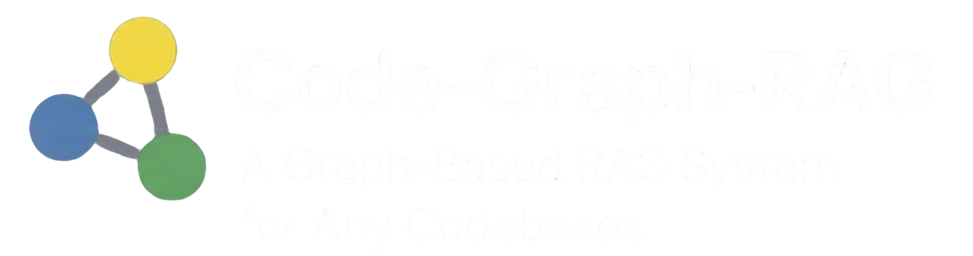
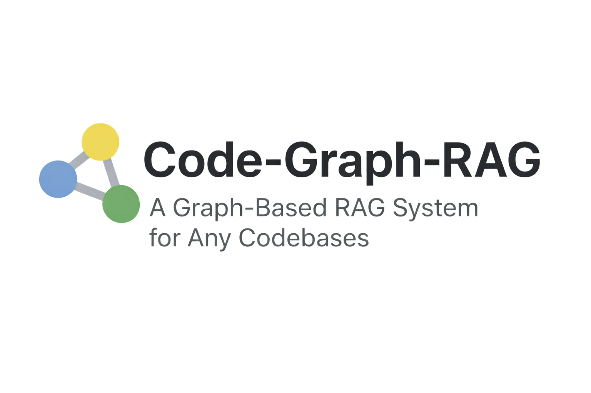
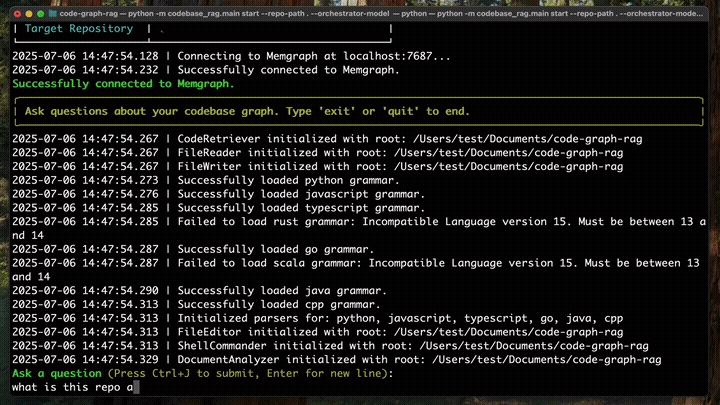

<div align="center">
  <!-- Bitbucket strips <picture>/<source> tags, so we use a single light-mode . Restore the theme-aware <picture> block below when the GitHub account is reinstated:
  <picture>
    <source srcset="assets/logo-dark-any.png" media="(prefers-color-scheme: dark)">
    <source srcset="assets/logo-light-any.png" media="(prefers-color-scheme: light)">
    
  </picture>
  -->
  

  <p>
  <!-- Badges below are commented out while the GitHub account is suspended. Restore them when the account is reinstated.
       Stars/Forks: shields.io hits GitHub's API (returns "repo not found" for suspended accounts).
       gitcgr: indexes from GitHub (shows "not indexed" while unavailable).
       MseeP.ai: badge PNG ignores inline height on Bitbucket and renders as a full-size tile.
  <a href="https://github.com/vitali87/code-graph-rag/stargazers">
    
  </a>
  <a href="https://github.com/vitali87/code-graph-rag/network/members">
    
  </a>
  -->
  <a href="https://github.com/vitali87/code-graph-rag/actions/workflows/ci.yml">
    
  </a>
  <a href="https://codecov.io/gh/vitali87/code-graph-rag">
    
  </a>
  <a href="https://sonarcloud.io/summary/overall?id=vitali87_code-graph-rag">
    
  </a>
  <!--
  <a href="https://mseep.ai/app/vitali87-code-graph-rag">
    
  </a>
  -->
  <a href="https://code-graph-rag.com">
    
  </a>
  <a href="https://pypi.org/project/code-graph-rag/">
    
  </a>
  <a href="https://pepy.tech/projects/code-graph-rag">
    
  </a>
  <a href="https://skillsllm.com/security-check/DHsMGRb1Ysys">
    
  </a>
  <a href="https://scorecard.dev/viewer/?uri=github.com/vitali87/code-graph-rag">
    
  </a>
  <a href="https://www.bestpractices.dev/projects/13757">
    
  </a>
  <!--
  <a href="https://gitcgr.com/vitali87/code-graph-rag">
    
  </a>
  -->
</p>
</div>

# Code-Graph-RAG

Code-Graph-RAG parses a multi-language codebase with Tree-sitter, builds a knowledge graph of its structure in Memgraph, and lets you query, edit, and optimise that code in plain English. It works across a monorepo of mixed languages under one unified graph schema.

<p align="center">
  
</p>

## Latest News 🔥

<!-- SECTION:latest_news -->
- **Ruby Support**: Ruby joins the graph through a new pluggable ast-grep tier that adds a language from a single YAML pattern file, emitting `Module`, `Function`, and `Class` nodes plus import edges without a hand-written parser.
- **Structural Search & Replace**: Find and rewrite code by AST pattern with ast-grep, exposed as agent tools so you can match and transform structure across the whole codebase instead of relying on text or regex.
- **Data-Flow Tracing**: New `FLOWS_TO` taint edges follow values through assignments, function calls, and I/O sinks, with coverage across C#, Java, C, and Go.
<!-- /SECTION:latest_news -->

See [NEWS.md](NEWS.md) for the full history.

## What It Does

Point Code-Graph-RAG at a repository and it reads every source file, extracts functions, classes, methods, modules, and the relationships between them, and stores the result as an interconnected graph. Once the graph exists you can:

- Ask questions about the codebase in natural language and get answers grounded in the real structure.
- Retrieve the actual source of any function, class, or method by name or by intent.
- Edit code through the agent with AST-based surgical patching and a diff preview before anything changes.
- Optimise code against language best practices or your own coding standards.
- Find dead code by walking call and reference edges from entry points.
- Search and rewrite structurally by AST pattern with ast-grep.

## How It Works

The system has two components:

1. **Multi-language parser.** A Tree-sitter based parser reads the codebase and ingests functions, classes, methods, modules, and their relationships into Memgraph under a single language-agnostic schema.
2. **RAG system** (`codebase_rag/`). An interactive CLI that turns natural language into Cypher queries, retrieves matching code, and drives AI-powered editing and optimisation.

```
Source Code -> Tree-sitter Parser -> AST Analysis -> Memgraph Knowledge Graph
                                                             |
User Query -> AI Model (Cypher Gen) -> Cypher Query -> Graph Results -> Response
```

See the [Architecture Overview](docs/architecture/overview.md) and [Graph Schema](docs/architecture/graph-schema.md) for the full picture.

## Supported Languages

Python, TypeScript, TSX, JavaScript, Rust, Go, Java, C, C++, C#, PHP, Lua, and Dart are fully supported. Scala is in development, and Ruby has structural support (modules, functions, classes, and imports) through the pluggable ast-grep tier. See the [Language Support](docs/architecture/language-support.md) matrix for per-language capabilities.

## Installation

`cgr` is published to PyPI. Install it system-wide with the `treesitter-full` (all languages) and `semantic` (vector search) extras:

```bash
# with uv (recommended)
uv tool install "code-graph-rag[treesitter-full,semantic]"

# or with pipx
pipx install "code-graph-rag[treesitter-full,semantic]"
```

You also need Docker (for Memgraph), `cmake`, and `ripgrep`. Full prerequisites, source installs, and environment setup are in the [Installation](docs/getting-started/installation.md) guide.

## Quick Start

```bash
# Start the packaged Memgraph + Qdrant stack (no compose file needed)
cgr daemon up

# Parse a repository into the graph, then query it
cgr start --repo-path /path/to/repo --update-graph --clean
cgr start --repo-path /path/to/repo
```

**Example analysis script:**
```bash
python examples/graph_export_example.py my_graph.json
```

This provides a reliable, programmatic way to access your codebase structure without LLM restrictions, perfect for:
- Integration with other tools
- Custom analysis scripts
- Building documentation generators
- Creating code metrics dashboards

### Step 4: Code Optimization

For AI-powered codebase optimization with best practices guidance:

**Basic optimization for a specific language:**
```bash
cgr optimize python --repo-path /path/to/your/repo
```

**Optimization with reference documentation:**
```bash
cgr optimize python \
  --repo-path /path/to/your/repo \
  --reference-document /path/to/best_practices.md
```

**Using specific models for optimization:**
```bash
cgr optimize javascript \
  --repo-path /path/to/frontend \
  --orchestrator google:gemini-2.0-flash-thinking-exp-01-21

# Optional: override Memgraph batch flushing during optimization
cgr optimize javascript --repo-path /path/to/frontend \
  --batch-size 5000
```

**Supported Languages for Optimization:**
All supported languages: `python`, `javascript`, `typescript`, `rust`, `go`, `java`, `scala`, `c`, `cpp`

**How It Works:**
1. **Analysis Phase**: The agent analyzes your codebase structure using the knowledge graph
2. **Pattern Recognition**: Identifies common anti-patterns, performance issues, and improvement opportunities
3. **Best Practices Application**: Applies language-specific best practices and patterns
4. **Interactive Approval**: Presents each optimization suggestion for your approval before implementation
5. **Guided Implementation**: Implements approved changes with detailed explanations

**Example Optimization Session:**
```
Starting python optimization session...
┏━━━━━━━━━━━━━━━━━━━━━━━━━━━━━━━━━━━━━━━━━━━━━━━━━━━━━━━━━━━━━━━━━━━━━━━━━━━━━━┓
┃ The agent will analyze your python codebase and propose specific          ┃
┃ optimizations. You'll be asked to approve each suggestion before          ┃
┃ implementation. Type 'exit' or 'quit' to end the session.                 ┃
┗━━━━━━━━━━━━━━━━━━━━━━━━━━━━━━━━━━━━━━━━━━━━━━━━━━━━━━━━━━━━━━━━━━━━━━━━━━━━━━┛

🔍 Analyzing codebase structure...
📊 Found 23 Python modules with potential optimizations

💡 Optimization Suggestion #1:
   File: src/data_processor.py
   Issue: Using list comprehension in a loop can be optimized
   Suggestion: Replace with generator expression for memory efficiency

   [y/n] Do you approve this optimization?
```

**Reference Document Support:**
You can provide reference documentation (like coding standards, architectural guidelines, or best practices documents) to guide the optimization process:

```bash
# Use company coding standards
cgr optimize python \
  --reference-document ./docs/coding_standards.md

# Use architectural guidelines
cgr optimize java \
  --reference-document ./ARCHITECTURE.md

# Use performance best practices
cgr optimize rust \
  --reference-document ./docs/performance_guide.md
```

The agent will incorporate the guidance from your reference documents when suggesting optimizations, ensuring they align with your project's standards and architectural decisions.

**Common CLI Arguments:**
- `--orchestrator`: Specify provider:model for main operations (e.g., `google:gemini-2.0-flash-thinking-exp-01-21`, `ollama:llama3.2`)
- `--cypher`: Specify provider:model for graph queries (e.g., `google:gemini-2.5-flash-lite-preview-06-17`, `ollama:codellama`)
- `--repo-path`: Path to repository (defaults to current directory)
- `--batch-size`: Override Memgraph flush batch size (defaults to `MEMGRAPH_BATCH_SIZE` in settings)
- `--reference-document`: Path to reference documentation (optimization only)

### Step 5: Dead Code Detection

Once a repository is indexed, report functions and methods that are unreachable
from any entry point. The walk starts from roots (exported/public symbols,
tests, decorated handlers like routes/tasks/commands, dunder/lifecycle methods)
and follows `CALLS` and `REFERENCES` edges; anything it never reaches is listed.

```bash
# Scan the indexed project (auto-selected when only one exists)
cgr dead-code

# Pick a project when several are indexed
cgr dead-code --project-name my-project
```

**Declare framework/external entry points** so the code they reach is not flagged:

```bash
cgr dead-code -e main -e cli.run --decorator-root celery_app.task
```

**Exclude generated or vendored code** (noisy with library-invoked callbacks):

```bash
cgr dead-code --exclude '*client/core*' --exclude '*.gen.*'
```

**Fail CI when new unreachable code appears**, writing a JSON report:

```bash
cgr dead-code --format json --output dead-code.json --fail-on-found
```

> Results are candidates for review, not a guaranteed delete list: code reached
> only via dynamic dispatch, reflection, or an external framework may still be
> reported. See the [Dead Code Detection guide](https://docs.code-graph-rag.com/guide/dead-code/) for details.

**Dead Code CLI Arguments:**
- `--project-name`, `-n`: Project to scan (defaults to the sole indexed project)
- `--entry-point`, `-e`: Treat symbols ending with this qualified name as reachable roots (repeatable)
- `--decorator-root`: Treat symbols carrying this decorator as roots (repeatable)
- `--exclude`: Glob matched against a symbol's file path to exclude (repeatable)
- `--include-tests` / `--no-include-tests`: Treat test code as roots (on by default)
- `--classes` / `--no-classes`: Also report unreachable classes (off by default)
- `--format`: `table` (default) or `json`
- `--output`, `-o`: Write the report to a file instead of stdout
- `--fail-on-found`: Exit with code 1 when any candidate is found

## 🔌 MCP Server (Claude Code Integration)

Code-Graph-RAG can run as an MCP (Model Context Protocol) server, enabling seamless integration with Claude Code and other MCP clients.

### Quick Setup

```bash
claude mcp add --transport stdio code-graph-rag \
  --env TARGET_REPO_PATH=/absolute/path/to/your/project \
  --env CYPHER_PROVIDER=openai \
  --env CYPHER_MODEL=gpt-4 \
  --env CYPHER_API_KEY=your-api-key \
  -- uv run --directory /path/to/code-graph-rag code-graph-rag mcp-server
```

### Available Tools

<!-- SECTION:mcp_tools -->
| Tool | Description |
|----|-----------|
| `list_projects` | List all indexed projects in the knowledge graph database. Returns a list of project names that have been indexed. |
| `delete_project` | Delete a specific project from the knowledge graph database. This removes all nodes associated with the project while preserving other projects. Use list_projects first to see available projects. |
| `wipe_database` | WARNING: Completely wipe the entire database, removing ALL indexed projects. This cannot be undone. Use delete_project for removing individual projects. |
| `index_repository` | WARNING: Clears all data for the current project including its embeddings. Parse and ingest the repository into the Memgraph knowledge graph. Use update_repository for incremental updates. Only use when explicitly requested. |
| `update_repository` | Update the repository in the Memgraph knowledge graph without clearing existing data. Use this for incremental updates. |
| `query_code_graph` | Query the codebase knowledge graph using natural language. Use semantic_search unless you know the exact names of classes/functions you are searching for. Ask questions like 'What functions call UserService.create_user?' or 'Show me all classes that implement the Repository interface'. |
| `get_code_snippet` | Retrieve source code for a function, class, or method by its qualified name. Returns the source code, file path, line numbers, and docstring. |
| `surgical_replace_code` | Surgically replace an exact code block in a file using diff-match-patch. Only modifies the exact target block, leaving the rest unchanged. |
| `read_file` | Read the contents of a file from the project. Supports pagination for large files. |
| `write_file` | Write content to a file, creating it if it doesn't exist. |
| `list_directory` | List contents of a directory in the project. |
| `semantic_search` | Performs a semantic search for functions based on a natural language query describing their purpose, returning a list of potential matches with similarity scores. Requires the 'semantic' extra to be installed. |
| `ask_agent` | Ask the Code Graph RAG agent a question about the codebase. Uses the full RAG pipeline to analyze the code graph and provide a detailed answer. Use this for general questions about architecture, functionality, and code relationships. |
<!-- /SECTION:mcp_tools -->

### Example Usage

```
> Index this repository
> What functions call UserService.create_user?
> Update the login function to add rate limiting
```

For detailed setup, see [Claude Code Setup Guide](docs/claude-code-setup.md).

## 📊 Graph Schema

The knowledge graph uses the following node types and relationships:

### Node Types

<!-- SECTION:node_schemas -->
| Label | Properties |
|-----|----------|
| Project | `{name: string}` |
| Package | `{qualified_name: string, name: string, path: string, absolute_path: string}` |
| Folder | `{path: string, name: string, absolute_path: string}` |
| File | `{path: string, name: string, extension: string?, absolute_path: string}` |
| Module | `{qualified_name: string, name: string, path: string, absolute_path: string, start_line: int?, end_line: int?}` |
| Class | `{qualified_name: string, name: string, modifiers: list[string], decorators: list[string], path: string, absolute_path: string, start_line: int?, end_line: int?, docstring: string?, is_exported: boolean?}` |
| Function | `{qualified_name: string, name: string, modifiers: list[string], decorators: list[string], path: string, absolute_path: string, start_line: int?, end_line: int?, docstring: string?, is_exported: boolean?, is_macro: boolean?}` |
| Method | `{qualified_name: string, name: string, modifiers: list[string], decorators: list[string], path: string, absolute_path: string, start_line: int?, end_line: int?, docstring: string?, is_exported: boolean?, is_property: boolean?, overrides_external: boolean?}` |
| Interface | `{qualified_name: string, name: string, path: string, absolute_path: string, modifiers: list[string]?, decorators: list[string]?, start_line: int?, end_line: int?, docstring: string?, is_exported: boolean?}` |
| Enum | `{qualified_name: string, name: string, path: string, absolute_path: string, modifiers: list[string]?, decorators: list[string]?, start_line: int?, end_line: int?, docstring: string?, is_exported: boolean?}` |
| Type | `{qualified_name: string, name: string, path: string?, absolute_path: string?, modifiers: list[string]?, decorators: list[string]?, start_line: int?, end_line: int?, docstring: string?, is_exported: boolean?}` |
| Union | `{qualified_name: string, name: string, path: string?, absolute_path: string?, modifiers: list[string]?, decorators: list[string]?, start_line: int?, end_line: int?, docstring: string?, is_exported: boolean?}` |
| ModuleInterface | `{qualified_name: string, name: string, path: string, absolute_path: string, module_type: string}` |
| ModuleImplementation | `{qualified_name: string, name: string, path: string, absolute_path: string, implements_module: string, module_type: string}` |
| ExternalPackage | `{name: string}` |
| ExternalModule | `{qualified_name: string, name: string, path: string}` |
<!-- /SECTION:node_schemas -->

### Language-Specific Mappings

<!-- SECTION:language_mappings -->
- **C**: `enum_specifier`, `function_definition`, `struct_specifier`, `union_specifier`
- **C++**: `class_specifier`, `declaration`, `enum_specifier`, `field_declaration`, `function_definition`, `lambda_expression`, `struct_specifier`, `template_declaration`, `union_specifier`
- **Go**: `function_declaration`, `method_declaration`, `type_alias`, `type_spec`
- **Java**: `annotation_type_declaration`, `class_declaration`, `constructor_declaration`, `enum_declaration`, `interface_declaration`, `method_declaration`, `record_declaration`
- **JavaScript**: `arrow_function`, `class`, `class_declaration`, `function_declaration`, `function_expression`, `generator_function_declaration`, `method_definition`
- **Lua**: `function_declaration`, `function_definition`
- **PHP**: `anonymous_function`, `arrow_function`, `class_declaration`, `enum_declaration`, `function_definition`, `interface_declaration`, `method_declaration`, `trait_declaration`
- **Python**: `class_definition`, `function_definition`
- **Rust**: `closure_expression`, `enum_item`, `function_item`, `function_signature_item`, `impl_item`, `macro_definition`, `struct_item`, `trait_item`, `type_item`, `union_item`
- **TypeScript (TSX)**: `abstract_class_declaration`, `arrow_function`, `class`, `class_declaration`, `enum_declaration`, `function_declaration`, `function_expression`, `function_signature`, `generator_function_declaration`, `interface_declaration`, `internal_module`, `method_definition`, `type_alias_declaration`
- **TypeScript**: `abstract_class_declaration`, `arrow_function`, `class`, `class_declaration`, `enum_declaration`, `function_declaration`, `function_expression`, `function_signature`, `generator_function_declaration`, `interface_declaration`, `internal_module`, `method_definition`, `type_alias_declaration`
- **Scala**: `class_definition`, `function_declaration`, `function_definition`, `object_definition`, `trait_definition`
<!-- /SECTION:language_mappings -->

### Relationships
The [Quick Start](docs/getting-started/quickstart.md) guide walks through parsing, querying, and exporting in five minutes.

## MCP Server

Code-Graph-RAG runs as an [MCP](https://modelcontextprotocol.io) server so Claude Code and other MCP clients can query and edit your codebase directly. See the [MCP Server](docs/guide/mcp-server.md) guide for setup.

## Documentation

**Getting Started**
- [Installation](docs/getting-started/installation.md)
- [Quick Start](docs/getting-started/quickstart.md)
- [Configuration](docs/getting-started/configuration.md)

**User Guide**
- [CLI Reference](docs/guide/cli-reference.md)
- [Interactive Querying](docs/guide/interactive-querying.md)
- [Code Optimisation](docs/guide/code-optimization.md)
- [Dead Code Detection](docs/guide/dead-code.md)
- [Graph Export](docs/guide/graph-export.md)
- [Real-Time Updates](docs/guide/realtime-updates.md)
- [MCP Server](docs/guide/mcp-server.md)

**Architecture**
- [Overview](docs/architecture/overview.md)
- [Graph Schema](docs/architecture/graph-schema.md)
- [Language Support](docs/architecture/language-support.md)
- [Data-Flow Edges](docs/architecture/data-flow-edges.md)

**Python SDK**
- [Overview](docs/sdk/overview.md)
- [Graph Loader](docs/sdk/graph-loader.md)
- [Cypher Generator](docs/sdk/cypher-generator.md)
- [Semantic Search](docs/sdk/semantic-search.md)

**Advanced**
- [Adding Languages](docs/advanced/adding-languages.md)
- [Ignore Patterns](docs/advanced/ignore-patterns.md)
- [Building Binaries](docs/advanced/building-binaries.md)
- [Troubleshooting](docs/advanced/troubleshooting.md)

## Enterprise Services

Code-Graph-RAG is open source and free to use. For organisations that need more, we offer **fully managed cloud-hosted solutions** and **on-premise deployments**:

- **Cloud-Hosted Deployment**: Managed cloud infrastructure for both the graph database and the AI agent connection. Zero infrastructure overhead, so we handle scaling, updates, and availability while your team focuses on building.
- **On-Premise & Air-Gapped Deployment**: Deploy Code-Graph-RAG entirely within your own environment, including air-gapped networks. Full data sovereignty for regulated industries and security-sensitive organisations.

We also offer custom development, integration consulting, technical support contracts, and team training.

**[View plans & pricing at code-graph-rag.com](https://code-graph-rag.com/enterprise)**

## Contributing

Please see [CONTRIBUTING.md](CONTRIBUTING.md) for contribution guidelines. Good first PRs come from the TODO issues.

## Support

For issues or questions, check the [Troubleshooting](docs/advanced/troubleshooting.md) guide first, then open an issue.

## License

MIT. See [LICENSE](LICENSE).
