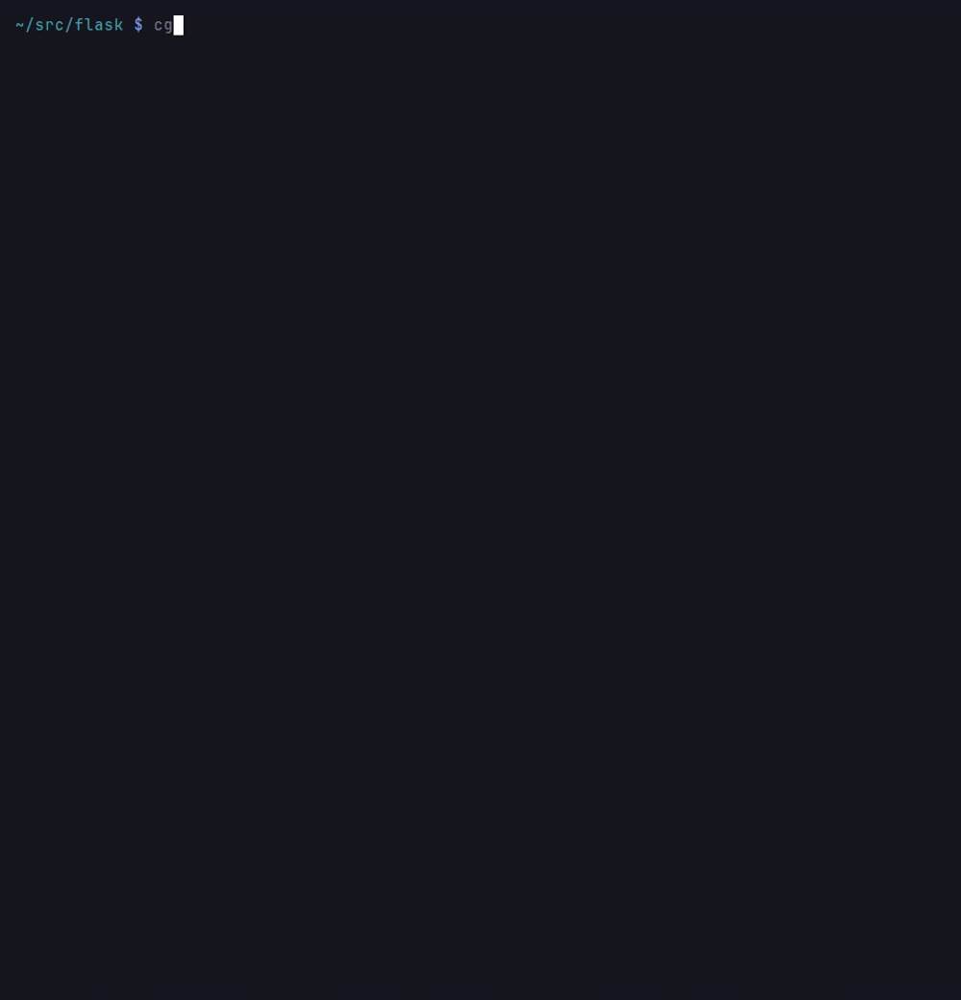

# Ignore Patterns

You can specify additional files and directories to exclude from analysis by creating a `.cgrignore` file in your repository root. Patterns follow `.gitignore` conventions.

## Format

```
# Comments start with #
vendor
*.gen.ts
docs/*.md
/generated
fixtures/**
!bin/keep.py
```

## Rules

- Patterns follow [gitignore](https://git-scm.com/docs/gitignore) syntax: `*` matches within a path segment, `**` crosses segments, `?` matches a single character
- A bare name (`vendor`) matches a file or directory with that name at any depth
- A pattern containing a slash (`docs/*.md`, `/generated`) is anchored to the repository root
- A trailing slash (`build/`) matches directories only
- Lines starting with `!` un-ignore matching paths that a **default** exclusion would skip (explicit excludes always win; the name-ending rule under [Default Exclusions](#default-exclusions) is un-ignorable only for `.min.js` and `.min.css`, and only by a `!` line naming the file)
- Lines starting with `#` are comments; blank lines are ignored
- Patterns from `.cgrignore` are merged with `--exclude` flags (which use the same syntax) and auto-detected directories

## Changing the Exclusion Set

The exclusion set is part of what an index is built against, so changing it is
treated as a change to the repository. Passing a different set of `--exclude`
flags, editing the patterns in `.cgrignore` or `.gitignore` (including `!`
negations), or changing the unignore choices made in interactive setup all
re-run the sync even when no file on disk has changed: newly excluded files
have their `Module`, `Class` and `Method` nodes removed from the graph, and
newly included ones are indexed.

The set each index was built under is recorded in `.cgr-exclusion-state.json`
in the repository root, alongside the hash cache. An index built before that
file existed has no recorded set, so the first run after upgrading re-runs once
to establish it and logs why.



*Recorded on pallets/flask.*

## Default Exclusions

Code-Graph-RAG automatically excludes common non-source directories such as `.git`, `node_modules`, `__pycache__`, `dist`, `build`, and similar.

Individual files are also skipped by how their **name ends**, covering build
output and editor leftovers (`.pyc`, `.pyo`, `.o`, `.a`, `.so`, `.dll`,
`.class`, `.tmp`, `~`) as well as minified bundles (`.min.js`, `.min.css`).
Minified bundles matter more than their count suggests: a project that commits
generated API documentation (jazzy, YARD, JSDoc, Sphinx) ships a vendored
jQuery or Lunr with it, and those files can contribute more functions than the
project's own source, under names the minifier chose (`v`, `y`, `ce`).

Only the exact ending is matched, so `app.min.js` is skipped while `admin.js`
and `min.js` are indexed normally. A non-minified vendored file (say
`docs/js/typeahead.jquery.js`) is not covered by this rule; exclude it with a
`.cgrignore` pattern naming the file, or `docs/**/js/**` for a whole vendored
directory. Prefer either to a blanket `docs/**`, which also drops the
first-party Markdown under `docs/` that the document tier indexes on purpose.

Unlike the directory exclusions above, un-ignoring the **directory** a
generated file sits in does not bring it back: `!build/` does not resurrect
`build/out.pyc` or `build/js/jquery.min.js`.

How to override it depends on which kind of file it is:

| Ending | Overridable? |
|---|---|
| `.pyc`, `.pyo`, `.o`, `.a`, `.so`, `.dll`, `.class`, `.tmp`, `~` | No. Compiled output and editor droppings are not source in any configuration. |
| `.min.js`, `.min.css` | Yes, with a `!` line naming the **file exactly**. |

So a bundle you maintain, or a third-party one you want to ask questions about,
can be indexed deliberately:

```text
!docs/js/jquery.min.js
```

A directory-level `!` is not enough, which keeps the default intact for the
common case: a repository that ships generated API documentation gets none of
its vendored JavaScript unless it names each file it actually wants.

The rescuing line must name the file literally: a `!` pattern containing `*`,
`?` or `[` does not rescue a bundle, so `!docs/js/*.min.js` and `!*.min.js`
have no effect and each file needs its own line. Everywhere else in this file
`!` patterns take globs as usual; this one rule is the exception, because a
glob is how you write "this whole subtree", which is exactly the
directory-level intent the default is protecting.

## Scope

Only the **repository root's** `.cgrignore` and `.gitignore` are read. Ignore files in subdirectories are not, and that includes a Git submodule's own `.gitignore` -- its files are indexed as part of the parent project unless the parent excludes them. See [Git Submodules](git-submodules.md).

## Symbolic Links

Indexing never follows a symbolic link, whether it names a file or a
directory and wherever it points:

| Link in the repository | What indexing does |
|---|---|
| `pkg/linked.py -> ../../outside/private.py` (target outside the repository) | Skipped. The target is never read, so nothing from outside `--repo-path` reaches the shared graph or a `cgr export`. |
| `pkg/linkdir -> ../../outside/lib` (directory outside the repository) | Skipped, and nothing under it is walked. |
| `pkg/alias.py -> core.py` (target inside the repository) | Skipped. `pkg/core.py` is indexed once, under its own path, so there is no second module duplicating its definitions. |
| `app/vendored -> ../pkg` (directory inside the repository) | Skipped. `pkg/` is indexed under its own path, and `app/vendored` gets no `Package` or `Folder` node. |

A dangling link is skipped the same way. The same rule applies to the
incremental sync, the real-time watcher, the interactive setup's list of
directories to keep, contract discovery, and the structural search and replace
tools. A link that an ignore rule already excludes is excluded as before. When
an indexed file is replaced by a link, the watcher removes the file's nodes and
does not index the link.

Each skipped link is logged at DEBUG with its target (run with
`LOGURU_LEVEL=DEBUG` to see them), and every sync logs one INFO line counting
them:

```text
Skipping symlink pkg/linked.py: its target /home/me/outside/private.py is outside the repository and is never read
Skipping symlink pkg/alias.py: its target pkg/core.py is in the repository and is indexed only under its own path
Skipped 4 symlink(s): links are not followed, ...
```

The repository root itself may be a link, or sit under one: only the entries
inside it are judged. A file named explicitly (a single-file sync, or the MCP
`reingest` tool) is resolved instead: naming `pkg/alias.py` re-indexes
`pkg/core.py`, and a link out of the repository is refused.

A graph built before this rule loses the links' modules, and the `Package`
nodes of linked directories, on its next sync. A link to a plain directory was
merged into its target's `Folder` node, so that `Folder` keeps one extra
containing folder until the project is rebuilt (`cgr delete-project`, then
sync again). The `Package` of a link out of the repository whose target sits
at the link's own relative path under another root (`pkg -> ../other/pkg`)
stays as well: it is shaped like the node another checkout indexed under the
same project name holds for its own directory, and the sync cannot tell the
two apart.

Shared sources that a repository reaches through a link are not indexed. Index
them as a project of their own (see [Multi-Project](../guide/multi-project.md)),
or replace the link with a copy or a [Git submodule](git-submodules.md).
