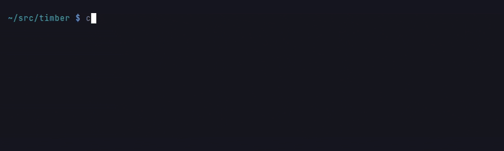
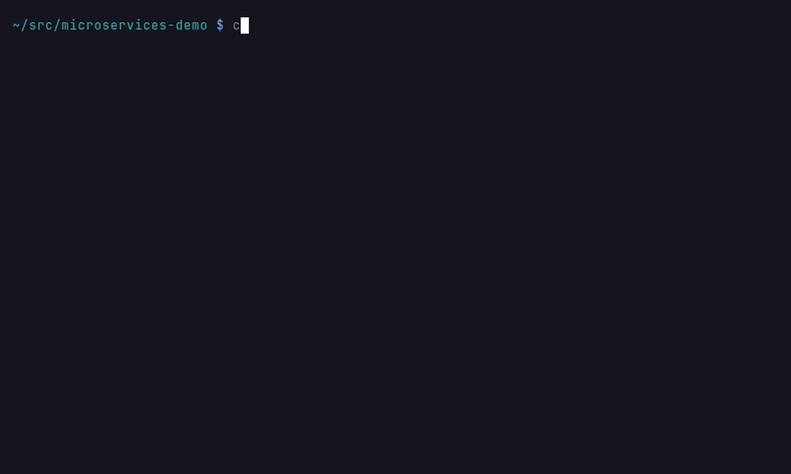

# Language Support

Code-Graph-RAG uses Tree-sitter for language-agnostic AST parsing with a unified graph schema across all languages.

Run `cgr language list-languages` to see every language below, its tier, and whether your install can parse it.

## Support Matrix

<!-- SECTION:supported_languages -->
| Language | Status | Extensions | Functions | Classes/Structs | Modules | Package Detection | Additional Features |
|--------|------|----------|---------|---------------|-------|-----------------|-------------------|
| C | Fully Supported | .c | ✓ | ✓ | ✓ | ✓ | Functions, structs, unions, enums, preprocessor includes |
| C# | Fully Supported | .cs | ✓ | ✓ | ✓ | - | Namespaces (block and file-scoped), classes/structs/records/interfaces/enums, generics, inheritance/interfaces/overrides, typed call resolution with overloads, using directives |
| C++ | Fully Supported | .cpp, .h, .hpp, .cc, .cxx, .hxx, .hh, .ixx, .cppm, .ccm, .mxx | ✓ | ✓ | ✓ | ✓ | Constructors, destructors, operator overloading, templates, lambdas, C++20 modules, namespaces, preprocessor macros |
| Dart | Fully Supported | .dart | ✓ | ✓ | ✓ | - | Classes, mixins, extensions, enhanced enums, factory/named constructors, Flutter widgets, package/relative/dart: imports, part directives, pubspec dependencies |
| Go | Fully Supported | .go | ✓ | ✓ | ✓ | - | Receiver methods with cross-file binding, structs, interfaces, type declarations, function-local types |
| Java | Fully Supported | .java | ✓ | ✓ | ✓ | - | Generics, annotations, modern features (records/sealed classes), concurrency, reflection |
| JavaScript | Fully Supported | .js, .jsx, .mjs, .cjs | ✓ | ✓ | ✓ | - | ES6 modules, CommonJS, prototype methods, object methods, arrow functions |
| Lua | Fully Supported | .lua | ✓ | - | ✓ | - | Local/global functions, metatables, closures, coroutines |
| PHP | Fully Supported | .php | ✓ | ✓ | ✓ | - | Classes, interfaces, traits, enums, namespaces, PHP 8 attributes |
| Python | Fully Supported | .py, .pyi | ✓ | ✓ | ✓ | ✓ | Type inference, decorators, nested functions |
| Rust | Fully Supported | .rs | ✓ | ✓ | ✓ | ✓ | impl blocks, associated functions, macro_rules! macros |
| TypeScript (TSX) | Fully Supported | .tsx | ✓ | ✓ | ✓ | - | All TypeScript features plus JSX elements and components |
| TypeScript | Fully Supported | .ts, .mts, .cts | ✓ | ✓ | ✓ | - | Interfaces, type aliases, enums, namespaces, ES6/CommonJS modules |
| Scala | In Development | .scala, .sc | ✓ | ✓ | ✓ | - | Case classes, objects |
| SQL (PostgreSQL) | In Development | .sql | ✓ | - | ✓ | - | Stored functions (CREATE FUNCTION), schema-qualified names, invocations between routines. CREATE PROCEDURE and in-depth PL/pgSQL bodies await upstream grammar support: the published grammar parses plain SQL statements only |
<!-- /SECTION:supported_languages -->

## Python Stubs and Source Encodings

**Type stubs (`.pyi`).** A stub is parsed as Python and indexed under the
module name its `.py` would have: `fastmath/_core.pyi` defines the module
`fastmath._core`, and `pkg/__init__.pyi` defines the package module `pkg`.
This makes a compiled extension (C, Cython or Rust/PyO3 built into a `.so` or
`.pyd`) visible in the graph. Its stub is the only source of its functions and
classes, so `from ._core import add` resolves to `fastmath._core.add`, and so do
calls made through the re-export.

A stub **beside its implementation is skipped**. When `x.py` is indexed, or the
package `x/__init__.py` (or, for `__init__.pyi`, the `__init__.py` next to
it), that file owns the module, and `x.pyi` is recorded only as a `File`, so
the module is never duplicated. The stub's signatures are not merged into the
implementation's `Function` nodes: an unannotated implementation gets no
`return_type` or `param_types` from its stub. An implementation that is
excluded from indexing (`--exclude`, `.cgrignore`) does not count, and the
stub then defines the module. Package detection still keys on `__init__.py`,
so a directory holding only `__init__.pyi` stays a `Folder`.

**Source encodings.** A Python source is decoded the way CPython decodes it.
A [PEP 263](https://peps.python.org/pep-0263/) declaration names the file's
encoding (`# -*- coding: latin-1 -*-`, `# vim: set fileencoding=cp1252 :`).
It must be on line 1, or on line 2 below a comment or blank line 1. The file
is re-encoded to UTF-8 before parsing, so `def café():` in a Latin-1 file is
indexed as `café`. A UTF-8 byte-order mark means UTF-8 and overrides a
conflicting declaration. Recorded line numbers are those of the file on disk,
and code snippets are read back in the same encoding. A declaration anywhere
else is an ordinary comment. If a declaration cannot be honoured (an unknown
codec, one that is not an ASCII-compatible text encoding such as `utf-16`, or
bytes that do not decode), a warning names the file and the codec, and the
file is read as UTF-8, as before. Files in other languages are always read as
UTF-8.

## Structural Support (ast-grep tier)

These languages have no hand-written tree-sitter parser in cgr. They are
handled by the pluggable [ast-grep](https://ast-grep.github.io/) tier, which
emits `Module`, `Function` and `Class` nodes plus `IMPORTS` edges from a
single YAML pattern file per language. Which node kinds a language yields
depends on its config: the `-` entries below mark constructs the language
does not have (Bash and Nix declare no class-like types).

This is a **basic** tier: there is **no call-graph (`CALLS`) resolution**, so
call-graph analyses such as dead-code detection skip these files.

Kotlin, Swift and Solidity name their members the way the tree-sitter tier
does: a function in a type is a `Method` `<module>.<Type>.<name>` defined by
the type, a nested function is `<module>.<outer>.<name>`, and a second
definition of one name (an overload) gets an `@<line>` suffix, so overloads
and same-named methods of different types stay distinct nodes. A Swift
`extension T` and a Kotlin extension function `fun T.f()` add their members to
`T` rather than declaring a second `T`. The other languages here keep flat
`<module>.<name>` names: an Elixir multi-clause `def` or a Haskell equation
per pattern is one function, which a per-line suffix would split. It requires the `ast-grep`
extra (`pip install 'code-graph-rag[ast-grep]'`).

A module's qualified name carries its extension: `app.rb` becomes
`<project>.app_rb`. Several of these languages accept two extensions, and a
`Module` is identified by its qualified name, so dropping the suffix would
merge `Main.kt` and `Main.kts` onto one node.

Graphs indexed before this keep the unsuffixed names, and a saved query
written against the old shape stops matching once they move. An incremental
sync will not move them: it compares each file's mtime against the hash cache
rather than hashing its content, so it skips every file whose mtime has not
advanced since the last sync. This change alters how a name is emitted rather
than the file itself, so cgr warns that the parser changed but keeps the old
results. Rebuilding with
`cgr start --clean --update-graph` is what re-emits them. Both flags are
required: `--clean` on its own deletes the graph and returns without
rebuilding. Note that it clears **every** project in a shared graph, so
re-index the others afterwards.

| Language | Extensions | Functions | Classes/Types | Imports |
|---|---|---|---|---|
| Ruby | .rb | methods, singleton methods | classes, modules | require, require_relative |
| Kotlin | .kt, .kts | functions incl. suspend/private/override, companion members, extension functions | classes, interfaces, data classes, objects, enums | import |
| Swift | .swift | functions, initializers, protocol requirements, extension members | classes, structs, enums, protocols | import |
| Elixir | .ex, .exs | def, defp, defmacro incl. zero-arg and guarded | defmodule, defprotocol, defimpl | import, alias, require, use |
| Haskell | .hs | equations and nullary binds | data, newtype, type, class | import |
| Solidity | .sol | functions, constructors, modifiers, `receive`/`fallback` | contracts, interfaces, libraries | import |
| Bash | .sh, .bash | all three `function`/`()` spellings | - | source, . |
| Nix | .nix | lambda bindings | - | import |

*Recorded on JakeWharton/timber (Kotlin, ast-grep tier).*

To add another language, drop a YAML file into
`codebase_rag/parsers/ast_grep_patterns/`; see the
[README](https://github.com/vitali87/code-graph-rag/blob/main/codebase_rag/parsers/ast_grep_patterns/README.md)
there for the rule format. Only languages with an ast-grep built-in grammar
are supported.

## Document Support (document tier)

Markdown files are parsed for **heading structure**. Each heading becomes a
`Section` node carrying its text, heading level (1-6) and line span, and
sections nest through `CONTAINS_SECTION` edges so a subheading hangs off the
heading above it; top-level headings hang off the file's `Module`.

A section's span runs from its heading to the line before the next heading at
the same or a shallower level, or to the end of the file. A deeper heading is
a child, so a parent's span contains its subsections.

| Format | Extensions | Nodes | Edges |
|---|---|---|---|
| Markdown | .md, .markdown | Section (per heading) | CONTAINS_SECTION |

Nesting follows heading **levels**, not the grammar's own `section` nodes:
ATX headings (`## Heading`) nest in the parse tree, but setext headings
(text underlined with `===` or `---`) are flat siblings, and only level
arithmetic treats both alike. A skipped level nests naturally — an `h3`
directly under an `h1` becomes that `h1`'s child.

Documents have no functions, classes, or calls, so they get neither of the
code tiers above and are absent from call-graph analyses such as dead-code
detection. Markdown files still receive the `File` node every indexed file
gets, so a base install without the grammar simply indexes them as files.

A document's qualified name keeps its extension, so `docs/guide.md` becomes
`<project>.docs.guide_md`. The suffix is part of the name because both `.md`
and `.markdown` are handled here, and dropping it would merge `guide.md` and
`guide.markdown` onto one `Module` node along with any identically-named
sections. A graph indexed before document support existed holds no `Section`
nodes at all, and any document `Module` it holds carries an unsuffixed name,
so a saved query written against the old names stops matching once the graph
is rebuilt. An incremental sync will not move it: `.md` files were already
hashed before this tier existed, so `--update-graph` sees them unchanged and
skips them, leaving the graph exactly as it was. Rebuilding needs
`cgr start --clean --update-graph`: `--clean` on its own wipes the database,
clears the embeddings, drops the hash cache and returns without indexing
anything, so it would leave you with an empty graph rather than renamed
document modules. Both flags together wipe and then re-index in one pass —
and because the wipe drops the hash cache, the re-index treats every file as
new, which is what re-emits the documents under their suffixed names. Note
that the wipe clears **every** project in the shared graph, so run it only
when that graph holds just this repository.
Requires the `treesitter-full` extra.

The wipe is needed there because that case *renames* existing nodes: the old
unsuffixed document modules have to go, and re-parsing alone would not remove
them. A change that only *adds* edges does not need it. Enabling a capture
group is the common example -- `CGR_CAPTURE=io` on an indexed project: the
hash cache keys file contents and every file is unchanged, but the capture
selection is part of the parser fingerprint, so the next `--update-graph`
sees the mismatch, ignores the cache for that run, re-parses every eligible
file of this repository once (excluded and ignored files aside) and emits
the newly enabled edges, then rewrites the
`.cgr-hash-cache.json`, `.cgr-dir-mtimes.json` and `.cgr-parser-fingerprint`
stamps; every other project in the shared graph is untouched, and the run
after parses nothing again (issues #1630 and #1977). The warning it logs says
what such a re-parse cannot do: it removes only what a re-parsed module
DEFINES, so a change that renames nodes still needs the wipe above.

## Language-Agnostic Design

All languages share a unified graph schema, meaning queries work the same way regardless of language. You can query across languages in the same knowledge graph when analysing polyglot repositories.

*Recorded on GoogleCloudPlatform/microservices-demo; the Go warning appears because the go/types frontend needs Go 1.26 and the recording machine has 1.24.*

## Adding New Languages

Code-Graph-RAG makes it easy to add support for any language that has a Tree-sitter grammar. See the [Adding Languages](../advanced/adding-languages.md) guide.

!!! tip
    While you can add languages yourself, we recommend waiting for official full support for optimal parsing quality and comprehensive feature coverage. [Submit a language request](https://github.com/vitali87/code-graph-rag/issues) if you need a specific language supported.
