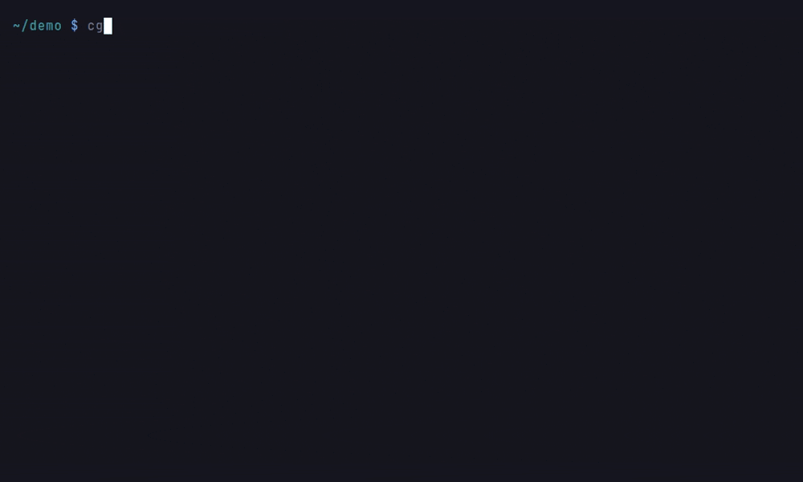
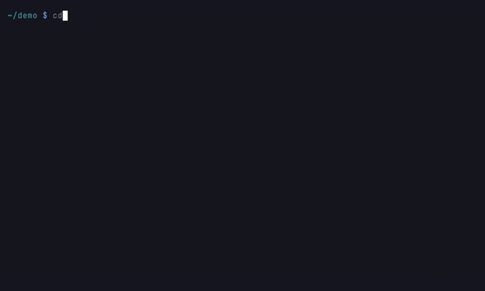

# Security Model

This page documents what users can and cannot expect from code-graph-rag in terms of security: the security requirements, the trust boundaries, the threat model, and the argument for why the requirements are met. Vulnerability reporting is covered by the [security policy](https://github.com/vitali87/code-graph-rag/blob/main/.github/SECURITY.md), and project decision-making by the [governance document](https://github.com/vitali87/code-graph-rag/blob/main/GOVERNANCE.md).

The [incident response plan](../incident-response.md) describes how the project
handles security incidents, compromised releases and recovery communications.

## What the software does

code-graph-rag parses codebases into a knowledge graph stored in a local Memgraph database, optionally embeds code for semantic search in a local Qdrant instance, and answers natural-language questions about the code, either through the interactive CLI agent or through the MCP server.

## Scope, assets and attacker assumptions

This model covers repository indexing, querying, agent tool use, MCP access,
external providers and official release distribution. The default local
deployment assumes a trusted host and operating-system account, not a shared
service for mutually untrusted users.

Assets to protect are:

- Source code, questions, graph and vector data, and source-bearing tool output,
  logs and exports.
- API credentials, MCP tokens, the developer's files and host, and the integrity
  and availability of analysis results.
- Maintainer access, release workflows and the artifacts users install.

Potential attackers include authors of malicious repositories or web content,
unauthorized users who can reach exposed services, and parties who compromise
dependencies, provider services or publishing accounts. A stolen valid token
can give an attacker the same access as its legitimate holder.

Operators must trust their host, configured toolchain executables and selected
providers. The application does not isolate a compromised host or make arbitrary
approved commands safe. Use a restricted environment and network controls when
handling hostile code or confidential repositories.

## Security requirements

These are design requirements, not a claim that every threat is eliminated.
The controls and remaining risks are described below.

1. Tree-sitter indexing must parse repository content rather than intentionally execute it. Paths that invoke language toolchains or preprocessors must be documented.
2. Runtime credentials must be kept out of committed source and graph metadata. This does not imply automatic redaction of secrets already present in analysed files or tool output.
3. The MCP server must not expose the graph or the tools to other hosts unauthenticated.
4. Network paths carrying source code or queries must be documented so operators can choose permitted providers and restrict egress.
5. File-tool path checks, command filtering and approval controls must limit unintended actions. These application-level checks are not an operating-system sandbox.

## Trust boundaries and threat model

The main data flows are repository files into parsers and stores; retrieved
content and questions into agents and configured providers; research queries
out to the configured web-search backend (DuckDuckGo by default, or Serpdive);
tool requests back to the host; and MCP requests from clients into the server. Release automation
is a separate trust boundary between project changes and distributed artifacts.

| Threat | Existing protection | Remaining risk and operator action |
| --- | --- | --- |
| Malicious input exploits a parser or corrupts analysis | Tree-sitter paths parse rather than run the analysed program; XML parsing uses `defusedxml`. | Parser bugs and incorrect results remain possible. Keep dependencies updated and verify security-sensitive conclusions. |
| Repository build logic executes during indexing | C# defaults to Tree-sitter; Roslyn-backed modes require an explicit configuration choice. | Toolchain-backed analysis and preprocessing run with host privileges. Review the modes below and isolate untrusted workloads. |
| Prompt injection steers the agent through repository or web content | CLI web research uses a separate agent with only the search tool; its summary is marked as untrusted data. | The main agent still interprets repository content and research summaries. These measures do not guarantee that it ignores malicious instructions; review proposed actions. |
| Tool use modifies unintended files or executes unwanted commands | File tools validate project paths; default CLI shell execution uses command filtering and approval checks. | Commands are not OS-sandboxed, and YOLO mode relaxes checks. Keep approvals enabled and restrict the account's privileges. |
| Source code, queries or credentials reach an unintended recipient | Provider configuration controls destinations; CLI research/search checks queries against recorded repository content. | Remote inference intentionally sends data, and text matching is not comprehensive data-loss prevention. Audit providers, MCP clients and tool egress; keep secrets out of inputs. |
| Unauthorized access to graph data or privileged MCP tools | New database stacks bind loopback by default; HTTP MCP requires a bearer token for a non-loopback bind. | Old Compose files can remain exposed; loopback is not per-user isolation. Protect remote transport, tokens and host access. |
| Large inputs, queries or tool calls exhaust resources | Shell pipelines, search requests and several toolchain calls have timeouts. | These are not global CPU, memory, disk or request quotas. Apply resource limits and avoid exposing the service to untrusted workloads. |
| Compromised dependencies or publishing access distribute malicious code | Dependency scanning, PyPI trusted publishing, and binary signing/provenance provide detection and traceability. | A compromised authorized build can still produce signed artifacts. Verify provenance and follow the incident response plan for suspect releases. |

### Repository parsing and toolchains

Treat analysed repositories as untrusted input. Tree-sitter parsing does not
intentionally execute the analysed program, but parsers and their native
dependencies can still contain vulnerabilities or consume excessive resources.
Parsing is not a guarantee of safe execution or correct analysis.

Current [frontend defaults](https://github.com/vitali87/code-graph-rag/blob/main/codebase_rag/config.py)
and important external-tool paths include:

- **C/C++:** `CPP_FRONTEND=hybrid` adds libclang parsing when the
  [`cpp` extra and compilation database](../guide/cpp-semantic-mode.md) are
  available. `CPP_FRONTEND=treesitter` disables that layer.
- **C#:** the default is `CSHARP_FRONTEND=treesitter`. Explicitly selecting
  `auto`, `hybrid` or `roslyn` can enable the Roslyn path when the required
  toolchain is available. It runs `dotnet restore`, evaluates MSBuild files and
  can execute source generators with the user's privileges. Keep Tree-sitter
  selected for repositories whose build you do not trust. The .NET CLI is
  invoked with `DOTNET_CLI_TELEMETRY_OPTOUT=1`, which disables .NET CLI
  telemetry only; no network restriction is applied to restore, MSBuild or the
  analysed project's own source generators. When the toolchain is absent the
  mode degrades to Tree-sitter, and the two cases log differently: an explicit
  `hybrid`/`roslyn` that cannot run is logged at WARNING, while an `auto`
  downgrade is logged at INFO, since falling back is what `auto` promises.
  Watching only for WARNING will therefore miss an `auto` downgrade.
- **Go:** `GO_FRONTEND=auto` enables the Go semantic frontend when its toolchain
  is available. `GO_FRONTEND=treesitter` disables it.
- **Java:** `JAVA_FRONTEND=heuristic` is the default; `javac` enables compiler
  analysis. Separately, Lombok preprocessing can run when Java, a Lombok JAR and
  a matching project are found; heuristic mode is not a promise of no subprocesses.

Toolchain subprocesses are not sandboxed and may use the host environment and
network. Review installed tools and preprocessing as well as the selected
frontend. See the [graph schema documentation](graph-schema.md) for the
semantic facts these modes add.

### Graph and vector stores

**The graph and vector stores are local processes bound to loopback by default, but an install predating that change stays exposed.** Memgraph and Qdrant run in local Docker containers managed by `cgr daemon`. A NEWLY rendered compose file binds every published port (7687, 7444, 3000, 6333, 6334) to `127.0.0.1`, closing the drive-by exposure reported in issue [#1012](https://github.com/vitali87/code-graph-rag/issues/1012), the same exposure class as [#808](https://github.com/vitali87/code-graph-rag/issues/808) for the MCP HTTP server.

`~/.cgr/docker-compose.yaml` is rendered once and never overwritten, because it is your file and may carry your edits. An install created before the fix therefore KEEPS its bare `host:container` mappings and continues publishing on every interface; `cgr daemon up` warns about it but does not migrate it. Check for a `127.0.0.1:` prefix on each published port. If it is missing, remediate in this order:

1. `cgr daemon down` to stop the stack
2. delete the file `~/.cgr/docker-compose.yaml`
3. `cgr daemon up` to re-render it with the loopback bind

The order matters: deleting the file while the stack is up achieves nothing, because the running containers keep their old bindings and a later start sees a healthy stack and returns before it would re-render anything. To keep local edits instead, add a `127.0.0.1:` prefix to each published port by hand, then run `cgr daemon down` and `cgr daemon up` to RECREATE the containers. Docker fixes a container's published ports when it is created, so an edited file does not rebind anything until the containers are replaced; `docker restart` is not enough.

Setting `CGR_STACK_BIND_HOST` widens the bind deliberately (for example to `0.0.0.0` to reach the stack from another machine). The bundled Memgraph Bolt, Memgraph Lab, and Qdrant services are UNAUTHENTICATED unless you turn authentication on as described below, so a wider bind, or a stale compose file, exposes the stores without credentials to hosts that can reach those ports. Treat graphs, vectors, exports and backups with the same confidentiality as the code itself. Loopback binding does not prevent access by other local users or processes.

#### Turning on authentication

`cgr daemon up` passes credentials from your settings (the environment or `.env`) to the containers it creates:

- **Memgraph:** set both `MEMGRAPH_USERNAME` and `MEMGRAPH_PASSWORD`. They reach the container as `MEMGRAPH_USER` and `MEMGRAPH_PASSWORD`, and Memgraph creates that user when it starts. From then on every connection must log in, including Memgraph Lab, which asks for the credentials by hand. A username without a password is not passed, because Memgraph turns nothing on for it. The user is stored in the `memgraph_data` volume, so unsetting the variables later does not turn authentication off, and changing `MEMGRAPH_PASSWORD` does not change the stored password. To change it, log in and run `SET PASSWORD FOR <user> TO '<new password>';`, then update `MEMGRAPH_PASSWORD` to match. Until the two match, `cgr daemon up` stops with an error saying Memgraph rejects the configured login. To turn authentication off, unset both variables, recreate the stack, then log in and run `DROP USER <user>;`; with no users left, Memgraph accepts connections without credentials again.
- **Qdrant:** set `QDRANT_API_KEY` and point `QDRANT_URL` at the bundled Qdrant, for example `http://localhost:6333`. When `QDRANT_URL` names the port and an address that Compose publishes the bundled Qdrant on (as `docker compose config` resolves it, so `CGR_STACK_BIND_HOST` and `QDRANT_HTTP_PORT` count wherever they are set), the key reaches the container as `QDRANT__SERVICE__API_KEY`, and every data request needs it, while the `/healthz`, `/livez` and `/readyz` probes stay open. Qdrant does not store the key, so unsetting it and recreating the stack turns authentication off. The bundled stack serves plain `http://`, and code-graph-rag refuses to send a key over plain http unless `QDRANT_ALLOW_INSECURE_API_KEY=true`. Set that only while the ports stay on `127.0.0.1`: over a wider bind the key crosses the network unencrypted. A key for another server, such as Qdrant Cloud or another Qdrant on this machine, is never copied into the local container or sent to it; with `QDRANT_URL` pointing elsewhere, the bundled Qdrant runs without a key, as before.

Containers take these values when they are created, so after setting or changing them run `cgr daemon down` and then `cgr daemon up`. A stack that is already running keeps its old configuration. `cgr daemon up`, `cgr daemon restart` and `cgr start`, whether they find the stack already up or have just started it, stop with an error when a running Memgraph or Qdrant still accepts connections without the configured credentials, or when the running Qdrant does not accept the configured key for writes, because it was started with a different key or knows this one only as its read-only key, instead of carrying on with a stack that does not enforce the settings. A stack they find running, fully or in part, with a service that accepts connections without the credentials is refused before anything is started and left as it is. Any open service found once `docker compose up` has run is therefore one they started, and they stop it (`docker compose stop` for that service, which keeps its container and data), so a failed start never leaves an open store running. The one exception is a service that was running but not answering yet when they checked: if its container is still the one `docker compose ps` listed before `docker compose up`, it is refused but left running, like a stack found already up. When Compose cannot list the containers, the service is stopped. That includes a start that fails or is interrupted before this check, while `docker compose up` runs or while they wait for the services to become ready; the original error is still reported. A service that does not answer yet is asked again for up to 15 seconds, so one that is still initialising is checked too. A protected service is never stopped: neither one that is only slow to start, nor a Qdrant that rejects the configured key, which another key protects. With a Qdrant key configured, they first ask Compose where it publishes Qdrant, so another service on the default port is never checked in its place. `cgr daemon down` keeps the data volumes, so recreating the stack clears the error without losing the graph or the vectors. The check that the running Qdrant accepts the key for writes sends it over plain http, so like the app it runs only with `QDRANT_ALLOW_INSECURE_API_KEY=true`.

Before starting the stack, `cgr daemon up` asks `docker compose config` what each container would receive and refuses to start if that differs from these settings, or if it cannot tell because that command fails. Three things cause a difference:

- **A compose file rendered before this support.** It lacks the `environment` entries that pass the values through. Re-render it with the same three steps as above, or list `MEMGRAPH_USER` and `MEMGRAPH_PASSWORD` under the `memgraph` service's `environment`, and `QDRANT__SERVICE__API_KEY` under the `qdrant` service's, by hand.
- **A value written into the compose file.** It takes precedence over the settings.
- **An `.env` file next to the compose file.** Compose reads it for any of these variables missing from its environment.

#### Vendor telemetry

Both bundled stores report usage to their vendors unless told not to: Memgraph sends the host's CPU and memory profile and the graph's vertex and edge counts, and Qdrant reports to `telemetry.qdrant.io` when it starts. A newly rendered compose file turns both off, with `command: ["--telemetry-enabled=false"]` on the `memgraph` service and `QDRANT__TELEMETRY_DISABLED=true` in the `qdrant` service's `environment` (issue [#2675](https://github.com/vitali87/code-graph-rag/issues/2675)). To share usage data with the vendors, delete the Memgraph line and set the Qdrant variable to `false`.

A compose file rendered before this change keeps telemetry on, like the port bindings above. Re-render it with the same three steps, or add the two settings by hand and recreate the containers with `cgr daemon down` and `cgr daemon up`.

### External providers and data transmission

Application-level data paths include:

- **Model calls:** questions and retrieved context go to the configured model
  providers, including the provider used by the research agent.
- **Embeddings:** local UniXcoder embeddings are the default;
  `CGR_EMBEDDING_PROVIDER=openai` sends code to the configured remote embedding
  service.
- **Web research:** CLI research can send queries to an external search backend.
  DuckDuckGo is the keyless default; Serpdive is configurable. No search API key
  is required for this network path to be available.

The CLI [research boundary](https://github.com/vitali87/code-graph-rag/blob/main/codebase_rag/tools/research.py)
checks queries before calling the research agent, and the search tool checks
again before sending them to its backend. These checks compare against content
recorded by participating repository-read tools in the session.
[Text matching](https://github.com/vitali87/code-graph-rag/blob/main/codebase_rag/taint.py)
does not reliably detect paraphrased, transformed or unrecorded data. It is not
a general secret scanner or a network-wide egress control. The rule is also
not simply "any verbatim quote". A recording is split by its normalised
length: one of 24 characters or more is matched on any verbatim 24-character
window, so a shorter quotation from it passes. A recording under that length
is instead matched only as a COMPLETE value, in either direction, so quoting
such a recording in full is blocked however short it is. That split is why a
common short value cannot refuse every later query that happens to contain it
inside a longer word.

Transport security depends on the endpoints configured rather than on
enforcement here. Requests use httpx with its default certificate
verification, but model and embedding base URLs are accepted as given,
including `http://` ones (the default Ollama URL is plain HTTP to localhost),
and the search client follows redirects without requiring the target to remain
HTTPS. Point remote providers at HTTPS endpoints.

Local inference and embeddings do not by themselves make a session offline.
Research, toolchain dependency downloads, operator-configured remote stores and
executed commands can also use the network. MCP clients may send returned data
to their own providers, outside this server's control. Use trusted destinations,
protected transport and host/network restrictions appropriate to the data.
Environment variables and `.env` configure credentials; they do not prevent
secrets in source files, command output or logs from being exposed.

### MCP access

The [HTTP MCP server](https://github.com/vitali87/code-graph-rag/blob/main/codebase_rag/mcp/server.py)
binds `127.0.0.1` by default and refuses a non-loopback bind without
`MCP_HTTP_AUTH_TOKEN`. When configured, the token is checked even on loopback.
This is a shared bearer credential, not per-user authorization. Authorized
clients can use privileged tools, including file modification and project
deletion; treat client access accordingly.

The server's HTTP configuration does not itself enable TLS. For remote access,
use a trusted TLS-terminating proxy or protected tunnel and restrict direct
access to the backend. A token does not protect plaintext traffic or provide
tenant isolation. Stdio transport instead relies on the launching process's
access and trust in the MCP client.

### Agent tools and untrusted instructions

The CLI can run commands and edit files. Default shell execution uses an
allowlist, dangerous-pattern checks and approval checks; file tools validate
paths against the target project root. YOLO mode relaxes approval and allowlist
checks, while destructive-path screening remains.

Graph queries written by the model are treated as untrusted and must stay
read-only. They are screened as text first: write keywords outside string
literals, and any `CALL` to a procedure outside the read-only allowlist, even
one hidden behind backticks or comments. The engine's own planner then
decides: the query is planned with `EXPLAIN` first and runs only if every
operator in the plan is on a list of known read-only operators and every
procedure it calls is allowed. Anything else, including an operator the list
has never seen or a plan that cannot be read, is refused before it runs. On Neo4j the query also runs in a READ access-mode session,
but the driver documents that mode as routing rather than access control, so
it is not relied on. For defence in depth on a shared or networked database,
connect with a user that has no write privileges for querying. Ingestion and
other built-in writes use fixed queries and are not affected.

Commands run with the host user's privileges and inherited environment.
Working-directory and argument checks are not an OS sandbox. Repository text,
project instructions, tool results and web summaries can influence model
decisions; review approvals rather than treating generated actions as trusted.
The research agent's restricted tool set reduces what web content can directly
steer, but its returned summary still reaches the main agent.

## Controls and evidence

- **Secure development process.** Pull-request CI, linting and regression tests provide evidence for individual changes. [SonarCloud](https://sonarcloud.io/project/overview?id=vitali87_code-graph-rag) reports coverage and static analysis; a passing check or coverage percentage is not proof that a trust boundary cannot be bypassed.
- **Dependency hygiene.** Dependencies are pinned in `uv.lock`, monitored by Dependabot, and scanned by OSV-Scanner in CI.
- **Supply-chain integrity.** Release binaries are signed with Sigstore and, from v0.0.484 onwards, carry SLSA build provenance generated by GitHub Actions; see [verifying release artifacts](../getting-started/installation.md#verify-release-artifacts). The project's [OpenSSF Scorecard](https://scorecard.dev/viewer/?uri=github.com/vitali87/code-graph-rag) is published, and the project holds the [OpenSSF Best Practices badge](https://www.bestpractices.dev/projects/13757).
- **No bespoke cryptography.** The project implements no cryptographic algorithms of its own; TLS and signature verification are delegated to httpx, Sigstore, and the platform.

## What users should not expect

- Toolchain-invoking analysis of a hostile repository is not sandboxed; the toolchain runs with your privileges (see the C# frontend caveat above).
- The local Memgraph and Qdrant containers are unauthenticated services intended for a single user on a trusted machine and network (see issue [#1012](https://github.com/vitali87/code-graph-rag/issues/1012)).
- Prompt-injection filtering, comprehensive secret redaction, multi-tenant isolation and global resource quotas are not guarantees of this application.
- Pre-1.0, the project releases continuously and security-relevant defaults may be tightened in any release; release notes call such changes out.

## Review and maintenance

The maintainer reviews this model when defaults, tools, providers, deployment
exposure or release paths change, and after relevant incidents. Update the
threat, control and residual-risk descriptions together rather than treating a
new safeguard as proof that a threat is eliminated.
