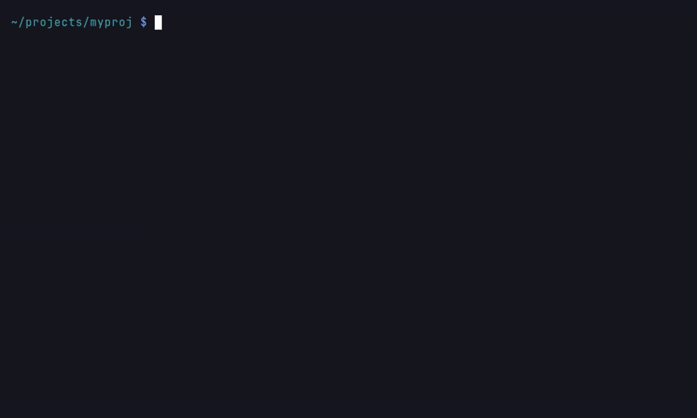

# Structural Delta

An agent that edits code through cgr gets immediate feedback on what the
edit did to the structure of the program (issue #1525). After
`surgical_replace_code`, `write_file` and `structural_replace` (with
`dry_run=false`) the touched files are re-ingested through the
[scoped re-ingest](../guide/mcp-server.md) and a JSON delta is appended to
the tool result. `cgr check --base <ref>` computes the same delta for a
whole working tree, for CI and pre-commit.

## How it is computed

`codebase_rag.structural_delta` is the in-memory twin of
`services/graph_diff.py`, which diffs exported indexes offline. It reads
the touched files' subgraph twice, immediately before and after the
re-ingest, with fixed Cypher queries scoped to the project:

| Read                    | What                                                                    |
|-------------------------|-------------------------------------------------------------------------|
| definitions             | The symbols defined in the touched files, with their declared positional parameters and whole-skeleton fingerprints. |
| sites                   | Every `CALLS` / `REFERENCES` / `INSTANTIATES` edge into or out of the touched files, with the per-site location and argument shape from [edge-site properties](graph-schema.md#edge-site-properties). Callees defined elsewhere are fetched by name so their signatures are known. |
| module imports          | The project's `Module -IMPORTS-> Module` graph.                         |
| named imports           | Every `IMPORTS` edge into or out of a touched module that binds a name (`imported_name`), with the bound name and the statement's position. |

The two snapshots are diffed client-side; one further project-wide linear
read (the duplicate fingerprints) serves the duplicate lookup, and the tests
reaching a changed symbol are found by walking its callers one hop at a time
(`CYPHER_DELTA_CALLERS_OF`). The reads and the re-ingest run under the same
lock as every other MCP graph access, so the delta always describes one
generation of the graph. Measured overhead on top of the re-ingest is
reported per call as `delta_ms`; the benchmark (`benchmarks/bench_reingest.py`)
records it next to the re-ingest itself.

## What it reports

```json
{
  "paths": ["pkg/util.py"],
  "reparsed": ["pkg/util.py"],
  "affected": ["pkg/app.py"],
  "removed_files": [],
  "symbols": {
    "added": [],
    "removed": [],
    "renamed": [{"old": "proj.pkg.util.helper", "new": "proj.pkg.util.assist", "path": "pkg/util.py"}],
    "changed": []
  },
  "dangling_callers": [
    {"caller": "proj.pkg.app.run", "path": "pkg/app.py", "line": 5, "col": 11,
     "target": "proj.pkg.util.helper", "renamed_to": "proj.pkg.util.assist"}
  ],
  "dangling_importers": [
    {"importer": "proj.pkg.app", "path": "pkg/app.py", "line": 1, "col": 0,
     "kind": "import", "name": "helper",
     "target": "proj.pkg.util.helper", "renamed_to": "proj.pkg.util.assist"}
  ],
  "signature_changes": [],
  "convention_changes": [],
  "arity_findings": [],
  "new_duplicates": [],
  "new_import_cycles": [],
  "stale_importers": [],
  "tests_reaching": [
    {"qualified_name": "proj.tests.test_app.test_run", "path": "tests/test_app.py",
     "depth": 2, "through": "proj.pkg.app.run"}
  ],
  "reingest_ms": 41.2,
  "delta_ms": 3.8
}
```

| Field                | Meaning                                                                                           |
|----------------------|---------------------------------------------------------------------------------------------------|
| `symbols.renamed`    | A symbol that disappeared while one with the same whole-skeleton fingerprint appeared in the same file. Paired one-to-one. |
| `symbols.changed`    | A symbol whose skeleton fingerprint, declared positional parameters, decorators or modifiers moved (`@property` added, `static` dropped, a route's `methods=` changed). A change to a literal alone does not register here. |
| `dangling_callers`   | Call sites of a removed or renamed symbol that still name it: every caller in a file that was not part of the edit, and callers in edited files that did not re-bind to the new name. The `line`/`col` are the site's recorded position. |
| `dangling_importers` | Import statements and Python `__all__` entries that still name a removed or renamed symbol (issue #2516): a package `__init__` re-exporting it, say, with no call site to go with the import. `kind` is `import` (the statement's position; `name` is the imported name) or `__all__` (the string entry's position; `name` is the name the module exported it under). An importer the edit did not touch is always listed; one it touched only if it still names the symbol. Nothing is listed while the old module still binds the name, as it does after a move that leaves `from new_home import name` behind. A replacement import is followed to its target, into modules the edit did not touch as well, so one naming nothing there does not count, while a wildcard import of a module that defines the name does; a Python module's assignments are read from its source, and a target outside the project is taken at its word. A string in a comment inside `__all__` exports nothing. |
| `signature_changes`  | Symbols whose positional parameters changed, with every call site and a verdict each, and `remote_callers`: call sites in any project that reach an endpoint the symbol exposes, through a network resource or directly for an RPC or dispatch resource (issue #1603). |
| `convention_changes` | Methods whose decorators or modifiers changed how they are called, with what changed and every call site with a verdict each (issue #3259); see [calling conventions](#calling-conventions). |
| `arity_findings`     | Call sites in the edited files the callee's language rejects: more positional arguments than the callee declares (`too_many`), the only verdict that needs no knowledge of defaults, and, where the signature declares which parameters are optional, fewer than it requires (`too_few`, see [signatures outside Python](#signatures-outside-python)). |
| `new_duplicates`     | New or changed functions whose fingerprint (`exact`) or branch set (`similar`, Jaccard at the duplicates threshold) matches an existing function; `original` is the older one. The duplicate detector's minimum size applies. |
| `new_import_cycles`  | Strongly connected components of the module import graph that contain an edited module and did not exist before the edit. |
| `stale_importers`    | Modules that still import a module every moved symbol left empty. Only a move (a rename across modules) produces one; the `move` operation's contract reads it. |
| `tests_reaching`     | Test functions from which any symbol of the edited files is reachable through the call graph, with the shortest distance and the symbol it is reached through. |

### Arity verdicts

Verdicts use the receiver arithmetic of `crash_correlation.diagnose_arity`:
a method's `self` counts for CPython but is not caller-supplied. That is
Python's rule; the languages whose signatures declare optionality follow
[their own](#signatures-outside-python). The stored Python list ends at `*args`; the definition
header is read back so a variadic callee is never reported as receiving
too many arguments. A `**opts` unpacking at the site supplies keywords
only and adds no positional, so `send(req, **opts)` passes one positional
to `def send(request, **kwargs)`. A `*rest` unpacking adds an unknown
number: the positionals written beside it are a floor, so `too_many` still
holds when they alone exceed the parameters (`one(a, b, *rest)` against
`def one(a)`), and the site reads `unknown` otherwise. `possibly_missing`
means fewer arguments than parameters: the graph does not record
defaults, so this is a hint, not a finding, and does not trip
`--fail-on-found`.

### Signatures outside Python

TypeScript, JavaScript, Go, Rust, PHP, Java and C# definitions store
`positional_params` too (issue #2517): every parameter a call fills, marked
with the optionality the signature declares. `pad?` may be left out (a
TypeScript `?`, any default value), `...rest` takes any number of trailing
arguments (rest, variadic, C# `params`), and `self` (Rust) or `this s` (a C#
extension method) is a receiver that a method call leaves implicit and a
path call (`S::m(s, 1)`, `Util.Ext(s, 1)`) passes. The site's
`call_qualifier` says which form it is written in, and the receiver counts
among the arguments only where the call passes it. A C# name counts as the
extension's class only when it binds no local, parameter, field or property
at the call, so `Util.Ext(1, 2)` on a string named `Util` stays an instance
call. A site whose form cannot be read (a name that is neither, such as an
inherited member) is judged both ways and keeps a verdict only when the two
agree. A TypeScript `this:` parameter, Java's `C this` and Go's receiver
field are never passed and are not listed. Each marker is a receiver only in
its own language: anywhere else a parameter named `self` is an ordinary one,
counted like any other. A change to the list is a signature change, and
each site is judged by the number of arguments it passes:

| Verdict            | When |
|--------------------|------|
| `ok`               | The count fits: every required parameter at least, every parameter at most, any number past a rest parameter, the receiver counted where the call passes it. A surplus is `ok` too where JavaScript is either end of the call or in PHP, both of which drop it at run time. |
| `too_few`          | Fewer arguments than the required parameters, where the language rejects the call: TypeScript, Go, Rust, PHP (`ArgumentCountError`), Java and C#. A finding: it trips `--fail-on-found` as `too_many` does. |
| `too_many`         | More arguments than the parameters, where the language rejects the call: TypeScript, Go, Rust, Java and C#. A finding. |
| `possibly_missing` | Fewer arguments than the required parameters where JavaScript is either end of the call: it passes `undefined`, and nothing type-checks a JavaScript caller. A hint. |
| `unknown`          | The site passes a number of values its arguments do not show (`f(...args)`, `f(...$args)`, `f(xs...)`, Go's `f(pair())` passing every result of `pair`, a tagged template; the edge's `spread_args`), or the edge was bound by name alone (`resolution` `heuristic` or `overload`) and may lead to a same-named function the call never runs. |

Java and C# put a method's parameter types in its qualified name, so a
parameter added, removed or retyped renames the node, and its callers are
reported under `dangling_callers` with `renamed_to`. A change that keeps
the types (a parameter renamed, a C# default added or dropped) is a
signature change as above.

Not read, so their edits never reach `signature_changes`: C and C++ (a
default sits on the header declaration, which the definition need not
repeat), Scala and Dart (named and curried parameter lists), Lua (any count
is accepted) and bodiless TypeScript signatures (an overload, an interface
or abstract member: a call matches one of possibly several). A definition
indexed before these lists existed has none on the base side and is not
compared; the first sync after upgrading re-parses every file, since the
parser changed, and records the lists and every site's `spread_args`.

### Calling conventions

A decorator or modifier can change how every caller must call a method
while its body and parameters stay as they were (issue #3259). Python's
`@property` and `@cached_property`, `@staticmethod` and `@classmethod`; the
JavaScript and TypeScript `get`, `set` and `static`; Java's `static`; and a
TypeScript or Java visibility narrowed below what a caller had. Each such
change is listed in `changes` (`became_accessor`, `no_longer_accessor`,
`became_static`, `no_longer_static`, `became_classmethod`,
`no_longer_classmethod`, `visibility_narrowed`), with `before` and `after`
holding the decorators and modifiers.

Each call site is read back from the caller's source at its recorded
position: whether it calls the member, and what it calls it through. An
instance is `Cart()`, `new Cart()`, Python's `self` or `this` in an instance
method; the class is its own name, Python's `cls`, or `this` in a static
method (and a Java call with no receiver there). A variable, a parameter or
a factory's result may hold either, so a site written through one is
`unknown`. A caller the edit did not touch is judged from the call it
makes, whether the re-bound graph still draws it or not: a Python property
read is a call edge only while it is a property.

| Verdict          | When |
|------------------|------|
| `calls_accessor` | A call of what is now a property or getter (`Cart().total()`): Python calls the value it returns, TypeScript rejects it (TS6234). |
| `reads_method`   | A Python read of what was a property and is now a method: it yields the bound method instead of the value. |
| `needs_instance` | A call through the class of what is now an instance method (`Cart.tax(3)`): TypeScript rejects it (TS2339), JavaScript finds no such member, Java rejects a non-static method from a static context. |
| `needs_class`    | A call through an instance of what is now static, in JavaScript and TypeScript (TS2576). Java allows it, so it reads `ok` there. |
| `rebound`        | A Python call whose receiver is bound where it was not, or no longer bound where it was: `Cart().tax(3)` once `@staticmethod` is gone passes the instance as `x`, and `Cart.make()` once `@classmethod` is gone passes nothing for `cls`. A call through the class of a plain method binds nothing, so `Cart.tax(3)` reads `ok`, and a refactor that drops `self` as it adds `@staticmethod` keeps what each argument fills. |
| `inaccessible`   | A caller outside the class of a member made `private`: in TypeScript any caller outside the class body, in Java a caller in another file. |
| `ok`             | The call is written the way the new convention takes it. |
| `unknown`        | The call's form cannot be read (a receiver held in a variable, a method handed on as a value, two calls of the same name starting where the site does), the parameters moved as well (`signature_changes` judges the count), a member was made `protected` (a subclass keeps it) or Java-`private` with the caller in the same file (a nested class keeps it), or the edge was bound by name alone. |

Every verdict but `ok` and `unknown` is a finding and trips
`--fail-on-found`. A Java member with no visibility modifier is
package-private in a class but public in an interface, which the node does
not say, so it is not compared; neither is a decorator or modifier a node
recorded before they were read back.

## `cgr check`

```bash
cgr check --base origin/main --fail-on-found
```



*`helper` was renamed by hand in `pkg/util.py` only; the report is written to a file and read with `jq`.*

The graph is assumed to reflect `--base` (index there, then edit). Files
that differ between the base and the working tree, untracked files
included, are re-ingested and the delta printed as JSON. With
`--fail-on-found` the command exits 1 when the delta reports dangling
callers, dangling importers, `too_many` arity findings, a call site
written for a calling convention its callee left, new duplicates or new
import cycles.
A project that is not indexed is refused: a scoped re-ingest completes a
graph, it cannot stand in for the first index.

The re-ingest is also what brings the graph up to the working tree, so a
second run on the same edit reports nothing. `--isolated` measures without
keeping the write:

```bash
cgr check --base origin/main --isolated --fail-on-found
```

The subgraph the re-ingest replaces (the changed files' module subtrees and
those of their dependents, the File nodes at those paths, the containers
above them and every relationship touching any of it) is captured inside the
re-ingest's own prologue, so the scope is the updater's rather than a guess
from the diff, and put back once the delta is computed; the hash cache is
restored byte for byte, timestamps included. Nodes the check creates beside
the subtrees (a new file's File node, a new directory's Folder, a new
finding, an ExternalModule for a new import) are removed; a shared node that
already existed is kept even when the check links it, and every node that
outlived the check gets its captured properties back exactly, with any key
the check added removed. A re-ingest that fails after its first write is
rolled back the same way.

What `--isolated` does not promise:

- **The graph changes while the check runs.** The re-ingest writes to the
  shared graph and the restore undoes it afterwards; a reader in between
  sees the check's state.
- **The restore is not one transaction.** It deletes before it re-creates.
  The project's incomplete-run marker is set before the first write and
  cleared only once the restore finishes, so if the restore fails partway
  the marker stays, readers refuse, and the next full update repairs the
  graph.
- **Some graphs are refused.** A capture that enables IO resource links, a
  graph that already holds any, and a hash cache that exists but cannot be
  read are all refused before anything is written, because the restore could
  not undo them.

The capture and restore read the changed files' subgraph plus one
graph-wide scan of the shared ExternalModule and Resource nodes, the same
set the re-ingest's own repo-wide sweeps touch. The delta itself still does
its project-wide reads (the duplicate-fingerprint lookup above), and the
re-ingest still runs its repo-wide cleanup passes.
