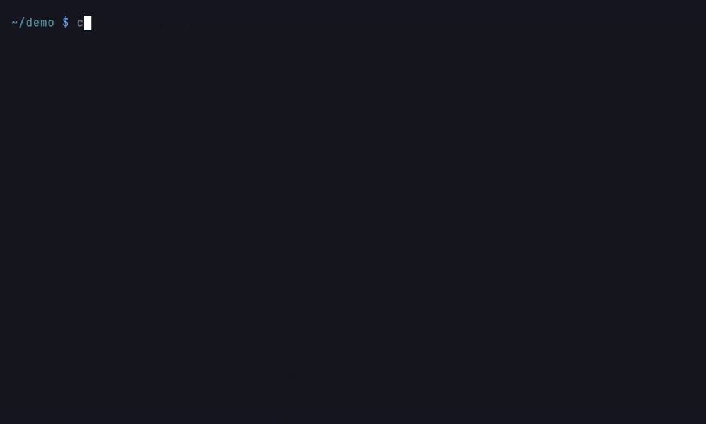
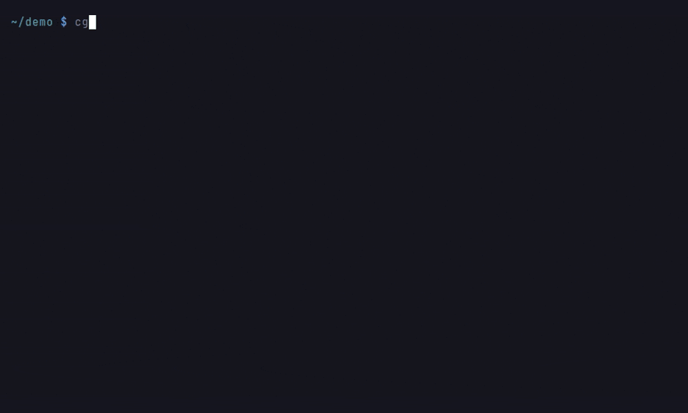
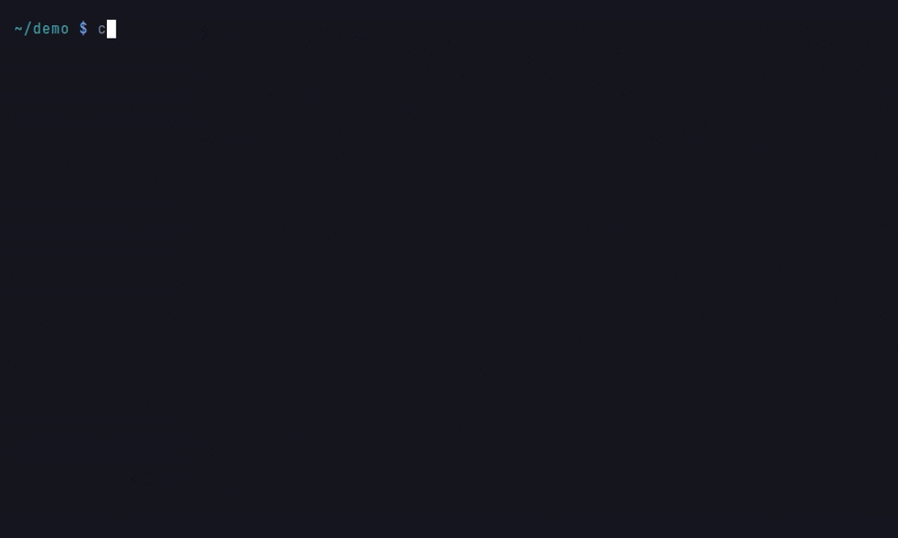
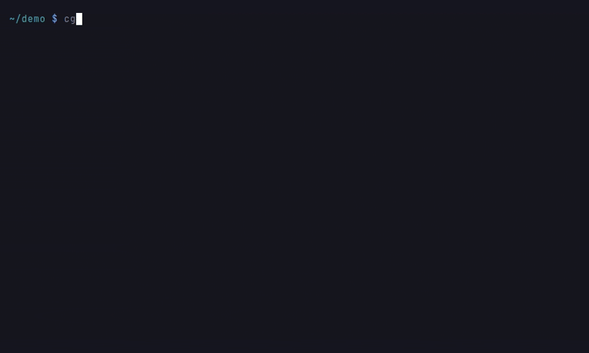
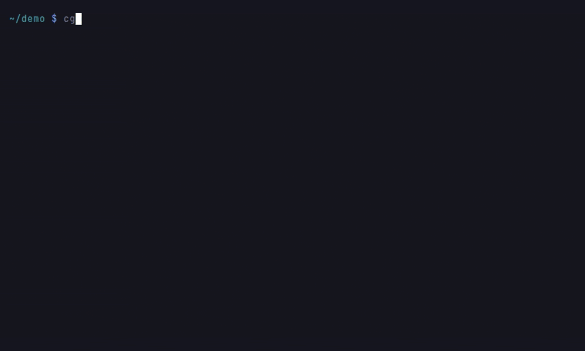
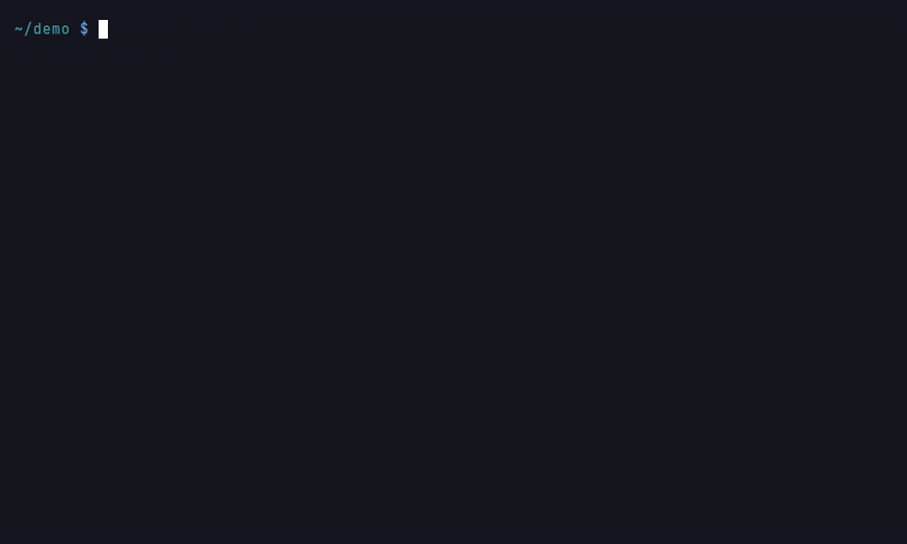
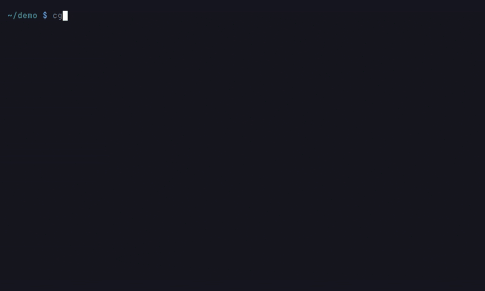

# CLI Reference

The `cgr` command is the main entry point for Code-Graph-RAG.

## Built-in Help

List commands by workflow or show the detailed page for a command:

```bash
cgr help
cgr help start
cgr help daemon logs
```





`cgr COMMAND --help` displays the same command-specific information.

## Command Overview

Every top-level command, from the CLI's own help registry:

<!-- SECTION:cli_commands -->
| Command | Description |
|-------|-----------|
| `cgr start` | Open the code assistant for a repository or workspace |
| `cgr optimize` | Run a language-focused code optimisation session |
| `cgr mcp-server` | Serve cgr tools over stdio or HTTP |
| `cgr index` | Write an offline protobuf index for a repository |
| `cgr export` | Export the shared graph, or chosen projects, to JSON |
| `cgr graph-loader` | Summarise an exported graph JSON file |
| `cgr stats` | Show graph node and relationship counts |
| `cgr dead-code` | Report code that appears unreachable from known entry points |
| `cgr duplicates` | Report structurally duplicated functions and methods |
| `cgr delete-project` | Delete one project without changing other indexed projects |
| `cgr language` | Manage language grammars and parser metadata |
| `cgr daemon` | Manage the shared Memgraph and Qdrant stack |
| `cgr trace` | Ingest runtime call traces as dynamic CALLS edges |
| `cgr edits` | Show or undo recorded edit transactions (multi-file edits applied through cgr). |
| `cgr graph` | Deterministic graph queries (resolve, definition, callers, callees, implementors, overrides, importers, tests-reaching) as JSON, no LLM. |
| `cgr check` | Report the structural delta of the working tree against a git ref: dangling callers and importers, arity findings, new duplicates, new import cycles, tests reaching the edited symbols. |
| `cgr rename` | Rename a definition everywhere the graph references it (definition, call and reference sites, imports, overrides, __all__); refuses on guessed sites. |
| `cgr context` | Print a graph-ranked context slice for a symbol, location or task within a token budget: source, caller lines, callee signatures, types, tests, docs. |
| `cgr workspace` | Manage named groups of repositories |
| `cgr stop` | Stop the shared stack (alias for cgr daemon down) |
| `cgr status` | Show stack state and the last sync time for each project |
| `cgr doctor` | Check dependencies, services, and configuration |
| `cgr help` | Show help for a command |
| `cgr verify-index` | Verify a protobuf index against its provenance manifest |
| `cgr diff-index` | Structural diff between two protobuf index snapshots |
<!-- /SECTION:cli_commands -->

## Core Commands

### `cgr start`

Parse a repository and/or start the interactive query CLI.

```bash
cgr start --repo-path /path/to/repo [OPTIONS]
```


<!-- SECTION:cli_options_start -->
| Option | Description |
|------|-----------|
| `--repo-path` | Repository to open. Defaults to the current directory. |
| `--update-graph` | Parse the repository, sync its graph, then exit without starting the assistant (cgr start already syncs before it starts). Cannot be combined with --ask-agent, --no-sync or --projects. |
| `--clean` | DESTRUCTIVE: Delete every project from the shared graph and clear the selected repository's sync cache. With --update-graph, rebuild after deletion. Asks for confirmation when other projects would be destroyed; use --yes to skip the prompt. |
| `--yes`, `-y` | Answer yes to destructive confirmations, such as the one --clean asks before deleting other projects from the shared graph. |
| `--output`, `-o` | Write this repository's project graph to PATH as JSON. Requires --update-graph. Use cgr export for the whole shared graph. |
| `--orchestrator` | Model for the planning assistant, in provider:model form (for example openai:gpt-5.6-terra or ollama:qwen2.5-coder). |
| `--cypher` | Model used to generate Cypher, in provider:model form. |
| `--no-confirm` | Skip edit confirmation prompts. |
| `--no-instructions` | Do not load ~/.cgr.md or &lt;repo>/.cgr.md into the session prompt. |
| `--batch-size` | Flush to Memgraph after this many buffered nodes or relationships. [x>=1] |
| `--project-name` | Project name to store in the graph. Defaults to the directory name plus a hash of its absolute path (e.g. myrepo__1a2b3c4d); cgr status lists the names already stored. |
| `--exclude` | Exclude paths matching PATTERN from indexing. Repeat the option to add patterns. |
| `--capture` | Capture GROUP on top of the defaults (structure, calls, types, imports). Opt-in groups: io, findings, glosses, parameters, fields, enum_variants, constants. +NAME adds and -NAME drops a GROUP or a relationship type such as OVERRIDES; all or none replaces the selection, so none first captures only what follows (none,structure). Repeatable or comma-separated; later values override CGR_CAPTURE. An unknown group or type is an error. |
| `--interactive-setup` | Choose which detected directories remain included. |
| `--ask-agent`, `-a` | Ask one question, write the answer to stdout, and exit. |
| `--output-format` | Format --ask-agent output as table or json. [default: table] |
| `--no-start-stack` | Do not start the shared stack automatically. |
| `--no-sync` | Do not synchronise the graph before starting the assistant. |
| `--no-embeddings` | Do not generate semantic embeddings during sync. Graph nodes and relationships are still updated. Equivalent env: CGR_SKIP_EMBEDDINGS=1. |
| `--projects` | Limit queries to comma-separated project names. Overrides --project-name; defaults to the selected repository or workspace. |
| `--workspace` | Query every project defined in workspace NAME. |
<!-- /SECTION:cli_options_start -->

`--clean` asks for confirmation before it deletes other projects. When it runs
non-interactively and other projects would be destroyed, or when the existing
projects cannot be listed, it stops unless `--yes` is given.

`-o` writes only this repository's project, scoped the way
`cgr export --project-name` scopes it: what the project owns, the
relationships that start there, the nodes they reach and the links between
the resources it holds.

### `cgr export`

Export the knowledge graph to JSON. Without options the file holds every
project in the shared graph.

```bash
cgr export -o OUTPUT [OPTIONS]
```

<!-- SECTION:cli_options_export -->
| Option | Description |
|------|-----------|
| `--output`, `-o` | Write the exported graph to PATH. [required] |
| `--project-name`, `-n` | Export only this project: what it owns, the relationships that start there, the nodes they reach, and the links between the resources it holds (RESOLVES_TO, FLOWS_TO). Repeatable; without it the whole shared graph is exported. |
| `--workspace` | Export only the projects defined in workspace NAME. |
<!-- /SECTION:cli_options_export -->

A name that is not indexed is an error that lists the projects that are. A
scoped file records its projects under `metadata.projects`. `--batch-size` and
`--json` are deprecated and ignored with a warning; `--no-json` is an error.



### `cgr optimize`

AI-powered codebase optimisation.

```bash
cgr optimize <language> --repo-path /path/to/repo [OPTIONS]
```

<!-- SECTION:cli_options_optimize -->
| Option | Description |
|------|-----------|
| `--repo-path` | Repository to optimise. Defaults to the current directory. |
| `--reference-document` | Reference document to use during optimisation. |
| `--orchestrator` | Model for the planning assistant, in provider:model form (for example openai:gpt-5.6-terra or ollama:qwen2.5-coder). |
| `--cypher` | Model used to generate Cypher, in provider:model form. |
| `--no-confirm` | Skip edit confirmation prompts. |
| `--no-instructions` | Do not load ~/.cgr.md or &lt;repo>/.cgr.md into the session prompt. |
| `--batch-size` | Flush to Memgraph after this many buffered nodes or relationships. [x>=1] |
<!-- /SECTION:cli_options_optimize -->

Supported languages: `python`, `javascript`, `typescript`, `rust`, `go`, `java`, `scala`, `c`, `cpp`

### `cgr stats`

Count the nodes and relationships in the shared graph, by label and type.
Without options the totals cover every indexed project, followed by one line
per project when there is more than one.

```bash
cgr stats [OPTIONS]
```

<!-- SECTION:cli_options_stats -->
| Option | Description |
|------|-----------|
| `--project-name`, `-n` | Count only this project's nodes and relationships. Repeatable; without it the totals cover every project in the shared graph. |
| `--workspace` | Count only the projects defined in workspace NAME. |
<!-- /SECTION:cli_options_stats -->

A project's count covers its containment tree, what it defines, and the
relationships that start there. A name that is not indexed is an error that
lists the projects that are.



### `cgr dead-code`

Report functions and methods unreachable from any entry point (candidates for
review, not a guaranteed delete list). See [Dead Code Detection](dead-code.md).

```bash
cgr dead-code [OPTIONS]
```

<!-- SECTION:cli_options_dead_code -->
| Option | Description |
|------|-----------|
| `--project-name`, `-n` | Project to scan. If omitted, cgr uses the only indexed project. |
| `--entry-point`, `-e` | Mark symbols ending with this qualified-name suffix as entry points. Repeatable. |
| `--decorator-root` | Mark symbols with this decorator as entry points. Extends the built-in set. |
| `--exclude` | Exclude symbols whose file path matches GLOB. The glob must cover the whole repo-relative path ('\*' spans directories) and be quoted ('tests/\*' for a root-level tests directory, '\*/tests/\*' for nested ones) so the shell cannot expand it first. Repeatable. |
| `--include-tests` / `--no-include-tests` | Treat test code as reachable so exercised production code is not reported. [default: include-tests] |
| `--classes` / `--no-classes` | Also report unreachable classes. This can include false positives for types used only by annotations or dynamic lookups. [default: no-classes] |
| `--format` | Report format: table or json. [default: table] |
| `--output`, `-o` | Write the report to this file instead of stdout. |
| `--fail-on-found` | Exit with status 1 when any candidate is found. Useful in CI. |
| `--min-resolution` | Ignore call edges below this confidence when deciding liveness: heuristic &lt; overload &lt; exact &lt; trace_confirmed (dynamic counts as confirmed). |
| `--endpoint-roots` / `--no-endpoint-roots` | Treat a decorator-routed handler (FastAPI, Flask) as reachable by its route decorator alone (default). With --no-endpoint-roots, such a handler is live only if some indexed call site resolves to its endpoint (RESOLVES_TO into it, or a direct READS_FROM/WRITES_TO for RPC and dispatch resources), so an endpoint nobody calls is reported. A handler registered by a call (Go HandleFunc, Express app.get) stays live through that call. [default: endpoint-roots] |
<!-- /SECTION:cli_options_dead_code -->



### `cgr duplicates`

Report groups of structurally duplicated functions and methods (copy-pastes,
including renamed and lightly edited copies). See
[Duplicate Code Detection](duplicates.md).

```bash
cgr duplicates [OPTIONS]
```

<!-- SECTION:cli_options_duplicates -->
| Option | Description |
|------|-----------|
| `--project-name`, `-n` | Project to scan. If omitted, cgr uses the only indexed project. |
| `--threshold` | Minimum branch-overlap similarity for a near-duplicate pair, 0-1. [default: 0.8; 0.0&lt;=x&lt;=1.0] |
| `--min-size` | Minimum skeleton size (tree nodes) for a function to be considered. Filters trivial getters and one-liners. [default: 15; x>=1] |
| `--exact-only` | Report only identical-fingerprint clone groups; skip similarity scoring. |
| `--exclude` | Exclude symbols whose file path matches GLOB. The glob must cover the whole repo-relative path ('\*' spans directories) and be quoted ('tests/\*' for a root-level tests directory, '\*/tests/\*' for nested ones) so the shell cannot expand it first. Repeatable. |
| `--format` | Report format: table or json. [default: table] |
| `--output`, `-o` | Write the report to this file instead of stdout. |
| `--fail-on-found` | Exit with status 1 when any duplicate is found. Useful in CI. |
| `--open` | Open group N's first two members side by side in your editor (CGR_EDITOR picks the editor; CGR_DIFF_COMMAND overrides the command). [x>=1] |
<!-- /SECTION:cli_options_duplicates -->


### `cgr mcp-server`

Serve cgr tools to MCP clients over stdio or HTTP.

```bash
cgr mcp-server
```

<!-- SECTION:cli_options_mcp_server -->
| Option | Description |
|------|-----------|
| `--transport` | Transport to serve: stdio or http. [default: stdio] |
| `--host` | HTTP bind host. Used only with --transport http. |
| `--port` | HTTP bind port. Used only with --transport http. |
| `--workspace` | Serve the projects of workspace NAME: `list_projects` shows them, a `project` argument, when given, must name one (omitted, the server takes the project rooted at its directory, or the workspace's only one), and source is read from each repo's own root. Also read from the MCP_WORKSPACE environment variable. |
<!-- /SECTION:cli_options_mcp_server -->

### `cgr index`

Index a repository to protobuf for offline use.

```bash
cgr index -o ./index-output --repo-path ./my-project
```

<!-- SECTION:cli_options_index -->
| Option | Description |
|------|-----------|
| `--repo-path` | Repository to index. Defaults to the current directory. |
| `--output-proto-dir`, `-o` | Write protobuf index files under DIRECTORY. [required] |
| `--split-index` | Write separate nodes.bin and relationships.bin files. |
| `--exclude` | Exclude paths matching PATTERN from indexing. Repeat the option to add patterns. |
| `--capture` | Capture GROUP on top of the defaults (structure, calls, types, imports). Opt-in groups: io, findings, glosses, parameters, fields, enum_variants, constants. +NAME adds and -NAME drops a GROUP or a relationship type such as OVERRIDES; all or none replaces the selection, so none first captures only what follows (none,structure). Repeatable or comma-separated; later values override CGR_CAPTURE. An unknown group or type is an error. |
| `--interactive-setup` | Choose which detected directories remain included. |
<!-- /SECTION:cli_options_index -->



### `cgr doctor`

Check that the services, credentials and tools a session needs are in place.

```bash
cgr doctor
```



It reports, one line per check: the Docker daemon; a connection to the configured graph engine (and, when reachable, the graph's structural integrity); the orchestrator and Cypher models: for a key-based provider, whether its credentials pass the rule `cgr start` applies (reported as "credentials present", with no network call); for a local Ollama model, whether Ollama answers at `OLLAMA_BASE_URL` and has the model pulled (reported as "ready", "not reachable" or "not pulled", with the `ollama pull` command to run); and ripgrep. The exit status is 1 when any check fails. On a terminal that cannot display `✓`/`✗` the marks are printed as `PASS`/`FAIL`.

### `cgr language`

Manage language support.

```bash
cgr language add-grammar <language-name>
cgr language add-grammar --grammar-url <url>
cgr language list-languages
cgr language list-languages --verbose
cgr language remove-language <language-name>
cgr language cleanup-orphaned-modules
```

`list-languages` prints one row per language across all three parsing tiers: its name, file extensions, tier (`tree-sitter`, `ast-grep` or `document`), level of support (`full`, `in development`, `structural` or `headings`) and whether this install can parse it. A language marked `no` needs its extra, which the command names below the table. A second table shows the optional semantic frontends (libclang, go/types, Roslyn, javac, Jedi): whether each toolchain is found, the setting that selects it, and whether indexing will use it. The language name and extensions are never truncated, including in piped output. `--verbose` adds the tree-sitter node types each language maps to functions, classes, modules and calls.


`add-grammar`, `remove-language` and `cleanup-orphaned-modules` are contributor tools: they edit the code-graph-rag source checkout the running `cgr` comes from, never the current directory. An installed `cgr` (PyPI, `pipx`, `uv tool install`) refuses them with a non-zero exit and changes nothing; clone the repository and run them there. See [Adding Languages](../advanced/adding-languages.md).

### `cgr graph`

Deterministic graph queries, printed as JSON, with no LLM in the path.

```bash
cgr graph resolve helper
cgr graph callers myrepo__1a2b3c4d.pkg.util.helper --depth 2
cgr graph tests-reaching myrepo__1a2b3c4d.pkg.util.helper --project myrepo__1a2b3c4d
```

The project is `--project`, or else the one `--repo-path` (default `.`) was
indexed as. The exit status tells an empty answer apart from a question the
graph cannot answer, and a refusal prints nothing on stdout:

| Status | Meaning |
|--------|---------|
| `0` | The JSON answer. `[]` means the name is in the graph and nothing matches it. |
| `3` | The project is not indexed, or, without `--project`, the directory was never indexed. The message on stderr names close matches. |
| `4` | `callers`, `callees`, `implementors`, `overrides`, `importers` or `tests-reaching` was given a qualified name the graph does not hold. The message names close matches, or points at `cgr graph resolve`. |

`resolve` answers `[]` when no name matches, and `definition` answers
`{"found": false, ...}` for a qualified name it does not find; neither exits
with `4`.

## Makefile Commands

<!-- SECTION:makefile_commands -->
| Command | Description |
|-------|-----------|
| `make help` | Show this help message |
| `make all` | Install everything for full development environment (deps, grammars, hooks, tests) |
| `make install` | Install project dependencies with full language support |
| `make python` | Install project dependencies for Python only |
| `make dev` | Setup development environment (install deps + pre-commit hooks) |
| `make test` | Run unit tests only (fast, no Docker) |
| `make test-parallel` | Run unit tests in parallel (fast, no Docker) |
| `make test-integration` | Run integration tests (requires Docker) |
| `make test-all` | Run all tests including integration and e2e (requires Docker) |
| `make test-parallel-all` | Run all tests in parallel including integration and e2e (requires Docker) |
| `make clean` | Clean up build artifacts and cache |
| `make build-grammars` | Build grammar submodules |
| `make watch` | Watch repository for changes and update graph in real-time |
| `make readme` | Regenerate README.md from codebase |
| `make lint` | Run ruff check |
| `make format` | Run ruff format |
| `make typecheck` | Run type checking with ty |
| `make check` | Run all checks: lint, typecheck, test |
| `make release` | Build, verify, and publish the current pyproject version to PyPI, then tag and create a GitHub Release |
| `make jvm-agent` | Build the JVM runtime tracing agent (requires JDK 24+) |
| `make pre-commit` | Run all pre-commit checks locally (comprehensive test before commit) |
<!-- /SECTION:makefile_commands -->
