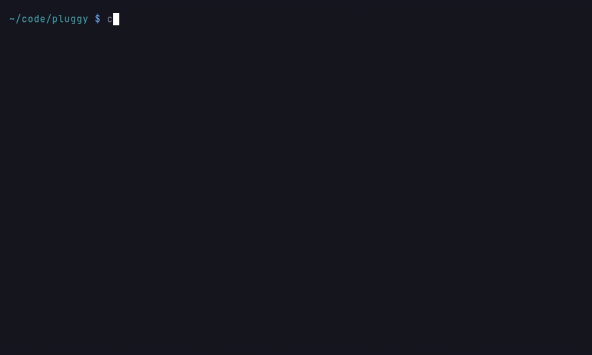
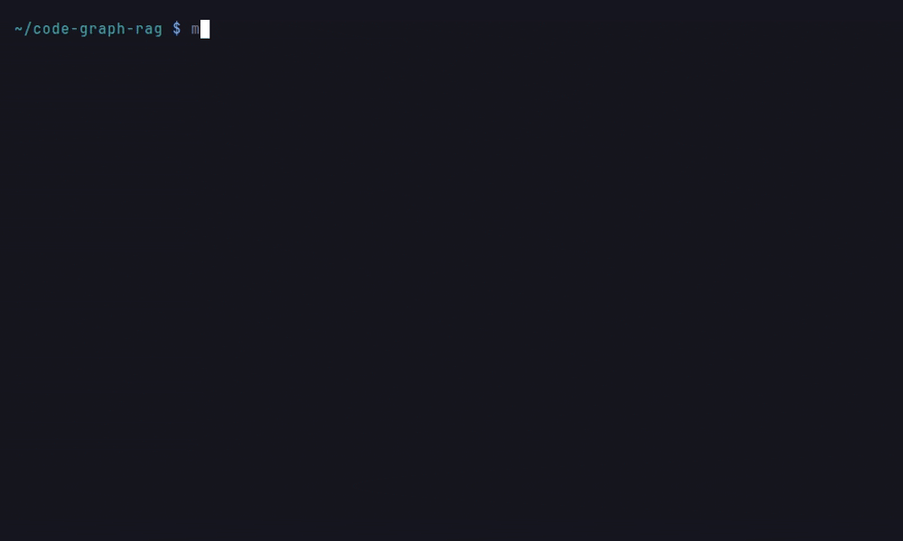
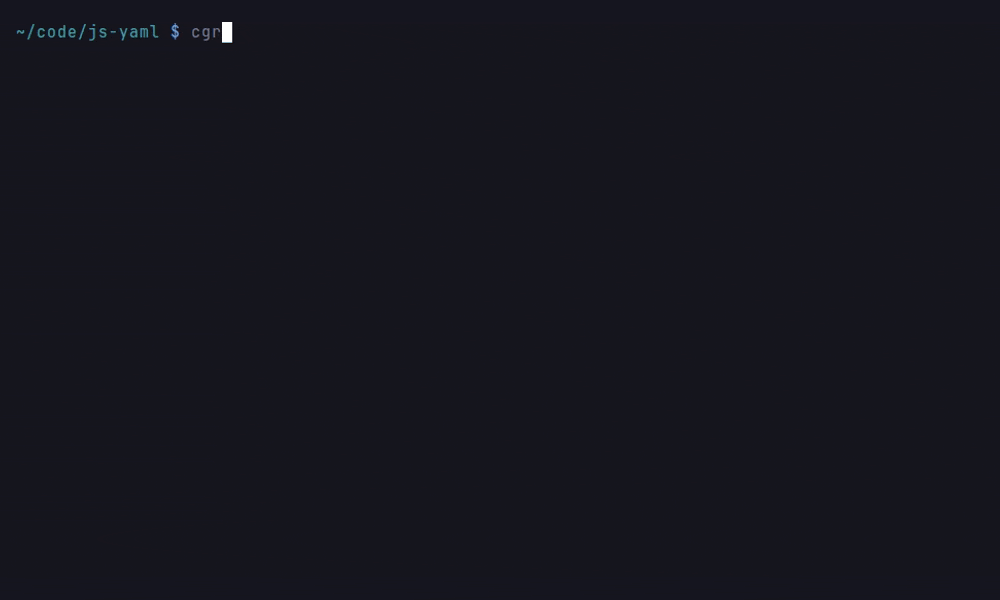
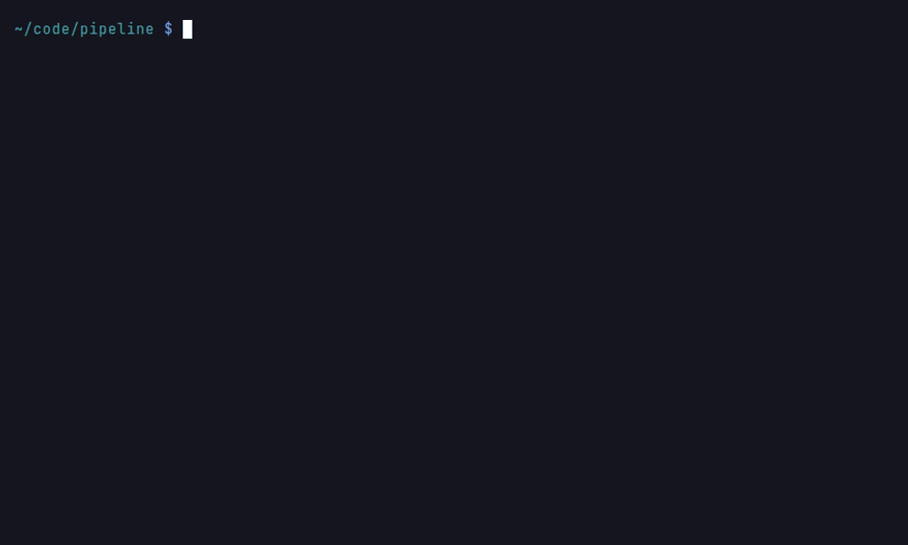
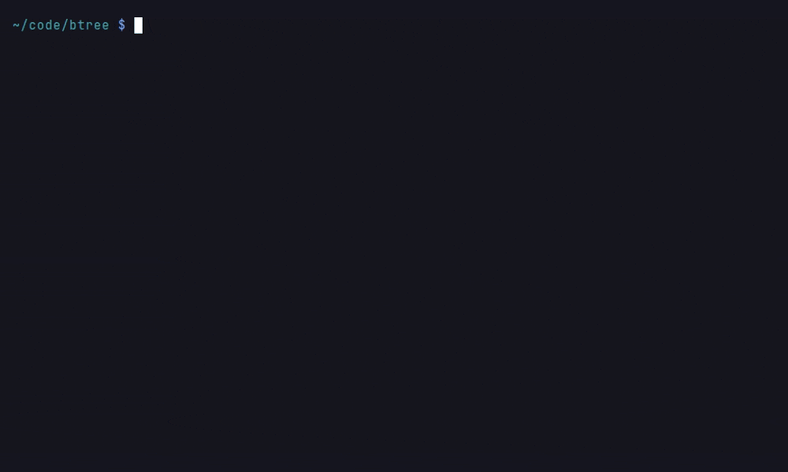
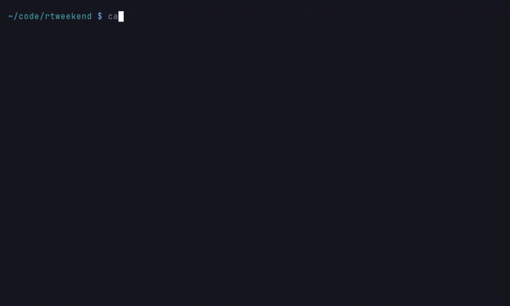
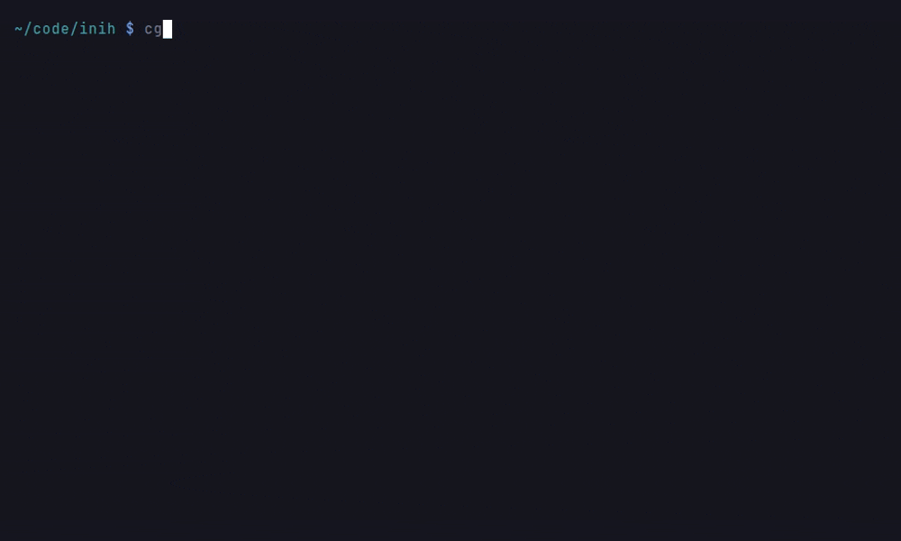
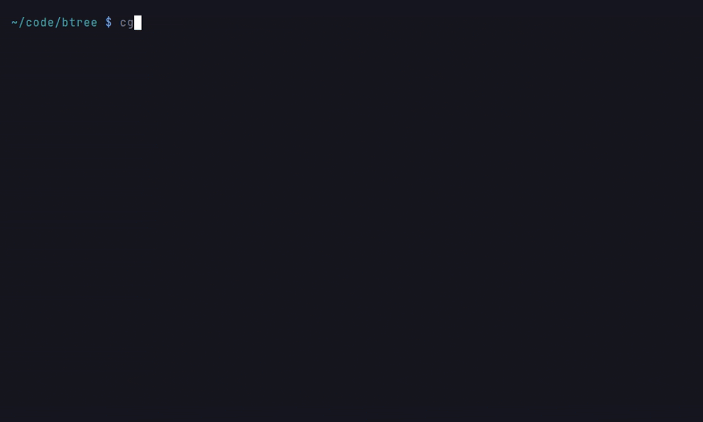

# Dynamic Call Tracing

Static analysis cannot see every call: dispatch through registries, `getattr`
lookups, callbacks routed by frameworks, and monkey-patched targets only exist
at runtime. Dynamic tracing runs your code (typically the test suite), records
which functions actually called which, and merges those observations into the
graph alongside the statically derived `CALLS` edges.

Currently supported runtimes: **Python** (3.12+, via `sys.monitoring`),
**Java/Scala** (zero-dependency `java.lang.instrument` agent, JDK 24+),
**Node.js** (V8 cpuprofile conversion), **.NET** (dotnet-trace speedscope
conversion), **PHP** (Xdebug trace conversion), **Lua** (a pure-Lua
`debug.sethook` agent), **Dart** (a VM Service sample collector),
**Go** (pprof CPU-profile conversion), **C/C++** (a
`-finstrument-functions` shim), and **Rust** (pprof-rs CPU-profile
conversion). For production fleets, an **eBPF continuous profiler** (Parca,
Pyroscope, OpenTelemetry, `perf`) can be ingested through the same pprof door
(`--format ebpf`). All per-runtime tracers landed under
[issue #1244](https://github.com/vitali87/code-graph-rag/issues/1244).

## Recording a trace

The `cgr` package ships a pytest plugin. It runs inside your test process, so
`code-graph-rag` must be importable by the pytest that runs your tests. The
`uv tool install` or `pipx install` from the installation guide keeps cgr in an
environment of its own, which your project's pytest cannot see: run as is,
`pytest --cgr-trace` stops with `error: unrecognized arguments: --cgr-trace`.
Add the package to the test run instead:

```bash
cd /path/to/your-repo
# a uv-managed project: overlay the package for this run only
uv run --with code-graph-rag pytest --cgr-trace
```

In any other virtual environment, install it into the project's test
environment once (`pip install code-graph-rag`), then enable the plugin, which
is inert until you do:

```bash
pytest --cgr-trace
```




*Recorded on pytest-dev/pluggy, with code-graph-rag installed in the project's test environment.*

The overlay leaves the project's dependencies untouched; installing the package
adds cgr's own dependencies (pydantic-ai and the rest) to the test
environment. The `cgr trace ingest` step below runs with the `cgr` you already
have on your PATH.

This writes `cgr-trace.jsonl` (override with `--cgr-trace-output PATH`). Each
test's node id is attached to the calls it triggered, so an edge in the graph
can tell you *which tests* exercise it. Tracing is scoped to files under the
pytest root; pass `--cgr-trace-repo PATH` if your repository root differs.

Under `pytest-xdist` each worker traces its own interpreter and writes its own
file with the worker id in the name (`cgr-trace-gw0.jsonl`, ...); ingest each
file to cover the whole run. Within one process, workload attribution is
best-effort for multi-threaded code: calls made by background threads are
attributed to the test the main thread was running.

Any other workload can be traced programmatically:

```python
from pathlib import Path
from codebase_rag.trace.tracer import CallGraphTracer

tracer = CallGraphTracer(Path("/path/to/your-repo"))
tracer.start()
try:
    run_your_workload()
finally:
    tracer.stop()
tracer.write(Path("cgr-trace.jsonl"))
```

## Recording a JVM trace (Java, Scala)

Build the agent once (requires a JDK with the `java.lang.classfile` API,
i.e. JDK 24+; the agent itself has no dependencies). Its source ships with
cgr, and `cgr trace agent jvm` prints where:

```bash
AGENT="$(cgr trace agent jvm)"
javac --release 24 -d cgr-jvm-agent "$AGENT"/src/cgr/trace/*.java
jar cfm cgr-jvm-agent.jar "$AGENT/MANIFEST.MF" -C cgr-jvm-agent .
```

Attach the `cgr-jvm-agent.jar` that built to any JVM workload, most usefully
a test run (give its absolute path when the workload runs elsewhere):

```bash
java -javaagent:./cgr-jvm-agent.jar="include=com.example;repo=/path/to/your-repo" ...
# Maven:  MAVEN_OPTS='-javaagent:...' mvn test
# Gradle: add the same -javaagent flag to test { jvmArgs ... }
```




*Recorded on munificent/craftinginterpreters (jlox) with OpenJDK 25, indexed with `--exclude note`.*

Agent arguments are semicolon-separated `key=value` pairs:

| Argument | Meaning |
|---|---|
| `include=com.example,org.acme` | Package prefixes to instrument (required). Both endpoints of an edge must match; the JDK and third-party code are never instrumented. |
| `output=cgr-trace.jsonl` | Trace file path (written on JVM exit). |
| `repo=/abs/path` | Repository root recorded in the trace header. |
| `workload=label` | Workload label for the run. Tests can refine it per case with `cgr.trace.TraceRecorder.setWorkload(...)`, which labels the calling thread and threads it spawns afterwards, so concurrent runners keep separate provenance. |

The agent instruments method entry and recovers the caller by walking the
stack to the nearest project frame, seeing through JDK internals,
lambda-metafactory classes, and generated proxies. That is deliberate: an
edge like `list.forEach(this::handle)` or a call through a DI proxy is
attributed to the code that initiated it, which is exactly the relationship
static analysis cannot see. Concrete receiver classes are sampled on
virtual and interface calls, so the graph records which implementation
actually handled a dispatch.

## Recording a Node.js trace (JavaScript, TypeScript)

No agent is needed: V8's built-in sampling profiler already records observed
call stacks, and Node ships it behind one flag. Run any workload (a test
run, a server under load, a script) with profiling on, then convert the
profile:

```bash
node --cpu-prof --cpu-prof-name=run.cpuprofile app.js
cgr trace convert run.cpuprofile --repo-path /path/to/your-repo --workload smoke
cgr trace ingest cgr-trace.jsonl --repo-path /path/to/your-repo
```




*Recorded on nodeca/js-yaml; `app.js` loads and dumps the repository's 7 MB benchmark document.*

Parent/child links in the profile are caller/callee relationships the
sampler actually observed, so dispatch through registries, event emitters,
and dynamic `import()` shows up whenever samples landed there. Two caveats
distinguish this from the instrumented Python and JVM tracers:

- **Sampling.** Short-lived calls can be missed entirely, and
  `dynamic_call_count` holds sample counts (relative weight), not call
  counts. Lower `--cpu-prof-interval` (microseconds, default 1000) to
  tighten coverage at the cost of larger profiles.
- **Transpiled output.** Frames point at the JavaScript that executed. Enable
  source maps in your build (`tsc --sourceMap`; the equivalent option for your
  bundler, whose default varies by tool and mode) and the converter follows each
  generated file's `sourceMappingURL` to its `.js.map` and relocates every frame
  back to its original TypeScript/JavaScript position, so a project built to
  `dist/` still resolves to the indexed `src/*.ts` nodes. Without source maps,
  or for a generated position that has no mapping (runtime glue, an occasional
  module wrapper), the frame keeps its generated `dist/*.js` location; keep the
  `.js.map` beside the `.js` so the converter can find it.
- **Resolution reporting.** Conversion logs a source-map resolution rate over
  the project frames it kept (for example `source-map resolution: 42/50 project
  frames resolved to source (84%)`) and categorises the misses so coverage gaps
  are visible rather than silent: `no_map` (no map referenced or found beside the
  file), `uncovered` (a map loaded but no segment covers the position), and
  `malformed` (a map file was found but could not be parsed). A low rate with
  many `no_map` misses usually means source maps are off in the build; `malformed`
  points at a broken emit.

## Recording a .NET trace (C#)

No agent is needed: the CLR's EventPipe sampler ships with the runtime, and
`dotnet-trace` (a standard global tool) drives it:

```bash
dotnet tool install --global dotnet-trace
dotnet-trace collect --output run.nettrace -- dotnet bin/Release/net10.0/MyApp.dll
dotnet-trace convert run.nettrace --format speedscope --output run
cgr trace convert run.speedscope.json --include MyApp --workload smoke
cgr trace ingest cgr-trace.jsonl --repo-path /path/to/your-repo
```

To trace a **test run**, point the collector at a test assembly that executes
its tests in-process (an xUnit v3 assembly runs as a plain executable:
`dotnet-trace collect -- dotnet bin/Release/net8.0/MyTests.dll`). Do not wrap
`dotnet test`: it forks a `testhost` child process that the single-process
sampler does not follow, so the test code's frames never appear. A DI- or
reflection-resolved implementation (`IServiceCollection`, `Activator.CreateInstance`)
is the runtime-only edge that static analysis cannot resolve; because the sample
records the concrete method on the stack, an interface call lands on the concrete
implementation (`Worker.Dispatch -> Dog.Speak`), so the implementation that
actually ran is observed. The exact receiver type or object is not recoverable
from samples (see the caveat below); the concrete implementation frame is what
the dispatch resolves to.

.NET frames carry no file paths, so scoping uses `--include` namespace
prefixes instead of the repository root, and resolution joins on the
namespace-bearing qualified names the static tier stores. CLR name mangling
is handled: async state machines (`Worker+<RunAsync>d__3.MoveNext`) resolve
to the source method, display-class lambdas to their enclosing method, local
functions (`<Run>g__Local|0_0`) to the `Run.Local` node nested under the
hosting method, `.ctor` to the constructor node, `get_`/`set_` accessors to the
property node, and nested-class `+` to dotted nesting. Two caveats:

- **Sampling.** Edge counts reflect observed activations in the flame
  chart, not exact call counts; very short calls between samples can be
  missed. Receiver types on interface dispatch are not observable from
  samples; the dispatch itself still appears because the concrete
  implementation's frames are recorded (an instrumented profiler-based
  tracer is the planned follow-up for receiver capture).
- **Overloads.** Runtime argument types (CLR names) cannot be matched to
  the graph's source-text signatures, so all overloads of a name collapse
  onto one deterministic node.
- **Overhead.** EventPipe sampling is cheap: measured at roughly 1.7x
  wall-clock on a short CPU-bound run (most of which is `dotnet-trace`'s
  fixed session startup), and the per-work cost is a stack sample about every
  millisecond, so it stays roughly constant regardless of call volume rather
  than scaling with it like the exact per-call tracers.

## Recording a PHP trace

Xdebug's function tracing records every call exactly (no sampling), with
the concrete receiver class resolved through variable calls,
`call_user_func`, and magic methods:

```bash
php -d xdebug.mode=trace -d xdebug.start_with_request=yes \
    -d xdebug.trace_format=1 -d xdebug.output_dir=. \
    -d xdebug.trace_output_name=run vendor/bin/phpunit
cgr trace convert run.xt --workload phpunit
cgr trace ingest cgr-trace.jsonl --repo-path /path/to/your-repo
```




*Recorded on thephpleague/pipeline (PHP 8.3, Xdebug 3.2) with a minimal `phpunit.xml.dist` pointing at `src`.*

Counts are true invocation counts. Xdebug reports call sites rather than
where functions are defined, so the converter recovers each function's
defining file from its own calls' positions; PHP qualified names are
path-derived (the namespace declaration is not part of them), and
resolution is span-first on those recovered positions. Leaf functions that
never call anything resolve by their `Class::method` name tail instead;
when several declarations share that tail, the frame is counted as
`unresolved[ambiguous]` rather than guessed.
Closures resolve through the file and line range embedded in their runtime
name. Instance calls (`$obj->method()`) record the concrete runtime class as
the edge's `dynamic_receiver_types`, so a dispatch through an interface or base
type shows which implementation ran; static calls (`Class::method()`) are not
dynamic dispatch and carry none. A trait method called on the using class is
observed under that class (`UsingClass->method`); it resolves by span when its
defining position is recovered, but a leaf trait method that makes no calls
falls back to the name tail and may be counted `unresolved`. Calls through
`__call` attribute to the magic method itself, since the graph has no notion of
the proxied target. Tracing overhead is significant (Xdebug records every call):
measured at roughly 15-20x wall-clock on a CPU-bound loop (about 17x on 1.2M
calls, PHP 8.3 with Xdebug 3), and the machine-readable trace grows by roughly
150 bytes per call, so a busy suite can produce a multi-hundred-megabyte file.
It is meant for test runs, not production; scope tracing to the suite you need
and convert one process at a time.

## Recording a Lua trace

The agent is a single dependency-free Lua module (`cgr_trace.lua`, which
ships with cgr; `cgr trace agent lua` prints where) built on `debug.sethook`;
it records every call exactly and writes the interchange format directly,
so no `cgr trace convert` step is needed:

```bash
export CGR_TRACE_REPO=/path/to/your-repo CGR_TRACE_WORKLOAD=busted
export LUA_PATH="$(dirname "$(cgr trace agent lua)")/?.lua;;"
lua -l cgr_trace main.lua
cgr trace ingest cgr-trace.jsonl --repo-path /path/to/your-repo
```

`CGR_TRACE_OUTPUT` overrides the output path. Functions dispatched through
tables or metatables have no runtime name; they are recorded by definition
site and resolved by line span, which is exactly how Lua's dynamic dispatch
becomes visible in the graph. Caveats: tail calls (`return f()`) replace
the calling frame, so the edge attributes to the tail-caller's parent;
C-function boundaries (`pcall`, `table.sort` comparators) are seen through
to the nearest Lua caller; under LuaJIT the hook disables JIT compilation
on traced paths and the module's `write()` must be called explicitly at
exit (plain tables have no `__gc` there).

## Recording a Dart trace

A small Dart tool that ships with cgr (`cgr trace agent dart` prints its
directory; one `vm_service` dependency fetched with `dart pub get`) runs the
target under
the VM's own sampling profiler, pulls the CPU samples over the VM Service
protocol when the program pauses at exit, and writes the interchange
format directly:

```bash
# once: `dart pub get` writes beside the tool, so work on a copy
cp -r "$(cgr trace agent dart)" ~/cgr-dart-collector
cd ~/cgr-dart-collector && dart pub get
dart bin/cgr_trace_collect.dart --repo /path/to/your-repo \
    --workload smoke -- /path/to/your-repo/main.dart
cgr trace ingest cgr-trace.jsonl --repo-path /path/to/your-repo
```

Sampled stacks make dispatch through function values, callbacks, and
`dynamic`-typed calls visible; counts are sample counts, not call counts,
so give workloads enough CPU time for the sampler to observe them.
Closures and async continuations surface as `<anonymous>` frames and
resolve to their enclosing declaration by line span (the static tier
creates no closure nodes). Extension methods (`Ext|method`) and setter
names (`value=`) are normalized to their source spellings.

To trace a test suite, point the collector at a `package:test` file directly
(`dart bin/cgr_trace_collect.dart --repo ... -- test/foo_test.dart`): running the
file executes its tests in-process, which the collector samples. Do not wrap
`dart test` itself, which forks an isolate per file that the single VM Service
attach cannot follow. Running a file this way does not load the full `package:test`
runner, so runner-dependent features (tags, sharding, custom reporters,
platform selectors) are unavailable; it suits straightforward unit tests whose
bodies run on invocation.

## Recording a Go trace

Go's own profiler does the capture; `go test` exposes it directly, and the
converter reads the pprof protobuf without dependencies:

```bash
go test -cpuprofile cpu.out -gcflags=all=-l ./mypkg
cgr trace convert cpu.out --repo-path /path/to/your-repo --workload go-test
cgr trace ingest cgr-trace.jsonl --repo-path /path/to/your-repo
```




*Recorded on google/btree, whose tests live in the root package (`.`).*

Name one package (`./mypkg`), not `./...`: `go test` runs each package's
test binary from that package's own source directory, so `./...` scatters a
separate relative `cpu.out` into every package and the converter reads only
one. Trace a single package per run, or convert each generated profile.

Sampled stacks make dispatch through interface values and function values
visible; counts are sample counts, so give workloads enough CPU time.
`-gcflags=all=-l` disables inlining for the traced build — without it,
inlined callees vanish from the profile entirely; the flag costs some
runtime speed but preserves edges, which is the right trade for a traced
test run. Compiler-generated closure symbols (`runAll.func1`) resolve to
their enclosing declaration by span; receivers and generic instantiations
are stripped from names, with declaration-line spans carrying identity.
Frames from the Go runtime, the standard library, and `vendor/` are seen
through to the nearest project frame.

## Recording a Rust trace

Rust has no runtime instrumentation hook, and static analysis already resolves
monomorphised calls, so the dynamic payoff is narrower but real: `dyn Trait`
dispatch, function pointers, and closures routed across boundaries.
[`pprof-rs`](https://crates.io/crates/pprof) samples the process and writes a
pprof protobuf, the same format as Go's, so `--language rust` selects the Rust
demangler (`cgr trace convert` reads the profile whether or not it is gzipped):

```toml
# Cargo.toml
[dependencies]
pprof = { version = "0.13", features = ["protobuf-codec"] }

# Trace a release build with symbols kept: pprof-rs's sampler can trip a
# debug-assertion (a slice-alignment check) in a dev build on recent
# toolchains, so profile the release profile with debug info on.
[profile.release]
debug = true
```

```rust
// In a small harness (or a `--release` integration test) that runs the workload:
use pprof::protos::Message; // brings write_to_writer into scope

let guard = pprof::ProfilerGuard::new(250).unwrap();
run_the_workload();
if let Ok(report) = guard.report().build() {
    let profile = report.pprof().unwrap();
    let mut file = std::fs::File::create("cpu.pb").unwrap();
    profile.write_to_writer(&mut file).unwrap();
}
```

```bash
cargo run --release       # runs the harness above, writing cpu.pb
cgr trace convert cpu.pb --language rust \
    --repo-path /path/to/your-repo --workload cargo
cgr trace ingest cgr-trace.jsonl --repo-path /path/to/your-repo
```




*Recorded on fralken/ray-tracing-in-one-weekend with the harness above wrapped around its renderer.*

Sampled stacks make `dyn Trait` dispatch and calls through function pointers
visible; counts are sample counts, so give the workload enough CPU time. An
optimized build inlines small functions and turns a pass-through wrapper
(`fn f(a) { a.method() }`) into a tail call whose frame the sampler never sees;
mark functions you want as distinct frames `#[inline(never)]`, and keep work
after the call so the callee is not in tail position. The
demangler strips the legacy `::h` symbol hash, collapses
generic instantiations and trait-qualified receivers
(`<Dog as Animal>::speak`) to their bare member, and marks closures
(`{{closure}}`) anonymous; monomorphised instances resolve to their single
generic source definition by declaration-line span. Frames from the standard
library, the cargo registry, and `target/` are seen through to the nearest
project frame.

## Recording a C or C++ trace

A single-file shim (`cgr_trace_shim.c`, which ships with cgr; `cgr trace
agent c` prints where; no dependencies beyond pthreads) rides the compiler's own instrumentation and
records **every call exactly**:

For a **C** project, compile the sources and the shim together:

```bash
cc -pthread -finstrument-functions -g -O0 your_sources... \
   "$(cgr trace agent c)" -o app
./app        # writes cgr-trace.addrs (override with CGR_TRACE_ADDRS)
cgr trace convert cgr-trace.addrs --repo-path /path/to/your-repo --workload smoke
cgr trace ingest cgr-trace.jsonl --repo-path /path/to/your-repo
```




*Recorded on benhoyt/inih (`examples/ini_dump.c`).*

For a **C++** project, compile the shim with the C compiler (it is C, and a
C++ driver would compile the `.c` file as C++ and fail) and link the
instrumented C++ objects with the C++ driver; only the C++ translation units
carry `-finstrument-functions`:

```bash
cc  -pthread -c "$(cgr trace agent c)" -o cgr_shim.o
c++ -pthread -finstrument-functions -g -O0 -c your_sources... # -> *.o
c++ -pthread your_objects... cgr_shim.o -o app
```

In CMake, add the `cgr_trace_shim.c` that `cgr trace agent c` prints to the
target's sources (CMake compiles a
`.c` file with the C compiler on its own), set `-finstrument-functions -g -O0`
on the traced build type, and link pthreads (the shim uses
`pthread_mutex_*`/`pthread_once`):

```cmake
find_package(Threads REQUIRED)
target_compile_options(app PRIVATE -finstrument-functions -g -O0)
target_link_libraries(app PRIVATE Threads::Threads)
```

The shim links in without a separate step.

The shim records function-address pairs and the main image's load bias;
conversion symbolises them with `atos` (macOS) or `addr2line` (ELF). PIE
binaries need no special build flag — the shim records the ASLR slide and
the converter subtracts it before symbolising, so the default hardened
(PIE) build works. Calls through function pointers (C) and virtual dispatch
(C++) land with true invocation counts; C++ names demangle and normalise to
their bare member form, with source positions carrying identity. Template
instantiations collapse to their one source definition (`apply<Dog>` and
`apply<Cat>` both become `apply`), while each distinct callee keeps its own
declaration-line position, so a virtual or templated call still resolves to
every concrete receiver that ran. Frames that
symbolise outside the repository (libc, the C++ runtime) drop their edges
rather than being guessed. An edge whose caller or callee does not resolve to
a project frame is excluded from the converted trace; addresses that do not
symbolise at all (stripped symbols, missing debug info) are additionally
counted and reported, so that symbolisation gap is visible rather than silent. Overhead is one mutex-guarded table insert per call — fine
for test workloads, not for production; the edge table holds 65k distinct
pairs, and conversion **rejects** a trace the shim marked `dropped`: edges
were lost because the table filled, calls nested deeper than its 4096-frame
stack, or an instrumented signal handler ran while the shim was busy. It does
not pass off an incomplete call graph as exact.

Frames left through `longjmp`, or through a C++ exception under clang++, never
run their exit hook, so a call made afterwards can name a skipped frame as its
caller. The shim detects this in two ways and marks the trace `unwound`, which
conversion also rejects:

- an exit that does not match the innermost recorded frame;
- a call whose caller's frame is not above it on the stack.

Either way the shim resynchronises its depth, so a long-running program cannot
overflow it. The second check only acts on a frame strictly above the recorded
caller: an inlined call's hooks run from its caller's own frame, so equal
addresses are not treated as proof. A jump that lands where a new call reuses
the skipped frame's exact address can therefore still go unnoticed. Programs that switch stacks, through `sigaltstack` signal handlers
or coroutines, can trip the second check and are refused. Build such
workloads with g++, which runs exit hooks while unwinding exceptions, or trace
them another way.

## Recording a production trace (eBPF continuous profilers)

Every recipe above traces a test or dev workload from inside the runtime. An
eBPF continuous profiler (Parca, Pyroscope, the OpenTelemetry eBPF profiler,
`perf` exported to pprof) instead samples stacks from the kernel: no
instrumentation of the target, roughly 1% overhead, fleet-wide and continuous.
Its output is the same pprof wire format the Go and Rust recipes decode, so a
production overlay ingests through the same door:

```bash
# obtain a merged pprof from your profiler (e.g. Parca's query API), then:
cgr trace convert prod.pb.gz --format ebpf --repo-path /path/to/your-repo \
    --language go \
    --build-id 8f3a...   `# keep only the target binary's mapping` \
    --path-map /build/src/=/path/to/your-repo/src/ \
    --label endpoint     `# a sample label becomes each edge's workload` \
    --service service_name=checkout \
    --commit 1a2b3c4       `# warns if it differs from the repo HEAD`
cgr trace ingest cgr-trace.jsonl --repo-path /path/to/your-repo
```

`--format ebpf` is required because eBPF profiles share Go pprof's gzipped
protobuf magic. Three things differ from a `go test -cpuprofile`:

- **Mappings.** A fleet profile mixes the target service, libc, and the kernel.
  `--build-id` keeps only the mapping whose build id (or binary filename) matches;
  other binaries are seen through, like any glue frame. Unsymbolised locations in
  the target binary are counted per mapping and logged, not dropped silently.
- **Path re-anchoring.** Production binaries are built elsewhere
  (`/build/src/...`, container prefixes), so `--path-map BUILD=REPO` rewrites the
  prefix before the in-repo check (repeatable). Frames no map re-anchors keep
  their path and are counted so the gap is visible; this is the source-map idea
  from the Node.js recipe applied to native builds.
- **Labels.** Profilers attach `pid`/`service`/`endpoint` tags per sample.
  `--service KEY=VALUE` filters to one service; `--label KEY` maps that label's
  value to each edge's `workloads` — production's analogue of "which test ran it".

`--language` selects how symbol names are normalised to their bare member
(`go`, `rust`, or `cpp`). This normalises names; it does not symbolise addresses
or demangle mangled symbols, so C/C++ frames must arrive already
server-side-symbolised and demangled (which Parca provides) for `--language cpp`
to reduce them correctly. Caveats:
optimized production builds inline aggressively, so coverage is structurally
lower than test-suite traces (absence of an edge still never means dead code);
symbolisation needs frame pointers or DWARF in the deployed binary; and the
profiled binary may lag the indexed graph, which `--commit` surfaces.

`cgr trace pull` fetches the profile in one step instead of downloading it by
hand: it GETs a pprof over HTTP(S) and converts it with the same eBPF options.
The URL is whatever your profiler serves as pprof bytes (a Parca download, a
Pyroscope `render?format=pprof` query, or any endpoint), and `--header` adds
auth:

```bash
cgr trace pull "https://parca.example/...&format=pprof" \
    --repo-path /path/to/your-repo --build-id 8f3a \
    --path-map /build/src/=/path/to/your-repo/src/ \
    --label endpoint --header "Authorization=Bearer $TOKEN"
cgr trace ingest cgr-trace.jsonl --repo-path /path/to/your-repo
```




*Recorded against a small google/btree service serving Go's `net/http/pprof` endpoint, with `endpoint` pprof labels; no eBPF profiler was available.*

Ingest is idempotent (properties are set, not accumulated), so a cron'd `pull`
plus `ingest` keeps a continuously refreshing production overlay. **Off-CPU and
wall-clock** profiles use the same pprof format and convert through the same
`--format ebpf` / `pull` path; off-CPU profiles weight samples by blocked
(off-CPU) duration and wall-clock profiles by elapsed time, so both surface
I/O-bound paths (a handler that lives in `await`) that a CPU profile barely
samples.

### Managed runtimes (`--language python`, `--language jvm`)

The `--language go`/`rust`/`cpp` paths above cover natively compiled binaries,
whose frames are addresses in the target's own binary. eBPF profilers
(OpenTelemetry, Parca, Pyroscope) also unwind **interpreted** stacks in the
kernel and report them as source-level names against the real `.py` file
(`<module>`, a bare `leaf_compute`, or `Service.handle_request`), not as native
addresses. Pass `--language python` for those:

```bash
cgr trace convert prod.pb.gz --format ebpf --repo-path /path/to/your-repo \
    --language python --path-map /app/=/path/to/your-repo/ --label endpoint
cgr trace ingest cgr-trace.jsonl --repo-path /path/to/your-repo
```

Interpreted frames are handled differently from native ones in two ways, both
automatic: they are **not** filtered by `--build-id` (they live in the
interpreter's mapping, not the target binary, so a native build-id would drop
every one) and are instead scoped to the project by source-path containment; and
their names are used as-is (only the `py::` prefix the perf-map symbolisation
route prepends is stripped) rather than run through a symbol demangler, then
routed to the same resolver the in-process Python tracer feeds. Frames from
outside the repository (the standard library, site-packages) are counted and
reported like any other unmapped path, never silently dropped. `--path-map` maps
the container/build source root to the repository the same way it does for native
frames.

JVM frames take the same road with `--language jvm`, but the symbol itself is
the path. Both real symbolisation routes emit the same grammar, e.g.
`long workload.Service$Inner.spin(workload.Service, int)`: the JDK's own perf
map (`-XX:+DumpPerfMapAtExit` on JDK 17+, or `jcmd <pid> Compiler.perfmap`,
which perf-map-reading profilers surface verbatim) and the OpenTelemetry
profiler's HotSpot demangler. The converter strips the return type and the
parameter list and derives the frame's path from the package
(`workload/Service.java`), the same package-derived convention the in-process
JVM agent emits, so ingestion routes the records to the existing JVM frame
resolver. Frames whose derived path matches no source file in the repository
(JDK and library classes, VM blobs like `Interpreter`, native symbols) are
counted and reported, never edge endpoints. Two JVM-specific caveats: give the
JVM `-XX:+PreserveFramePointer` or the profiler cannot unwind through JIT
frames at all, and expect inlining to hide callees, since the JIT aggressively
inlines hot methods and a perf-map symbol only names the outermost one. A
Scala class whose source file does not share the class's name derives a path
that matches no file and is counted unmapped, and so is a class whose stem
matches both a Java and a Scala file, since the symbol carries no
source-language discriminator to pick between them.

Like every eBPF profile, these profiles are sampled: ingested edges carry
`dynamic_sampled: true` and their `dynamic_call_count` is an approximate sample
count, not the exact per-call total the in-process tracers (`sys.monitoring`,
the JVM agent) record.

## Ingesting a trace

Parse the repository into the graph first (`cgr start --repo-path ... --update-graph`),
then ingest the trace against the same repository:

```bash
cgr trace ingest cgr-trace.jsonl --repo-path /path/to/your-repo
```

The ingest step resolves each recorded frame to the graph's `Function`,
`Method`, or `Module` nodes and writes `CALLS` edges with dynamic-provenance
properties:

| Property | Meaning |
|---|---|
| `dynamic: true` | This edge was observed at runtime. |
| `dynamic_call_count` | Total observed invocations in the trace. |
| `dynamic_workloads` | Test ids that exercised the edge (capped list). |
| `dynamic_workload_count` | Uncapped number of distinct workloads. |
| `dynamic_receiver_types` | Concrete receiver types observed for method calls. |
| `dynamic_sampled` | `true` when the edge came from a sampling profiler (Go pprof, Node.js/V8, .NET `dotnet-trace`, Dart CPU samples), so its presence and `dynamic_call_count` are approximate; `false` when the tracer observed every call (Python, the JVM agent, Xdebug, the C shim, the Lua hook), so counts are exact. |
| `static_missed: true` | No matching static `CALLS` edge existed in the graph at ingest time. Dynamic dispatch, reflection, and registries are the common causes; a stale or incomplete static graph produces the same flag. |
| `dynamic_stale` | `false` when ingested. Set to `true` by a later sync that re-parsed a caller or callee whose definition changed since (compared by its `anchor_hash`, so comments and formatting do not count): the edge is kept, but it records what the old code did. Only a new ingest sets it back to `false`. |

An edge with `dynamic: true` and `static_missed: false` is a static edge
confirmed at runtime. Re-ingesting a trace is idempotent: properties are set,
not accumulated.

The command reports resolution quality: frames outside the repository,
synthetic code objects (lambdas, generator expressions), and names the graph
does not know are counted per reason instead of being silently dropped.

## Caveats

- **Coverage honesty.** The dynamic view only reflects the workload that was
  traced. The absence of a dynamic edge never means dead code; it means the
  traced workload did not exercise that path.
- **Staleness.** Dynamic properties describe the commit that was traced.
  An incremental sync (`cgr start --update-graph`, the watcher, the MCP
  `reingest` tool) keeps them on every re-parsed file: each edge is
  re-applied by qualified name, confirming the static edge the re-parse
  produced or staying runtime-only, and is flagged `dynamic_stale: true` when
  its caller's or callee's definition changed. An edge whose caller or callee
  no longer exists is dropped. The sync logs a warning with both counts; re-run
  the trace and ingest again to refresh them. A full graph rebuild with
  `--clean` discards dynamic edges entirely.
- **Threading.** Counts are aggregated without locks; heavily threaded
  workloads may undercount, though edge presence is unaffected.
- **Overhead.** `sys.monitoring` keeps Python tracing cheap enough for test
  suites, but expect measurable slowdown on call-heavy code. Receiver types
  are sampled only for a pair's first few calls to bound the cost.
- **JVM overhead.** The agent walks the stack on every instrumented method
  entry, costing roughly a microsecond per call (measured: 6M instrumented
  calls added ~7s on a JIT-friendly loop that runs in milliseconds
  untraced). Test suites dominated by I/O see far less relative impact, but
  keep `include=` scoped to your own packages and avoid tracing
  compute-heavy inner loops.
- **JVM resolution.** A lambda body has no static node of its own, so its
  frame resolves to the enclosing method by line span. An anonymous-class
  method resolves to its own node — the innermost source span containing the
  frame line, threaded under the enclosing method — rather than to the
  enclosing method itself. Frames the static graph cannot account for
  (implicit constructors, static initializers) are counted as unresolved
  rather than guessed. Scala name mangling (`Util$`, `$anonfun$`) is
  normalized, but Scala static parsing is still in development, so expect
  lower resolution rates than Java.
