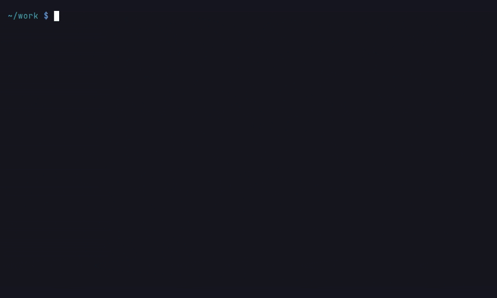
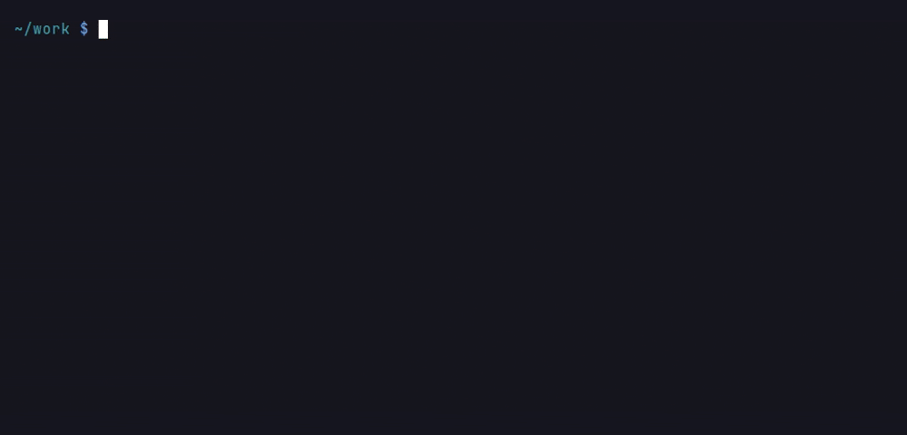

# Multi-Project Graphs

One Memgraph instance can hold the graphs of several repositories at once.
Each indexed repository becomes a `Project` node, every qualified name is
prefixed with that project's name, and retrieval tools read source files
through each node's recorded absolute path, so answers stay correct no
matter which directory you launch from.

## Indexing several repositories

Index each repository separately; every run adds (or refreshes) one project
in the shared graph:

```bash
cgr start --repo-path ~/services/user-service --update-graph
cgr start --repo-path ~/services/order-service --update-graph
```



Project names are derived from the directory name plus a short hash of the
full path (for example `user-service__a1b2c3d4`), so two checkouts with the
same folder name never overwrite each other. Pass `--project-name` to choose
a name yourself. A chosen name cannot contain `.`: it separates the parts of
a qualified name, so a project `acme.web` would share nodes with the `web`
package of a project `acme`.

Each `Project` node records the repository root it was indexed from
(`root_path`), and every code node stores the absolute path of its source
file, which is what allows cross-project retrieval from any working
directory.

## Querying across projects

`cgr start` scopes queries to the selected repository by default. To query
several projects in one session:

```bash
# Explicit list of project names
cgr start --repo-path ~/services/user-service --projects "user-service__a1b2c3d4,order-service__e5f6a7b8"

# Or a saved workspace
cgr workspace create backend
cgr workspace add-repo backend ~/services/user-service
cgr workspace add-repo backend ~/services/order-service
cgr start --workspace backend
```


*`cgr start --workspace backend` opens the LLM chat and is not part of the recording.*

`--projects` overrides `--project-name`; `--workspace` expands to every
repository saved in the workspace. See `cgr help workspace` for the full
workspace command set.

A workspace is saved as `~/.cgr/workspaces/<name>.toml`, so its name is an
identifier, not a path: it starts with a letter or digit and uses only
letters, digits, `.`, `_` and `-`. Any other name (empty, `a/b`, `../x`) is
refused with exit 1 before a file is touched.

## Semantic search within one project

When several projects share the graph, semantic search can be confined to a
single project: the agent's `semantic_search` tool accepts an optional
project name and then only returns matches whose qualified names belong to
that project. Without it, results are ranked across every indexed project.

## Tracing calls between services

With the `io` capture group enabled, a route handler such as
`@app.get("/users/{id}")` becomes an endpoint resource
(`resource::ENDPOINT::GET /users/{id}`) connected to its handler by an
`EXPOSES` edge, and a client call like
`requests.get("http://user-service:8000/users/42")` becomes a network
resource connected to its caller by `READS_FROM`/`WRITES_TO`. After each
indexing run, literal client URLs are matched against the endpoint path
templates in the graph (`{id}` matches one path segment) and linked with
`RESOLVES_TO`, so a request in one service traces to the handler in
another:

```bash
cgr start --repo-path ~/services/user-service --update-graph --capture io
cgr start --repo-path ~/services/order-service --update-graph --capture io
```

```cypher
MATCH (caller)-[:READS_FROM|WRITES_TO]->(:Resource {kind: 'NETWORK'})
      -[:RESOLVES_TO]->(:Resource {kind: 'ENDPOINT'})<-[:EXPOSES]-(handler)
RETURN caller.qualified_name, handler.qualified_name
```


Matching uses the URL path only: dynamic (non-literal) URLs and requests
whose paths match no known template stay unlinked.

### Cross-service edges

What the route extractors recognise, and what the links can and cannot say:

| Language | Routes recognised |
|----------|-------------------|
| Python | FastAPI and Flask style decorators (`@app.get`, `@router.post`, `@app.route`), with `include_router` mount prefixes resolved |
| JavaScript / TypeScript | Express and `express.Router` handlers (`app.get(...)`, `router.post(...)`), including handlers registered as options |
| Go | `http.HandleFunc` / `Handle`, and the `echo`, `gin`, `chi` and `mux` router factories |

A client URL links to an endpoint only when it is a literal with a path
the endpoint's template matches; an f-string, a concatenated path or a
computed host stays unlinked and shows up as an unresolved dependency
rather than as a wrong link. RPC and dispatch resources join their callers
directly (`READS_FROM`/`WRITES_TO` on the resource itself) and need no
`RESOLVES_TO`.

Three deterministic MCP tools read these edges, all project-scoped like the
other graph tools: `endpoints` lists what a project exposes with how many
call sites in the whole graph reach each one; `endpoint_callers` lists the
call sites in any project that reach one endpoint, by handler name or by
identity (`GET /users/{id}`); `remote_dependencies` lists every network
access a project makes with the handler it resolves to, keeping the
unresolved ones. `cgr dead-code --no-endpoint-roots` stops rooting a
decorator-routed handler (FastAPI, Flask) by its decorator alone: such a
handler whose endpoint no indexed call site reaches is reported. A handler
registered by a call (Go `HandleFunc`, Express `app.get(path, handler)`)
stays live through that registration, whatever the switch. On a graph
holding one project the report reads as "no callers indexed", which the
command says; index the calling services first.

Two analyses follow the link across the boundary. `flow_verdict` continues
a `FLOWS_TO` walk from a client's network resource into the handler it
resolves to (and from an RPC or dispatch resource into its handler), loads
that handler's project's own flow edges once the walk reaches the hop, and
reports the pairs where the path crossed into another project as
`remote_hops` (a service calling itself over HTTP is not a boundary). A
`NO_FLOW` verdict needs full coverage of every project the walk entered,
not only the asked one. The structural delta after a write lists, on a
signature change, the `remote_callers`: call sites in other projects
reaching the changed handler's endpoint, which no `CALLS` edge would ever
name.

## Housekeeping

```bash
# Remove one project without touching the others
cgr delete-project --name user-service__a1b2c3d4
```



Deleting a project also removes its embeddings from the vector store.

A checkout that was moved, renamed or deleted leaves its project behind with a
`root_path` that no longer exists; `cgr status` marks those `(missing)`. Sweep
them in one pass:

```bash
# List the projects whose root is gone, removing nothing
cgr prune --dry-run

# Remove them, asking first
cgr prune
```

A project is pruned only when its root is provably absent -- an unreadable
directory (a permissions error, an unavailable mount) is treated as live --
the checkout `cgr` itself runs from is never pruned, every purge is
verified against a fresh read of the graph before it is reported, and the
graph's current `root_path` is re-read inside the delete path, so a
concurrent sync repointing the project is skipped, not destroyed.

Prune judges `root_path`s on the machine it runs on: a shared graph whose
projects were indexed inside containers or on other hosts reads those roots
as missing from here. Prune only a graph whose checkouts live on the machine
asking.
