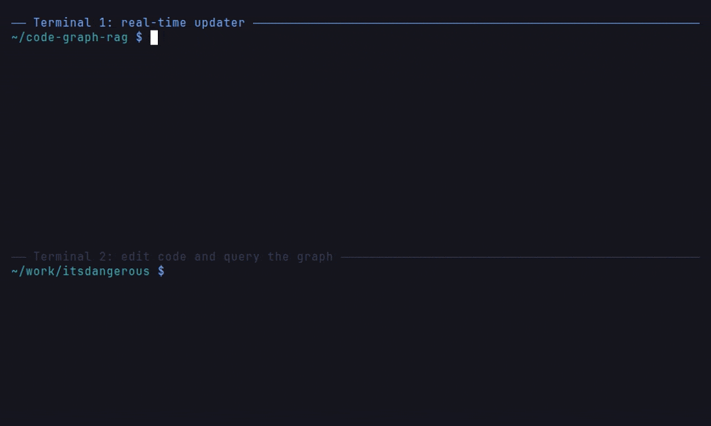

# Real-Time Graph Updates

For active development, keep your knowledge graph automatically synchronised with code changes using the real-time updater.

## What It Does

- Watches your repository for file changes (create, modify, delete)
- Automatically updates the knowledge graph in real-time
- Re-parses only the changed file and the files that depend on it, and re-resolves calls in that set only (the same `GraphUpdater.reingest` path the MCP `reingest` tool uses)
- Filters out irrelevant files (`.git`, `node_modules`, etc.)

## Usage

Run the real-time updater in a separate terminal:

```bash
python realtime_updater.py /path/to/your/repo
```



*Terminal 2 edits `encoding.py`; the watcher re-ingests it (and its dependents) and the new function is in the graph.*

Or using the Makefile:

```bash
make watch REPO_PATH=/path/to/your/repo
```

### With Custom Memgraph Settings

```bash
python realtime_updater.py /path/to/your/repo \
  --host localhost --port 7687 --batch-size 1000
```

```bash
make watch REPO_PATH=/path/to/your/repo HOST=localhost PORT=7687 BATCH_SIZE=1000
```

## Multi-Terminal Workflow

The watcher names the project exactly as `cgr start --repo-path` does for the
same directory (the directory name plus a hash of its resolved path), so its
live updates land in the project `cgr start` and the other `cgr` commands read.
If you name the project with `--project-name`, pass the same name to both.

```bash
# Terminal 1: Start the real-time updater
python realtime_updater.py ~/my-project

# Terminal 2: Run the AI assistant
cgr start --repo-path ~/my-project
```

## CLI Arguments

| Argument | Required | Default | Description |
|----------|----------|---------|-------------|
| `repo_path` | Yes | | Path to repository to watch |
| `--host` | No | `localhost` | Memgraph host |
| `--port` | No | `7687` | Memgraph port |
| `--batch-size` | No | | Number of buffered nodes/relationships before flushing to Memgraph |
| `--project-name` | No | Same as `cgr start --repo-path` | Project name to store in the graph; give the one you gave `cgr start --project-name` |

## Performance Note

The updater batches rapid saves with a debounce window. Each processed change
runs `GraphUpdater.reingest`, which deletes what the file previously
contributed, re-parses it together with the files that import or call into it
(one level deep, found through the graph's own edges), resolves calls within
that set only, and restores every other inbound edge verbatim. A change in one
file therefore costs the parse of its affected dependents rather than a
re-resolution of the project (a hub file imported by dozens still pays for each
of them); see [Scoped re-ingest latency](../reports/REINGEST_BENCHMARK.md)
for measured numbers.

Agents that edit files directly can call the MCP `reingest` tool with the paths
they touched instead of waiting for the watcher or running `update_repository`.
